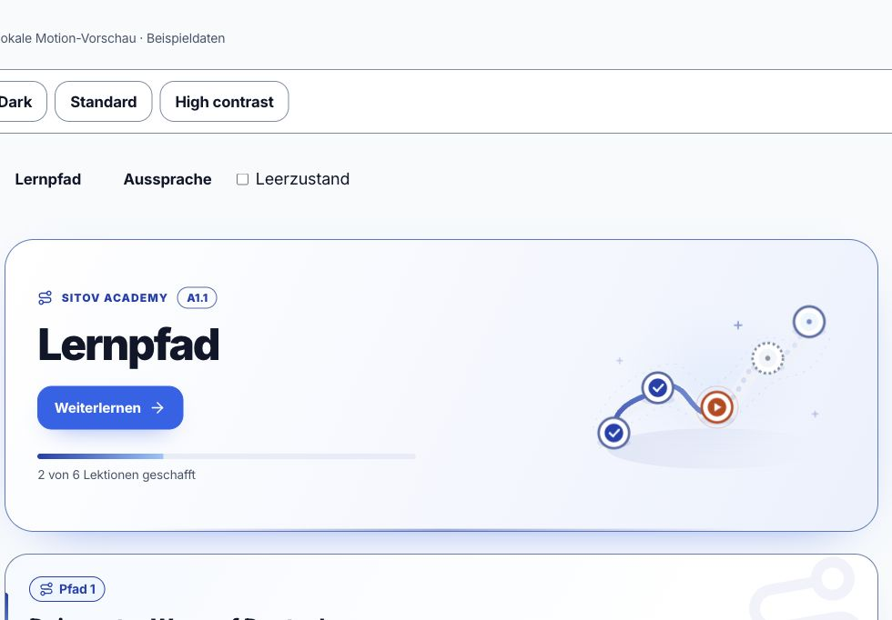
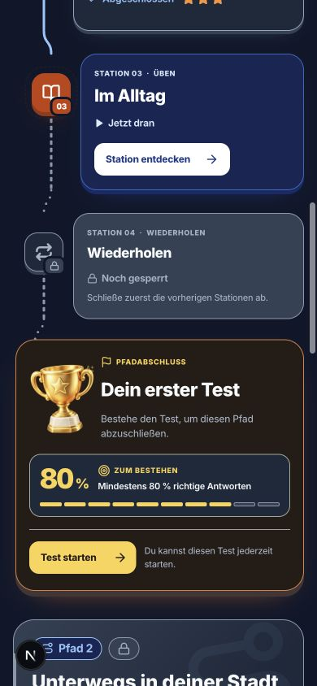
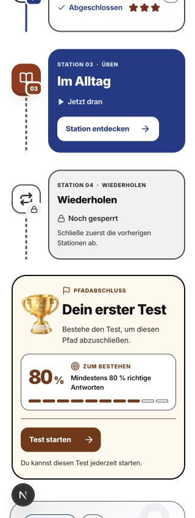

# Sitov Academy · Lernpfadstationen

Lokale Designabnahme vom 8. Oktober 2026. Umsetzung in `components/learning-path/PathTrail.tsx` und `learning-path.module.css`.

Die Stationen zeigen Lernart, nummerierte Etappe, sichtbaren Status und echte Sterne. Die aktuelle Station erhält eine dunkelblaue Fläche und eine direkte Aktion. Gesperrte Stationen zeigen weiterhin die Lernart und erklären ihre Freigabe; abgeschlossene Stationen behalten ihre gespeicherten Sterne. Der Pfadkopf zeigt pro regulärer Station ein Fortschrittssegment und einen beschrifteten Zähler.

Der Test bildet einen eigenen goldenen Pfadabschluss mit einer freigestellten 3D-Trophäe. „Mindestens 80 % richtige Antworten“ ist ausdrücklich die Bestehensgrenze. Acht von zehn dekorativen Skalenabschnitten visualisieren diesen Prozentwert, keine konkrete Aufgabenanzahl und keinen persönlichen Fortschritt. Ein gespeichertes Ergebnis steht getrennt darunter. Fehlende Ergebnisdaten führen zu keiner erfundenen Prozentzahl. Tests bleiben entsprechend dem Serververtrag auch innerhalb eines gesperrten Pfads verfügbar, sobald die Niveau- und Trainerberechtigung vorliegt.

Die UI folgt `de`, `en`, `ru`, `uk` und `tr`. Aufgaben, Schlüssel, Fortschritte und Audios wurden nicht geändert. Die Trophäe wurde mit ImageGen erstellt; die ausgelieferte transparente WebP-Datei ist 420 × 479 px und rund 40 kB groß. Das PNG bleibt als Quelldatei erhalten.

Druckfeedback verwendet `PRESS_SCALE` und `MOTION.fast`. Die Stationssymbole treten kurz auf; die aktuelle Markierung und die Trophäe bewegen sich ruhig. Pointer und Tastatur reagieren unmittelbar. `SitovMotionStage` pausiert die fortlaufende Bewegung außerhalb des Viewports und bei verborgenem Dokument und räumt Listener, Observer und Frames auf. Die CSS-Regeln für reduzierte Bewegung zeigen die vollständige statische Darstellung. Hoher Kontrast entfernt Glanz und Schatten.

## Prüfung

- 98 gezielte Jest-Tests in fünf Suites: Darstellung und Text in allen fünf Sprachen, getrennte Bestehensgrenze/Ergebnisse, fehlende Ergebnisdaten, aktueller Checkpoint, Sperren, offene Tests, unveränderte Aufrufparameter, laufende Requests und gemeinsame Motion-Steuerung.
- TypeScript, ESLint für die geänderten TypeScript-Dateien und `git diff --check`.
- Browserabnahme im Codex In-app Browser: Desktop mit 1440 px, Handy mit 390 und 320 px; Hell, Dunkel und hoher Kontrast. In allen fünf UI-Sprachen bei 320 px kein horizontaler Dokumentüberlauf und keine überlaufende Stationskarte. Tastaturfokus und Pausieren unsichtbarer Trophäen wurden im DOM überprüft. Reduzierte Bewegung ist über die gemeinsame Motion-Test-Suite und die CSS-Regeln geprüft.
- Vorschau mit Beispieldaten: `/de/sitov-preview/motion?view=path`. Die Entwicklungsroute bleibt in Produktion gesperrt. Die produktive Authentifizierung und ein echtes DB-Test-Durchlaufen waren nicht Bestandteil der Browserabnahme; diese Aufrufwege bleiben erhalten und sind durch die vorhandenen UI-Tests abgedeckt.

Die Änderung ist lokal und wurde in diesem Auftrag nicht veröffentlicht. Die parallele Session wurde über Tätigkeit und Dateiumfang informiert.

## Screenshots

