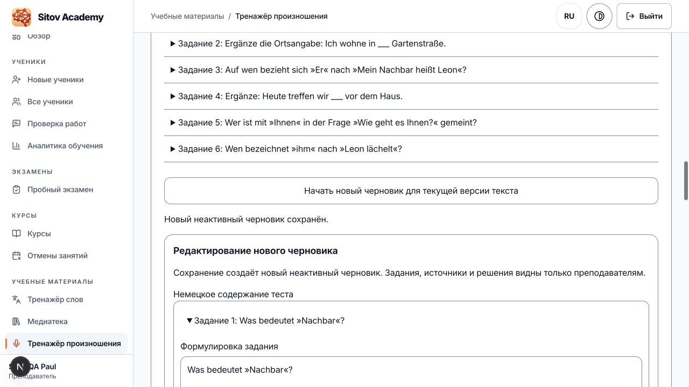

## 10. Oktober 2026, 14:30 MESZ — tatsächlicher Audioimport und vollständige native Inhaltsübernahme

**OPEN / AUTO_DEPLOY autorisiert / noch nicht produktionsfreigegeben.** 5.398 Audios tatsächlich in die vollständige isolierte QA importiert und vollständig per GET mit Bytes/Hashes/Wortzeiten geprüft. Alle 538 aktuellen Inhaltsänderungen in einer nativen Transaktion übernommen; 538 ganze Altarchive, 2.690 Übersetzungen und 66 ursprüngliche Antwortpaaränderungen unabhängig bestätigt. 60 individuelle Vortests mit 5.650 Audiobindungen vollständig nativ zurückgelesen. Auth/REST/Storage zeigen tatsächlich auf dieselbe vollständige QA; alle 214 Ziel-, 211 Quell- und 188 früheren QA-Tabellen beim Servicewechsel unverändert. 98 echte menschliche Hörfreigaben bleiben gebunden; autonome Prüfungen werden nicht als menschliche Hörfreigaben bezeichnet. Keine weiteren Nutzer-Hörprüfungen.

Echte authentifizierte Publikation hat einen gesicherten QA-Teilstand erreicht und wurde von der strikten RAM-Grenze angehalten; Wiederaufnahme mit denselben Konten/Request-IDs wird vorbereitet. Hotspot-Verbindung bestätigt, alle zuvor laufenden Netzwerkjobs sauber beendet. Frischer Produktionsbackup/aktueller Bestandsschutz, vollständiger authentifizierter Schülerflow und finale Release-Gates bleiben offen. Noch kein produktives Deployment; Payment aus. Wochenbudget frisch 74 % verbraucht /26 % verfügbar, null weitere Resets. [Bestätigte Ergebnisse und verbleibende Pflichtschritte](../handoffs/SITOV-NIGHT-2026-10-08/M/actual5398-native538-authrest-checkpoint.md). Die folgenden Abschnitte bleiben historische Stände.

## 10. Oktober 2026, 10:48 MESZ — 38 echte Hörfreigaben, lokales Paket5276

20 neue Urteile PASS/vier REJECT aus dem24er-Paket exakt gebunden und technisch geprüft; neue Apple-Aufnahme PASS, neuen erneut REJECT. Insgesamt38 menschlich bestätigte Texte, fünf Reparaturtexte und57 ungehörte Diagnosefälle offen. Neues tatsächlich importervalidiertes lokales Bündel5276/62 HOLD; noch kein Import oder Deployment. Korrekte komplette Rehearsal-DB und Pfadfilter9569/856/66 tatsächlich bestätigt, eigene114/115-Scratchprobe läuft begrenzt. Produktion unverändert, Payment aus;63% Wochenbudget verbraucht/37% verfügbar, keine Resets. [Bestätigter aktueller Nachweis](../handoffs/SITOV-NIGHT-2026-10-08/M/current6c26022-thirtyeight-human-pass-checkpoint.md). Die folgenden Abschnitte bleiben historische Stände.

## 10. Oktober 2026, 10:03 MESZ — zehn weitere echte Audiofreigaben

Die tatsächlichen zwölf Nutzerurteile sind gesichert: zehn PASS, zwei REJECT (“1 Apfel, also ein Stück.” und “neuen”). Alle zehn PASS sind unabhängig technisch verifiziert; insgesamt jetzt 17 exakt gebundene menschliche PASS. Neues unveröffentlichtes lokales Bündel: 5.255 ausgewählte Aufnahmen, 83 gehaltene Texte. Zwei neue Reparaturkandidaten und die lesende QA-Voraussetzungsprüfung laufen begrenzt. Weitere 24 Hörfälle (214 Sekunden) sind vorbereitet. Native Vollübernahme, Bestandsschutz und Deployment bleiben offen. Details: [bestätigter Audio-Checkpoint](../handoffs/SITOV-NIGHT-2026-10-08/M/current6c26022-seventeen-human-pass-checkpoint.md).

## Bestätigter Zwischenstand 10.10.2026, 09:49 MESZ

Die vollständige aktuelle Freigabebindung aller **538 geänderten Aufgaben, 59 Eltern und zehn Ziele** ist von M anhand der Originalbelege unabhängig bestätigt. Der tatsächliche aktuelle CAS-Preparer akzeptiert alle 538 Zeilen mit einer ausdrücklichen M-Quellfreigabe ausschließlich für die isolierte Probe; noch keine native Gesamtbatch-Ausführung und keine Produktionsfreigabe. Alle 66 ursprünglichen DB→Source-Antwort-/Antwortlistenänderungen sind separat erfasst und benötigen historische native Nachweise.

Genau sieben tatsächliche Nutzer-Hör-PASS bleiben bestätigt. Alle 93 übrigen Audiotexte sind unabhängig diagnostisch geprüft, ohne erfundene Hörfreigaben; zwölf gezielte erste Hörfälle mit zusammen 27,72 Sekunden Audio vorbereitet. Obsidian43 tatsächlich zurückgelesen und mit allen Altbytes erhalten. **OPEN / NOT_RELEASE_READY**, Produktion unverändert, Payment aus, Budget61 % verbraucht /39 % verfügbar, keine Resets.

[Exakte Freigabe-, Preparer- und offene Nachweise](../handoffs/SITOV-NIGHT-2026-10-08/M/current6c26022-complete-source-review-checkpoint.md). Die folgenden Abschnitte bleiben historische Stände.

## Bestätigter Zwischenstand 10.10.2026, 09:30 MESZ

Weiterhin OPEN / NOT_RELEASE_READY. Aktuelle Inhaltsquelle `6c26022d91d9d00bf1b112f9efb11e481d9e361c`: letzte Konjunktiv-Mehrdeutigkeit mit exakt sechs Skalaren repariert, elf integrierte Tests und frische vollständige unabhängige Neuprüfung bestanden. Aktuell 538 Aufgaben / 59 Eltern / tatsächlich zehn geänderte Lernziele; vollständige Freigabezusammenführung läuft.

**Alle sieben Pflicht-Hörprüfungen sind jetzt tatsächlich bestanden.** Der Nutzer bestätigte die native wollte-Alternative; die zu schnelle Datei bleibt ausgeschlossen. Neues lokales unveränderliches Audiobündel mit tatsächlich 5.245 importervalidierten Dateien und Wortzeitmarken erstellt, 93 andere Diagnosefälle weiterhin HOLD. Keine pauschale Hörfreigabe und noch kein neuer Import. Beide tatsächlichen Audioadapter bestätigen unveränderte aktuelle Pfadtexte nach der letzten Anweisungsreparatur.

Der echte native Konkurrenzfall eines ganzen Eltern-/Übersetzungskontexts ist bestanden: Gewinner erhalten, veralteter CAS mit SQLSTATE 40001 abgewiesen, null Archive/Receipts; M hat Originalbelege unabhängig geprüft. Geschützte185/QA188 unverändert, eigener Scratch entfernt. Nativer vollständiger Gesamtbatch und übrige Release-Gates bleiben offen. Budget tatsächlich 60 % verbraucht /40 % verfügbar, null weitere Resets. Produktion unverändert, Payment aus.

[Bestätigte Einzelheiten und verbleibende Pflichtarbeit](../handoffs/SITOV-NIGHT-2026-10-08/M/current6c26022-seven-human-pass-checkpoint.md). Die folgenden Abschnitte sind historische Stände.

## Bestätigter Zwischenstand 10.10.2026, 08:18 MESZ

Weiterhin OPEN und NOT_RELEASE_READY. Aktuelle Inhaltsquelle`af644f8dd574a03af7394e99da9d474b8d7912e7`: exakt72 zusätzliche editorielle Skalare integriert undunabhängig nachgerechnet,107 bestehende Tests/neun native Paritäten/9569 Schema-Prüfungen bestanden. Vollinventar538 Aufgaben/59 Eltern/sieben Zieländerungen.270 der291 ergänzenden ganzen Kontexte gelesen;letzte21 laufen,41 exakte Korrekturen aus Blöcken05–09 vorbereitet. Gesamtfreigabe undfrische Neuprüfung offener Befunde fehlen.

Acht geänderte Aufnahmen lokal erzeugt,tatsächlich dekodiert undaus Alignment-Rohlogits nachgerechnet: sieben ASR-Wortfolgen passend,eineDeniz/Dennis bleibt HOLD. Aktuelle Pfadauswahl620/704,84 HOLD;Vortestauswahl4682,neun HOLD. Zusammen5245 technische Kandidaten/93 HOLD;noch kein neues5245er Bündel oderImport. Zwei bytegebundene orthografische ASR-Diagnosen ersetzen keine menschliche Hörprüfung.279 primär zurückgelesene Original-Pfad-MP3s unverändert,nachacht Textrevisionen. Frühere5244er Bündelzahlen bleiben historisch.

S5epoch37 bestätigt tatsächliche mobile Fokusfreiheit in13 Geometrien undauthentisches macOS ReducedMotion mitwiederhergestelltem Originalzustand. Physisches Mikrofon/Hörfreigaben weiterhin unbestätigt. Echter isolierter CAS-Konkurrenztest S1e48 läuft. Produktion unverändert`966a380f7a6118654f19750a9d62200795feb8c2`,Payment aus;56% Wochenkontingent verbraucht/44% verfügbar,kein weitererReset. AUTO_DEPLOY erst nach sämtlichen Pflichtprüfungen.

[Bestätigte Einzelheiten und offene Gates](../handoffs/SITOV-NIGHT-2026-10-08/M/current-af644-audio5245-selection-checkpoint.md). Die folgenden Abschnitte sind historische Stände.

## Bestätigter Zwischenstand 10.10.2026, 07:42 MESZ

Weiterhin unvollständig und nicht freigegeben. AUTO_DEPLOY ist autorisiert; Produktion bleibt auf `966a380f7a6118654f19750a9d62200795feb8c2`, Payment aus. Wochenkontingent zuletzt tatsächlich 53 % verbraucht /47 % übrig; Reset bereits verbraucht, keine weiteren Guthaben.

- Aktuelle Inhaltsquelle `7d9a403388efa7ae0f67c93164adfd0bdcff05b3`: 538 geänderte Aufgaben,58 Eltern,704 kanonische Audios/760 Aliasse. S1 hat247 vollständige source-/reviewergebundene ACCEPT-Kandidaten und291 offene vollständige Genehmigungen ermittelt. Dies sind verschiedene Prüfstadien, keine Gesamtfreigabe.
- Die ersten90 der291 Aufgaben sind inzwischen unabhängig mit allen fünf Sprachfassungen, ganzen Eltern und allen Pfadzielen gelesen. Block01:21 Gesamt-ACCEPT/9 HOLD; Block02:29 Task-ACCEPT/1 HOLD; Block03:20 Gesamt-ACCEPT/10 HOLD. M hat die60 neuen Task-/Parent-/ALLGoals-Bindungen gegen tatsächliche Seedobjekte unabhängig nachgerechnet. Exakte Berichte bleiben in den S4-/S7-Handoffs erhalten.
- Daraus sind52 genaue Autorenkorrekturen vorbereitet:49 Scalars in10 Aufgaben,ein Elternscalar,zwei Zielscalars. Noch nicht umgesetzt oder in eine Datenbank übernommen. Eine1→1-Antwortwortrevision benötigt zusätzlich nativen Nachweis der unveränderlichen historischen Version und gespeicherten Altantworten. Fachlich nötige feminine Grammatik-/Anredekontraste bleiben erhalten.
- Audioentwurf5244:4680 Vortest-Assets +621 Pfad-Assets −57 identische Überschneidungen; alle finalen Dateien und Metadaten geprüft,621 Pfad-MP3 tatsächlich dekodiert.287 passende Original-Pfadaufnahmen bleiben bytegleich.94 Texte noch HOLD (83 Pfad/11 Vortest), unabhängige Hörfreigaben nicht vorhanden. Keine Publikationsfreigabe.
- S5 epoch36 prüfte17 echte Browserfälle einschließlich320/390/1440px,UK/TR,Hell/Dunkel/hoherKontrast: kein Textüberlappen oder horizontaler Überlauf. Ein echter erster Hilfe→Shift+Tab-Fokus lag unter der mobilen Navigation; dieser Befund bleibt offen. M-Fix `b06843194db2e4c5ad5fea3cf40b12394f941f04` reserviert per scroll-margin die bestehende Leistenhöhe. Frischer maskierter Produktionsbuild tatsächlich PASS, Build-ID `XLm2trsHZX8ZGja1yykY-`; nativer Regressionstest S5e37 läuft. Kein Mikrofon-/ReducedMotion-Erfolg ohne tatsächlichen Nachweis.

Nächste Pflichtschritte: konkrete Befunde reparieren und vollständig neu bestätigen; restliche Blöcke04–10 lesen; reale Hörfreigaben; vollständiges Content-CAS-Manifest samt Eltern/Zielen, native Gesamtbatch-/Konkurrenztests, aktuelle Audio-/Versionsübernahme; finaler QA-Bestandsschutz und eigener Fixture-Abbau. Danach frischer Produktionsbackup,185 geschützte Tabellen und sämtliche75 effektiven kommerziellen Bestandsrechte vor/nach Migration, isolierte Probe, prepare-only und exakt geprüfte Revision mit authentifizierten Smoke-/Health-/Readiness-Prüfungen aktivieren.

Die folgenden Abschnitte dokumentieren frühere Stände und ersetzen diesen Zwischenstand nicht.

# Sitov Academy – Nachtlauf-Übergabe 2026-10-08

## Aktueller bestätigter Stand 10.10.2026, 07:18 MESZ

**OPEN / AUTO_DEPLOY nach sämtlichen Pflichtprüfungen / NOT_RELEASE_READY.** Aktuelle Inhaltsquelle `7d9a403388efa7ae0f67c93164adfd0bdcff05b3`, bestätigte neue Review-/Browserbelege integriert bis `272d8e27c66c805b7b322aa96db3ccb9d1614aef`. Wochenbudget frisch 51 % verbraucht, 49 % verfügbar, null weitere Reset-Guthaben. Produktion bleibt `966a380f7a6118654f19750a9d62200795feb8c2`; kein produktiver Import, Push oder Deployment. Payment bleibt aus.

Vollständiger Quellenvergleich: 538 geänderte Aufgaben / 58 Eltern / keine Einheiten bei 9.569 Aufgaben, 856 Eltern und 66 Einheiten insgesamt; keine Identitäts-/Typ-/Reihenfolgen-/Lernzielzuordnungsdrift. S2epoch45/46 reparierten genau 60 Skalare: 57 Aufgabenfelder in 17 Aufgaben und drei Elternbeispiele. Jeweils 107 bestehende Tests, neun native Paritäten und alle Schema-Prüfungen bestanden. Beide Audioadapter aller 9.569 Aufgaben sowie sämtliche zehn vollständigen Audiokataloge blieben dabei exakt. S4epoch48 las anschließend alle 18 relevanten ganzen Aufgaben, zehn Eltern und sämtliche 49 zugehörigen Ziele frisch in fünf Sprachen: einzeln ACCEPT. M prüfte die tatsächlichen Quelldaten, Eingabe- und Originalbeleg-Hashes unabhängig. Die vollständige per-ID-Abdeckung aller 538 Aufgaben wird gerade neu abgeglichen; keine pauschale Gesamtfreigabe.

Audio: neuer unveränderlicher **5.244er technischer Entwurf**, 5.244/5.244 tatsächliche Importer-Validierungen und finale Metadaten-Rückleseprüfungen. Aktueller Pfadbestand: 760 Aliasse / 704 eindeutige Texte, davon 621 technisch ausgewählt und 83 gehalten; zusätzlich elf gehaltene Vortesttexte. 287 ursprüngliche Pfad-MP3s bleiben bytegleich. Sieben neu erfasste unveränderte Texte wurden frisch per GET aus dem Bestand gelesen und tatsächlich dekodiert: alle sieben mit gültigen Wortzeitgrenzen. Die formelle Anrede mit notwendigem Frau/geehrte-Kontrast und bewusstem Namensplatzhalter wurde lokal mit Qwen erzeugt; M prüfte originale Aligner-Arrays, Klassenpfade, Wahrscheinlichkeiten, exakte Wortabdeckung und Audiodauer unabhängig. Das ist keine menschliche Hörfreigabe. Sieben Reparaturvarianten und repräsentative/auffällige Hörproben bleiben Pflicht. Keine künstlichen Zeitintervalle, keine weiteren identischen Wiederholungen zur vermeintlichen Qualitätsverbesserung.

Der reale EN390/dunkel/Standard-Fall besteht mit dem neuen QA-Build `eed9cc8f` / `y6jNTwXmEGFKxEVq8szt1`: Aufnahme-Karte liegt nach Text und Referenzaudio, kein Wortüberdecken nach nativem PageUp und 900 ms Ruhe; sichtbarer Tastaturfokus. Derselbe Schüler und sein echter gespeicherter PASS bleiben unverändert. 320/1440, UK/TR, zusätzliche Theme-/Kontrastfälle, authentisches Reduced Motion und Mikrofonaktivierung sind noch offen. Letzter voller Regressionstest: 4.278 PASS / null Fehler / zwei optionale Skips auf der früheren Inhaltsquelle `db9bd0cc`; neue UI-Reparatur zusätzlich mit sechs relevanten Tests, TypeScript und ESLint bestätigt. Keine vollständige neue Browser- oder Regressionsevidenz daraus abgeleitet.

Offline-CAS für alle 58 vollständigen Original-Eltern und fünf Original-Lernziele vorbereitet und ausschließlich als ROLLBACK-SQL validiert, unbekannte Felder erhalten. Noch offen: übrige vollständige Inhaltskontexte, Audio-Hör-/Versionsbindung, vollständige native Batch-/Race-Proben, frischer Vergleich aller geschützten Bestandsdaten und aller 75 kommerziellen Kontorechte, Backup, prepare-only, Aktivierung der exakt geprüften Revision sowie Health/Readiness/authentifizierte Smokeprüfungen. Obsidian erhält bestätigte Meilensteine; heutige Umsetzung und Deployment bleiben bei M.

Details: [aktueller Quellen-/Audio-Beleg](../handoffs/SITOV-NIGHT-2026-10-08/M/current538-selected5244-checkpoint.md). Ältere Abschnitte unten sind historische Nachweise.

## Historischer bestätigter Stand 10.10.2026, 06:26 MESZ

**OPEN / AUTO_DEPLOY nach Pflichtprüfungen / NOT_RELEASE_READY.** Aktuelle Inhaltsquelle `db9bd0cc589adbc92120ec9260417f223d377c75`; integrierte Audits bis `d26a30b0`. Wochenlimit zuletzt 47 % verbraucht, 53 % verfügbar, kein weiterer Reset. Produktion unverändert `966a380f7a6118654f19750a9d62200795feb8c2`; kein produktiver Import, Push oder Deployment.

**Aktuelle vollständige Regression: 4.278 Tests bestanden, null Fehler, zwei optionale Skips, 322 bestandene Suites** auf `db9bd0cc589adbc92120ec9260417f223d377c75`, 103,24 Sekunden. Der vorherige Lauf mit drei Fehlern bleibt als echter Fehlbefund erhalten: zwei veraltete Ellipsen-Erwartungen wurden auf die geprüften Lückenmarker korrigiert, ein vorgezogenes „dafür“ im A2.1-Pfad 2 wurde aus genau einer Frage entfernt. Der Audio-Test verwendet jetzt den tatsächlichen JSON-Typ. TypeScript nach dieser Typkorrektur sowie ESLint beider geänderter Tests bestanden. Ein Standard-Turbopack-Build scheiterte an der außerhalb des Worktrees verlinkten Toolchain; der dokumentierte Webpack-Build mit vollständig maskierten Umgebungsvariablen, isolierter QA, einem Worker und 1.536 MiB Heap bestand auf `6aae253d678bd825db68d02d05fe226f8354234c`. Lokale gebaute QA-App: Build-ID `rsOvgr-hO4pf3nuHqucj_`. Spätere Änderungen betreffen Seeds und Dokumentation; daraus wird keine neue Build-Identität behauptet.

Der aktuelle Vollvergleich erfasst weiterhin alle 9.569 Aufgaben, 856 Knoten und 66 Einheiten: 532 geänderte Aufgaben, 57 Eltern, keine Einheiten, keine Identitäts-/Reihenfolgen-/Typ-/Lernzielzuordnungsdrift und keine unbelegte Quellenherkunft. S2epoch43 korrigierte genau elf Aufgaben; S4epoch43 las alle elf finalen Aufgaben, fünf Eltern und sämtliche zugehörigen Pfadziele vollständig und akzeptierte sie. S2epoch44 korrigierte anschließend genau zwei weitere Skalare: die A2.1-Frage ohne „dafür“ und das A1.1-P7-Kommunikationszitat „dem Lehrer“, passend zur aktuellen Regelkarte. Antworten und Übersetzungen blieben exakt; 99 bestehende Level-Tests, neun native Paritäten und 9.569 Schema-Prüfungen bestanden. Eine zusätzliche unabhängige finale Prüfung dieser letzten drei betroffenen Gesamtkontexte läuft in S4epoch46; noch kein Ergebnis vorweggenommen.

S1epoch45 hat vorhandene Nachweise ausdrücklich nach ihrem tatsächlichen Lesenumfang geordnet: 114 vollständige ACCEPT-Kandidaten, 418 noch nicht vollständig etablierte Aufgabenfreigaben, sechs Elternkandidaten und 51 offene Elternfreigaben. Das bedeutet keine 418 fachlich falschen Aufgaben. Die inzwischen zusätzlich abgeschlossenen S4epoch44/45 prüften 39 Aufgaben und acht Elternkontexte samt allen zugehörigen Pfadzielen frisch vollständig: jeweils ACCEPT. S7epoch23 prüfte weitere 27 Aufgaben, 14 Eltern und 64 Pfadziele frisch: 25 vollständige Gesamtkontexte ACCEPT, zwei HOLD allein wegen des anschließend korrigierten P7-Zielzitats. Alle 27 Aufgaben und 14 Eltern waren fachlich akzeptiert. Diese neueren Nachweise müssen noch in einen aktualisierten, vollständigen per-ID-Freigabestand eingearbeitet werden; eine globale CAS-Freigabe liegt weiterhin nicht vor. Die drei ungeklärten Vogel-Provenienzfälle bleiben unverändert und offen.

**Sicherer Datenbank-Prüfhelfer integriert:** pro Tabelle begrenztes READ ONLY mit kanonischem Zeilenstream, kein großes 188-faches JSON-Aggregat. 14 relevante Offline-Tests auch von M bestanden. Genau ein tatsächlicher vollständiger Lauf durch S5epoch32 ergab 188/188 identische Tabellen gegen Ms gebundene Nachherbasis, einschließlich aller 17 unveränderten Rate-Limit-Zeilen; M verglich die tatsächlichen Hashes unabhängig. Keine DB-/Runtimeänderung. Die frühere Herkunft dreier Rate-Limit-Deltas bleibt unklassifiziert. Der bereits bestandene echte DE-Browserablauf FAIL → Wiederholung → PASS → genau ein Text/Volltextaudio bleibt gültiger begrenzter Nachweis. S5epoch33 arbeitet jetzt mit dem neuen Build und sicherem Prüfhelfer an einer eigenen fortsetzbaren Browserfixture; weitere Sprachen, Ansichten, Tastatur und Reduced Motion bleiben nur im tatsächlich geprüften Umfang freigegeben. Physisches Mikrofon und menschliches Hören sind weiterhin nicht bestätigt.

Audio: Die neun neuen finalen S2epoch43-Aufnahmen sind lokal erzeugt und mit tatsächlichen MP3-/Metadaten-Prüfsummen, rohen Aligner-Arrays, Klassenpfaden und positiven Wortintervallen geprüft. Größeres lokales ASR löst den Spätschicht-Befund, der Name Rojas bleibt auffällig; kein Hörurteil daraus. Für die eine S2epoch44-Frage sind lokale Qwen-Synthese, kleine/große ASR-Diagnose und rohes Forced Alignment technisch fertig; Ms tiefere Rückprüfung steht noch aus. Die acht Wiederholungen auffälliger role42-Aufnahmen erzeugten wegen festem Seed identische MP3-Bytes und haben keine Qualitätsverbesserung bewiesen.

Der erstmals vollständige lokale Audioabgleich aller 532 geänderten Aufgaben umfasst 751 Quellenverweise/697 eindeutige aktuelle Texte, einschließlich bereits vorhandener Audioverweise. Ein großer Teil vermeintlicher lokaler Lücken war vorhandener Produktionsbestand: **249 Original-MP3s und vollständige Originalmetadaten wurden frisch per GET zurückgelesen, 249/249 Byte-/Metadatenidentitäten bestätigt**, insgesamt 4.757.484 Bytes, ohne Schreiben oder Neusynthese. Strenge tatsächliche Decodierung: 248 mit vollständigen Zeitgrenzen bestanden, eine Aufnahme „Tom steht um sechs Uhr auf. Dann rasiert er sich.“ zur Wortzeitprüfung gehalten. Eine neue gemessene Alignment-Kandidatur der unveränderten MP3 ist lokal vorhanden, noch nicht importiert oder als endgültig akzeptiert. Der alte unveränderliche 4.825er-Entwurf bleibt erhalten und wird erst in einem neuen Paket auf den aktuellen Quellenstand abgeglichen; neue Selektionen, Kollisions-/Metadaten-CAS-Fälle und gehaltene Texte sind keine Publikationsfreigabe. Unabhängige Hörstichproben und insbesondere die sieben Reparaturvarianten sind Pflicht, ASR ist Diagnose.

Nächste Schritte: aktuelle Reviews samt Ziel-Delta sauber per ID zusammenführen; weitere offene Ganzkontexte prüfen; aktuelle Audios unveränderlich zusammenstellen und offene Qualitäts-/Wortzeitfälle beheben; tatsächliche restliche Browsermatrix; vollständige native Batch-/Race-Prüfungen, frische Produktions-/75-Konten-Rechtevergleiche, Backup und kontrollierte Release-Vorbereitung/Exaktaktivierung. Payment bleibt aus. Obsidian-Notiz43 ist bestätigt bis zur vorigen Dokumentationseinheit; diese neueren Ergebnisse werden in der nächsten kurzen Dokumentationseinheit ergänzt.

## Aktueller bestätigter Stand 10.10.2026, 05:41 MESZ

**OPEN / AUTO_DEPLOY nach Pflichtprüfungen / NOT_RELEASE_READY.** Letzte geprüfte Inhaltsquelle `03ae6c9905b4c154df33457ecf0ca39a29e3d378`, dazu bestätigte Audit-/Browserdokumentation bis `9ed9a6f32363644623dcdf295e0764bcca3b3429`. Wochenlimit zuletzt 44 % verbraucht, 56 % verfügbar, null Reset-Guthaben. Produktion weiter `966a380f7a6118654f19750a9d62200795feb8c2`; kein produktiver Import, Push oder Deployment. Ältere Zeitabschnitte sind historische Nachweise.

Der vollständige aktuelle Quellenvergleich umfasst 9.569 Aufgaben, 856 Knoten und 66 Einheiten: gegenüber dem eingefrorenen Produktionsquellbestand ändern sich 532 Aufgaben und 57 Elternknoten, keine Einheiten. Keine Identitäts-, Typ-, Lernziel- oder Reihenfolgendrift; alle Deltas sind der integrierten Herkunft zugeordnet und technisch durch den begrenzten 114-Vertrag abbildbar. Das ersetzt keine fachliche Freigabe. S2epoch42 änderte 31 Rollenaufgaben, 75 einzelne Lückenmarker, eine metasprachliche Paarfrage, drei Eltern, ein Lernziel und 23 mechanisch exakt abgeleitete Erklärungsspiegel; insgesamt 125 betroffene Aufgaben/396 skalare Änderungen. Sechs neue Antwortrevisionen sind 1→1 mit unveränderter Optionsposition; historische Originale bleiben vor einer Übernahme durch 114 zu archivieren. Die drei ungeklärten Vogel-Provenienzfälle bleiben unverändert.

S4epoch42 hat alle 31 finalen Rollenaufgaben vollständig in fünf Sprachen mit Eltern und Lernzielen gelesen: 27 ACCEPT, zwei HOLD, zwei PARTIAL. Tatsächliche RU-/UK-Übersetzungs-, DE-/EN-Possessiv- und UK-Schreibfehler sowie eine zeitliche Unschärfe sind exakt dokumentiert. S7epoch22 hat alle 23 Spiegelaufgaben vollständig geprüft: alle 115 Spiegel-Erklärungen fachlich ACCEPT, Gesamtaufgaben 16 ACCEPT und sieben HOLD zur männlichen Szenenbesetzung. Eng begrenzte Korrekturen durch S2epoch43 und die unabhängige Zusammenführung vorhandener Freigabebelege durch S1epoch44 laufen; diese Ergebnisse sind hier ausdrücklich noch nicht als bestanden behauptet.

**Echter aktueller Browserablauf bestanden:** regulärer Schüler ohne Vokabel-/Verb-/Lernpfadnachweise, 0/12 FAIL → sichtbare Wiederholung → 12/12 PASS → genau dieser Text und seine vorbereitete Volltextaufnahme freigegeben. M hat tatsächliche Downloadbytes unabhängig nachgehasht. Die anschließende isolierte QA-Störung und Bereinigung wurden unabhängig aufgeklärt: 187 unveränderte Tabellen gegenüber der Fixture-Basis, ausschließlich drei private Rate-Limit-Zeilendeltas; eigene Fixture entfernt. Nach genau einem kontrollierten bestehenden QA-Datenbankneustart alle 188 Tabellen identisch, Ressourcen/Mounts erhalten, drei Health-Endpunkte 200. Detailbeleg `docs/handoffs/SITOV-NIGHT-2026-10-08/M/qa-browser-current-first-root-recovery.md`. Keine vollständige Browsermatrix, Mikrofon- oder Releaseabnahme daraus ableiten.

Die beiden aktuellen Seed-/Audio-Regressionssuites bestehen auf Quelle03ae6 mit 34/34 Tests, null Fehlern, 11,8 Sekunden. Der letzte vollständige Jest-Lauf mit 4.275 PASS und zwei optionalen Skips sowie Build/TypeScript/ESLint gehören zu älteren ausdrücklich gebundenen Ständen; ein abschließender aktueller Gesamtlauf bleibt erforderlich.

Zusätzlich zu den früheren unveränderten Audioentwürfen sind 26 Rollenaufnahmen aus epoch41 und 102 aus epoch42 lokal mit dem vorgeschriebenen männlichen Qwen-Profil erzeugt. Für alle 102 wurden tatsächliche MP3-/Metadatenbytes, rohe Aligner-Arrays, Eingabefingerprints und gewählte Wahrscheinlichkeiten unabhängig nachgerechnet: 102 technisch akzeptiert, null verworfen; 78 kleines ASR-exakt, 24 größere ASR-Diagnosen. Manifest-SHA256 `186ffdb5ef159b078c67ecb1e78505fcd4501b8b2312974bd358f3bf85cbdbd0`. Diese Entwürfe haben keine unabhängige Hör- oder Publikationsfreigabe; die laufenden Quellenkorrekturen benötigen neue passende Fassungen. Der frühere unveränderte 4.825er-Entwurf bleibt als historischer technischer Entwurf erhalten und muss auf den endgültigen Quellenstand abgeglichen werden.

Offen: endgültige sourcegebundene Inhaltsfreigaben und Audioauswahl/-Hörprüfung/-Import, vollständige Browsermatrix, tatsächliche vollständige native Batch-/Race-Prüfung, aktuelle ursprüngliche vollständige Produktionsbestände und effektive Rechte sämtlicher 75 Bestandskonten, Backup, isolierte Probe, vorbereitete exakte Revision, Aktivierung und authentifizierte Smokes. Payment bleibt aus. Obsidian erhält die bestätigten neuen Ergebnisse in der nächsten freigegebenen Dokumentationseinheit.

## Aktueller bestätigter Stand 10.10.2026, 04:43 MESZ

**OPEN / AUTO_DEPLOY nach Pflichtprüfungen / NOT_RELEASE_READY.** Integrationsbasis `c84604b3ef65a6abc117b77df1491d3f818e50fd`; Wochenkontingent zuletzt 40 % verbraucht, 60 % verfügbar, null Reset-Guthaben. Produktion bleibt `966a380f7a6118654f19750a9d62200795feb8c2`. Kein produktiver Import, Push oder Deployment. Die folgenden älteren Zeitabschnitte bleiben historische Nachweise und beschreiben nicht den aktuellen Stand.

Der vollständige Quellvergleich nach S2epoch40 umfasst 9.569 Aufgaben, 856 Knoten und 66 Einheiten. Gegenüber dem eingefrorenen Produktionsquellbestand ändern sich 451 Aufgaben und 52 Elternknoten; keine Einheiten und keine IDs, Typen, Lernziele oder Reihenfolgen. Herkunftszuordnung ersetzt keine redaktionelle Freigabe. Die neun zusätzlichen Antwortwortrevisionen sind ausdrücklich als 1→1-Änderungen dokumentiert; Migration114 muss vorherige vollständige Antworten und Datensätze archivieren. Ein vollständiges aktuelles unabhängiges Freigabemanifest für die gesamte Übernahme fehlt noch.

S7epoch20 hat die letzten 30 Aufgaben samt fünf Sprachfassungen vollständig nachgeprüft: 27 akzeptiert, drei präzise Korrekturvorschläge. M hat beide türkischen Endungen und den einen deutschen Audio-Lückenmarker exakt umgesetzt und alle drei aktuellen vollständigen Aufgaben mit den unabhängig vorgeschlagenen Tasks und ihren SHA256-Werten verglichen. Vier Elternkontexte sind akzeptiert. Die feminine Anrede „Liebe Frau …“ in P7-N10-E06 ist als fachlich notwendiges Grammatikbeispiel unabhängig bestätigt; die eng begrenzte Begründung steht in `docs/handoffs/SITOV-NIGHT-2026-10-08/M/grammatical-gender-retention-P7N10E06.md`. Weitere 70 benannte Rollenkontexte und 66 einzelne Audio-Lückenmarker plus eine doppelte Lücke sind vorbereitete Auditaufträge, keine pauschal festgestellten Fehler oder bereits angewendeten Änderungen.

Die aktuellen beiden A1.1-/Audio-Regressionssuites bestehen mit **34 Tests, null Fehlern**; ESLint besteht. Drei Golden Cases lesen echte Aufgaben aus dem Seed und prüfen den korrekten vollständigen Satz in beiden tatsächlichen Audio-Adaptern. Der letzte vollständige Jest-Lauf bestand mit 4.275 Tests, null Fehlern und zwei optionalen Skips auf dem damaligen älteren Teststand; ein aktueller vollständiger HEAD-Lauf steht noch aus. Erfolgreicher Build/TypeScript/ESLint und laufende lokale QA-App gehören weiterhin zu `717e884c5df0ce9917c4b6cd4a8c83d3f9cef5fe`, nicht zum neuesten HEAD.

Der unveröffentlichte 4.825er-Audioentwurf besitzt tatsächlich zurückgelesene finale MP3s und Metadaten, 143 projizierte positive Wortzeitarrays und 3.843 korrigierte kanonische Speicherpfade. Importervalidierung und tatsächliche vollständige MP3-Decodierung bestehen. Manifest-SHA256: `5f16347684e0ff240f47dd5491bab63b0fc45242d08c721955aaada7518ad6f9`. 73 Texte bleiben gehalten; vier bestehende Metadaten benötigen eine gesonderte CAS. Das Paket ist unverändert und muss nach neueren Textänderungen erneut auf aktuelle Verbraucher abgeglichen werden. Zusätzlich sind 27 neue Rollenaufnahmen technisch erzeugt und mit tatsächlichen rohen Aligner-Arrays geprüft: 20 ASR-exakt, sieben zur Prüfung vorgemerkt. Der inzwischen korrigierte einzelne Lückensatz wurde separat erneut erzeugt, technisch geprüft und vom größeren lokalen ASR exakt erkannt. Zwei weitere neue Lückensatz-Aufnahmen bleiben wegen ASR-Abweichungen gehalten. ASR und Alignment ersetzen keine unabhängige Hörprüfung. Keine dieser neuen Entwürfe wurden produktiv importiert oder veröffentlicht.

**Das enge native Recovery-Gate ist geschlossen:** S1epoch43 prüfte tatsächliche getrennte PostgreSQL-READ-ONLY-Transaktionen für OLD/NEW nach genau einem echten Combined-CAS-COMMIT in einer eigenen Scratch-Datenbank. Simulierter Rückgabeverlust, kein physischer Netzwerkabbruch; kein zweiter Writer. Vier tatsächlich veränderte SQL-Ausgabebilder wurden abgelehnt. M hat alle 44 Belegdateien nachgehasht und sämtliche sieben tatsächlichen CLI-Rücklesungen unabhängig erneut klassifiziert. Scratch entfernt, vollständige ursprüngliche 185-/188-Tabellenbestände erhalten. Das ist ein synthetischer Einzelfall und keine vollständige reale Inhalts- oder Releaseabnahme. Beleg: `docs/handoffs/SITOV-NIGHT-2026-10-08/S1/epoch43-readonly-native-recovery.md`.

Noch erforderlich sind der endgültige Inhalts-/Audiobestand, unabhängiges Hören, aktuelle unveränderliche QA-Definitionen mit exakten Audiobindungen, tatsächlicher Retake-PASS und die restliche Browsermatrix, vollständige native Batch-/Race-Prüfungen sowie frische Produktions-Bestandsschutz-/75-Konten-Rechtenachweise, Backup und der vorbereitete, anschließend exakt aktivierte VPS-Release. Payment bleibt aus. Obsidian-Notiz43 wurde aktualisiert und tatsächlich nachgelesen; jüngste Recovery-/Aufgabenkorrektur-Nachträge sind für die nächste Dokumentationseinheit vorgemerkt.

## Aktueller bestätigter Stand 09.10.2026 22:24 CEST

**OPEN / AUTO_DEPLOY nach Pflichtprüfungen / NOT_RELEASE_READY.** Verifizierter Integrationsstand `65a118c2`; frisches Restbudget89 Prozent, einmaliger Reset eingelöst, null weitere Reset-Guthaben. Payment aus. Produktion weiter `966a380f7a6118654f19750a9d62200795feb8c2`; noch kein produktiver Import, Push oder Deployment.

**Alle60 individuellen Texttest-Pools sind verfasst und von M unabhängig gelesen/geprüft:** 1440 Fragen, jeweils24 pro Quelle. Aktuell149 Offlineprüfungen, sieben Autorenvertragstests und CLI60/60/5760 Aliasse/89 inaktive Altentwürfe bestanden. Diese Prüfung ersetzt weder empirische Kalibrierung noch menschliche Hörabnahme. Entwürfe bleiben inaktiv. Eindeutiger realer Grammatikbefund korrigiert: Unflektiertes „jemand“ ist auch Dativ und durfte nicht als falsche Alternative zu „jemandem“ gewertet werden; nur der Distraktor wurde zu Genitiv „jemandes“ geändert, korrekter Schlüssel erhalten. Quellen: Duden/IDS. M-Prüfbeleg der letzten drei SHA `a3524ae609e785333f10529264d61e416b9c7ab184521b9616f390eaaaf37b74`.

**Inhaltsqualität:** 71 A1.1-Fragenkorrekturen/166 Aliasänderungen sowie31 A1.2-Fragenkorrekturen/64 Aliasänderungen tatsächlich angewendet und unabhängig geprüft. S7-Audits erster30 Quellen/720 Fragen liegen vor; A2.2-Audit31–40 läuft. Weitere A1.2/A2.1-Qualitätskorrekturen, Figuren-/Mappingprüfung und höhere unabhängige Audits bleiben offen. Künstliche falsche Verbformen werden teilweise von Qwen automatisch normalisiert; sie werden durch echte, im gegebenen Kontext eindeutig falsche Formen ersetzt und neu vertont. ASR-Homophone (dass/das, Jahr/Ja), Schreibweisen und Ziffern sind keine automatisch belegten Inhaltsfehler.

**Bestandsschutz und Datenbank:** Enge Definer-ACL-Migrationen110/111 sind geprüft; vollständiger nativer Storage-Test nach111 auf der isolierten Produktionskopie PASS. API-/PUBLIC-Freigaben wurden dabei nicht erweitert. Tatsächliche Ursache der Rechteabweichung belegt: Migration93 nahm140 alte Verb-Einheiten zusätzlich in die allgemeine Metadatenliste auf; die ursprüngliche Liste behandelte Verben getrennt. Für alle75 Konten ergibt der präzise Korrektur-SELECT wieder exakt die Vorherliste. Das ist noch kein vollständiger Nachher-Rechtenachweis. Migration112 für exakte Metadaten und set-basierte Performanceoptimierung wird ausschließlich auf der isolierten Kopie implementiert/geprüft. Vollständiger Nachhervergleich aller75 Konten, positive neue Kauf-/VIP-/Trial-Randfälle und frische Gesamtinstallation bleiben Pflicht. Ursprüngliche185 Tabellen qualifiziert erhalten:184 exakt, nur kanonische96 setzt audio_cache.public auf false. QA188 bleibt exakt `f78808720aa242bfb6a17dde4b398497d1f0478465ba4eb9c9d376d25e1236b1`; historischer OOM bleibt dokumentiert.

**Lokales Audio:** Syntheseläufe der Pools31–54 und aller202 neuen A1.1-/75 A1.2-Reparaturaufnahmen fertig, automatische größere Diagnosen erfolgt. Letzte55–60 laufen seriell auf dem Mac. Die235 fehlenden Bestandsaufnahmen sind lokal vorbereitet; exakte aktuelle Bundle-Projektionen, neue immutable Definition-/Audiobindungen, Imports und Rückleseprüfungen stehen noch aus. Keine Publikation aus Kandidaten abgeleitet.

**Neue wichtige Einschränkung der Wortzeitbelege:** Die lokal installierte Qwen-Aligner-Bibliothek korrigiert nichtmonotone Klassen teilweise durch Nachbarkopie/lineare Interpolation. Frühere „positive Messkandidaten“ (1248/1299) belegen deshalb ohne zusätzliche Rohklassenprüfung keine vollständig schätzungsfreien Einzelwortintervalle. Originalbytes und Metadaten bleiben erhalten, keine produktive Überschreibung. M prüft einen streng begrenzten Decoder anhand tatsächlicher Modell-Klassifikationswerte, ohne Interpolation oder künstliche Verbreiterung; bisher keine Übernahme oder Freigabe.51 bisherige Restfälle und echte alte Zahlen-/Abkürzungs-Sprechfehler bleiben separat offen. Keine menschliche Hörabnahme behauptet.

**Pflichtfolge bis Deployment:** verbleibende Inhalts-/Audio-Korrekturen und unabhängige Audits → exakte neue Definitionen/Audio-Proofs und QA-Imports → normale persistente FAIL/Retake/PASS/exaktes-Audio-Kette, Autoren-MFA/CAS, fünf UI-Sprachen und mobile/accessibility/motion-Abnahme → vollständiger Rechte-/Fresh-Install-/Releasevergleich → geschütztes Backup/prepare-only → exakte VPS-Aktivierung mit Schemafreigabe und Health/Readiness/authentifizierten Smokes/Payment-off. Der individuelle bestandene aktuelle Texttest bleibt einzige fachliche Aussprachevoraussetzung; kommerzieller Zugang separat. Keine heutige Übergabe an Claude, Dokumentation bereitet morgen vor.

## Historischer bestätigter Stand 09.10.2026 21:34 CEST

OPEN / AUTO_DEPLOY nach Pflichtprüfungen / NOT_RELEASE_READY. M führt die ausdrücklich beauftragte Umsetzung, lokale deutsche Audioerzeugung, Inhaltsprüfung und abschließendes VPS-Deployment weiter. Der einmalige kostenlose Reset wurde bei einem Prozent erfolgreich eingelöst; frisch92 Prozent Restbudget, null weitere Reset-Guthaben. Payment bleibt aus. Ältere Abschnitte dokumentieren ausdrücklich historische Zustände.

48/60 individuelle Texttest-Pools sind integriert und sämtlich von M inhaltlich geprüft; zwölf fehlen. Aktuelle Inhaltsfreigabe4bf9e427:123 Offlineprüfungen, sieben Autorenvertragstests und CLI48/60/4608/89 bestehen. Die ersten zehn A1.1-Pools enthalten71 tatsächlich angewendete, unabhängig geprüfte Fragenkorrekturen mit166 geänderten Audioaliasen. Alle historischen Definitionen, Schlüssel, IDs und Prüfbelege sind erhalten. Für die ersten vier A1.2-Pools liegen31 Korrekturvorschläge mit64 geänderten Aliasen vor; M hat sämtliche96 Fragen/16 Kerne/vier Quellen gelesen und zwei konkrete sprachlich bessere Audio-Prompts vor Anwendung verlangt. Weitere A1.2/A2.1-Reparaturen, Audits der höheren Pools sowie Figuren-/Mappingkorrekturen bleiben offen. Entwürfe sind inaktiv; keine menschliche Hörabnahme oder empirische Kalibrierung behauptet.

Die vollständige Produktionskopie wurde mit dem tatsächlichen supabase_admin-Migrationsakteur erfolgreich durch alle17 bytegleichen kanonischen/VPS-Migrationen93–109 geführt. Der Vergleich aller ursprünglichen185 Tabellen mit ursprünglichen Spalten zeigt184 vollständig identische Tabellen. Einzige tatsächliche Feldänderung: storage.buckets.audio_cache.public von true auf false, wie Migration96 ausdrücklich vorsieht. Sämtliche übrigen Felder aller acht Bucket-Zeilen unverändert; die rohe Hashabweichung bleibt dokumentiert. Exakter privater DeltaSHA9b893dd6c7e2b0923e92018d9ca55b3f14af454bc0f23931d5fc1a40c560a8be. Ursprüngliche75 Konten/75 Profile bleiben erhalten, Payment aus. Alle188 QA-Tabellen bleiben exaktf78808720aa242bfb6a17dde4b398497d1f0478465ba4eb9c9d376d25e1236b1; drei Health200 und aktuelle Guards/noOOM bestehen. Der historische OOM bleibt nachvollziehbar dokumentiert.

Vor der Migration wurden die tatsächlichen75 Profile über alle zehn Niveaus/fünf Trainer, alle1280 Units und960 Verben unter nativen authentifizierten Claims geprüft; getrennte Ownerreferenz. Storageabfragen waren wegen einer bestehenden Definer-ACL-Kette fehlerhaft. Ein zusätzlicher ausschließlich lesender Produktionsrollenvergleich bestätigt denselben fehlenden EXECUTE-Zugang für postgres als internen Definer. S1 bearbeitet jetzt eine eng begrenzte neue Migration110: nur der legitime interne Definer erhält EXECUTE, keine Erweiterung für öffentliche/API-Rollen. Anwendung zunächst ausschließlich auf der Prüfkopie. Der vollständige Rechtevergleich nach Migration, synthetische fehlende Randfälle und tatsächliche HTTP/Storageprüfungen bleiben separate Pflicht-Gates.

235 zuvor fehlende deutsche Lern-Audios sind lokal vollständig vorbereitet:235 MP3/4.494.548 Bytes/1872 positive lexikalische Intervalle/null Nullintervalle, BundleSHAe57b666138babedfd6ebf84e585ba4ea0dd77cde31cd9515f825c7616f027195. Alle235 automatisch diagnostiziert, unsichere Takes lokal ersetzt und erneut geprüft. Für Pools31–45 sind die nativen lokalen Syntheseläufe abgeschlossen (jeweils226/233/237/228/247 neue Kandidaten, darunter ein tatsächlich fehlgeschlagener37–39-Kandidat durch neue Aufnahme ersetzt). ASR und echte Forced-Alignment-Nachmessungen laufen; einzelne noch unsichere Wörter/Prompts werden gezielt neu erzeugt. Kandidaten sind keine Veröffentlichung. Die202 neuen Kandidaten für sämtliche71 A1.1-Qualitätsreparaturen sowie240 für Pools46–48 sind vorbereitet. Imports, SHA-Rückleseprüfung und unveränderliche exakte Definition-/Audiobindung bleiben offen.

Bestands-Wortzeiten: von1299 ursprünglichen Objekten sind1248 Kandidaten jetzt ausschließlich mit tatsächlich gemessenen positiven Intervallen belegbar;51 bleiben offen. Die ursprünglichen MP3-Bytes und Metadaten bleiben erhalten; keine geschätzten Zeitintervalle oder künstliche Verbreiterung. Noch keine produktive Metadatenkorrektur. Auffällige alte Abkürzungen/Zahlenformulierungen sind von neuen Texttest-Aufnahmen getrennt dokumentiert.

Browser: normaler Login, zwölf echte Antworten, gespeichertes0/12FAIL, Review und Logout bestehen. Die zusammenhängende Retake/PASS/exakteAudio-Kette, Autoren-MFA/CAS/Publikation sowie die breite fünfsprachige Abnahme mit Viewports/Themes/Keyboard/Touch/ReducedMotion bleiben offen. Appquellen/Build unverändert1c041c6f1e57191ac0955092a635b21ebeed690e;4237 Jest-PASS/zwei gesonderte Integrations-Skips/TypeScript/Lint/Build gelten für diesen getesteten Umfang. Bestehende QA48 Definitionen/5 aktiv/43 inaktiv/4490 Proofs/2496 Assets/zwei Konten/keine Versuche oder Passes erhalten. Der individuelle bestandene aktuelle Texttest bleibt die einzige fachliche Aussprachevoraussetzung; kommerzieller Zugang und Bestandsschutz bleiben separat.

Produktion bleibt966a380f7a6118654f19750a9d62200795feb8c2, noch kein Push/Produktionsimport/Deployment. Pflichtfolge: ausstehende Qualitäts-/Audio-/Rechte-/Browsernachweise → gesicherter exakter Release/Backup/isolierte Schema-Kompatibilität → prepare-only → Aktivierung der exakten Revision mit Schemafreigabe → Health/Readiness/authentifizierte Smokeprüfungen. Obsidian wird mit bestätigten Meilensteinen fortgeschrieben für Claude ab morgen; die heutige Umsetzung bleibt bei M. Zwei optionale Bonusinhalte sind bis Abschluss der Pflichtfunktionen zurückgestellt.

## Historischer Auftrag — 09.10.2026, 19:24 CEST

**OPEN / NOT_RELEASE_READY.** Der Nutzer hat die Arbeit wieder aufgenommen und heute ausdrücklich das abschließende VPS-Deployment autorisiert: **AUTO_DEPLOY**, ausschließlich M nach sämtlichen Pflichtprüfungen, Backup, isolierter Migrationsprobe und Aktivierung der exakt vorbereiteten Revision. Vorherige COMMIT_AND_HANDOFF- und BUDGET_STOP-Angaben unten sind historisch. Genau ein vorhandener kostenloser Reset wird erst bei frisch verifiziertem einem Prozent Restlimit mit gespeichertem Idempotenzschlüssel eingelöst; bislang noch nicht eingelöst. Keine kostenpflichtigen APIs.

Vollständige lokale deutsche Audioerzeugung auf diesem Apple-Silicon-Mac ist priorisiert. Ein frischer schreibgeschützter Produktionskatalog bestätigt235 fehlende Bestandsaufnahmen; deren Offline-Qwen-Lauf ist gestartet. Drei neue A2.2-Pools sind technisch geprüft, benötigen vor Audioerzeugung eine von M verlangte Verbesserung der semantischen Distraktoren.30 Pools bleiben unabhängig geprüft,27 noch unverfasst. Neuer registrierter S7-Audit-Chat ergänzt die vorhandenen Sessions; maximal zwei gleichzeitige Workerfreigaben bleiben verbindlich.

Alle bestätigten Ergebnisse und der tatsächliche Releasezustand werden in Obsidian dokumentiert, damit Claude ab morgen nachvollziehbar weiterarbeiten kann. Heutige Umsetzung und Deployment bleiben bei M. [Aktuelle Restarbeiten und Abnahme](sitov-night-2026-10-08-remaining-work.md). Keine Produktionsfreigabe allein aufgrund technischer Strukturtests.

## Historische Nachweise und frühere Zwischenstände

## Wiederaufnahme nach ausdrücklicher Budgetfreigabe

09.10.2026: Nutzer erlaubt das gesamte Restbudget bis 1 Prozent. Frühere 30/25/18/15-Grenzen aufgehoben; Abschluss wird ab 3 Prozent gesichert. Bestehende S1–S6, höchstens zwei Worker und zehn Minuten Lease, gleiche Daten-/Audio-/Qualitätsregeln sowie COMMIT_AND_HANDOFF bleiben verbindlich. Wiedervorlage im selben Master-Chat wieder ACTIVE bestätigt. Produktionsreife noch nicht bestätigt. Konkrete offene Arbeiten: `sitov-night-2026-10-08-remaining-work.md`.

## Aktueller bestätigter Stand, 09.10.2026 15:28 CEST

**SAVE_ONLY / unvollständig / NOT_RELEASE_READY / COMMIT_AND_HANDOFF.** Zuletzt drei Prozent Wochenrestbudget, Sicherung ab drei, STOP spätestens bei eins. Die ausdrückliche Nutzerfreigabe hebt frühere Budgetreserven auf, nicht die Qualitätsanforderungen. Geprüfter Inhalt und vollständige Audio-/Versionsnachweise sind in `e12e7700016241fd419e7b133122072c255c2b75` gesichert. Spätere Abschlusscommits ergänzen Nachweise und Dokumentation. **Kein Push, produktiver Import oder Deployment; Payment bleibt deaktiviert.** Aktuelle Pflichtlücken und Fertigkriterien: [Restarbeiten](sitov-night-2026-10-08-remaining-work.md). Nachfolgende datierte Abschnitte sind historische Zustände.

**Inhalte und Audio:** 30 von 60 kanonischen privaten Vortestpools sind integriert und unabhängig von M anhand sämtlicher Quellen, Fragen, Optionen, Schlüssel, Begründungen und Kernkompetenzen geprüft; 30 fehlen. Die sechs neuesten Pools umfassen Sport, Landbesuch, Vereinsanmeldung, Heizung, Gruppe und Handy. Eine private Vereins-Mappingbegründung wurde korrigiert; öffentliche Fragen/Antworten blieben dabei unverändert. Alle 30 bleiben Autorenentwürfe mit `humanReview=false` und `calibration=pending`. 80 Offlineprüfungen ohne Skips, sieben Autorenvertragtests und CLI30/60 mit2.880 Audioaliasen und 89 inaktiven Alttexten bestehen. Frühere eingefrorene Hashnachweise wurden erhalten.

Die letzten sechs Pools wurden mit lokalem männlichem Qwen3-TTS und tatsächlichem Forced Alignment vorbereitet: 548 Standardbundle-Objekte geprüft, 464 neu in QA importiert, 84 tatsächlich wiederverwendet; kein bestehendes Asset überschrieben. Alle aktuell benötigten 2.382 unterschiedlichen MP3s wurden aus QA mitsamt Bytes/Hash/Profil/Text/Wortzeiten rückgelesen: 14.036 positive lexikalische/numerische Intervalle, 268 ungesprochene Satzzeichenintervalle, keine Fehler. Das ist ein technischer Nachweis, keine subjektive Hörabnahme oder Kalibrierung. Die letzten sechs aktuellen Definitionen wurden ausschließlich als neue unveränderliche **inaktive** QA-Versionen mit exakten M-Review-/Quell-/Audio-/Wortzeitbindungen gespeichert. Alle 30 neuen Versionen erfüllen die technische Readiness. QA: 48 Definitionen/5 aktiv/43 inaktiv/4.490 Frageaudio-Proofs/2.496 Assets/2 Konten/0 Versuche/0 Passes/0 Submissions. Alte 42 Definitionen, Approvals, Audio-Proofs und Readiness sowie Profile/Auth blieben vollständig erhalten. Kein PASS-Transfer, keine Aktivierung oder Produktionspublikation. Der ältere aktive Audiofehler im früheren Alters-Distraktor wurde nicht durch Überschreiben verborgen; die korrigierte Aufgabe verwendet eine neue inaktive Version.

**Technik:** Vollständiger App-Jest auf `1c041c6f1e57191ac0955092a635b21ebeed690e`:4.237PASS/320Suiten, zwei gesonderte Integrations-Skips, null Fehler. TypeScript, ScopedLint und Produktionsbuild bestanden. App-/Bibliotheks-/Komponenten-/öffentliche Quellen und Konfiguration sind seither bytegleich; neuere Inhalts-/SQL-Nachweise sind separat geprüft. Die Verbkatalogabfrage verwendet autorisierte konkrete IDs in seriellen150er-Batches und erhält zulässige abweichende Katalog-/Elternniveaus. Kein rechteverändernder Niveau-Shortcut.

109 wertet `learning_private.new_objects()` innerhalb `get_learning_new_items(text)` einmal in einer materialisierten CTE aus. Äußere VOLATILE-/SECURITY-DEFINER-/Suchpfad-/Owner-/ACL-Verträge, Auth-/Input-/Fehler-/Antwortsemantik und alle anderen Rechtefunktionen bleiben erhalten. Ein Aufruf erhält einen kohärenten Snapshot; keine Behauptung identischer Gleichzeitigkeit zweier früher getrennter Statements. S1: neun native Tests/41 vollständige JSON-Paare, zusätzlich 22 aktuelle gebündelte native/Schema-Prüfungen. M unabhängig:9 PASS sowie zwei aktuelle109-Ketten-/kanonische Paritätsprüfungen. Echte QA-DDL bewahrte 148 vollständige Tabellenhashes und Funktionsrechte. S5 Epoch27 bestätigt genau einen echten authentifizierten HTTP-Aufruf:200/success=true/1,4278s mit nichtleeren Itemlisten. Seine Lessonlabels waren leer; dafür gilt der native nichtleere Labelnachweis, S5 Epoch29 schließt die tatsächliche HTTP-Labelprüfung: genau zwei eigene synthetische Lektions-IDs und nichtleere Namen kommen trotz umgekehrter Einfügung in korrekter lexikalischer Reihenfolge zurück, HTTP200/success=true/1,5832s. Alle188 Tabellenhashes und der gemeinsame Ratenzähler sind nach regulärem Logout und exakter OwnCleanup einschließlich einer eigenen Mail-Notification identisch. Keine Browser- oder vorher/nachher Live-Latenzvergleichsbehauptung. Die achtminütige Lease wurde eingehalten. Historische Last-Active/New-Items-SQLSTATE57014 sind damit nicht als generell behoben erklärt; Stabilitätsabnahme bleibt offen.

**Tatsächliche Bedienung:** S5 Epoch24–26 bestätigt in de/en/ru/uk/tr bei390px gespeicherterFAIL → genau autorisierte heißen/Präsens-Rückhilfe → ausgewählte Karte, unbetätigtes Hinzufügen, Tastaturfokus/Scrollen, erhaltene UI-Sprache und deutsche Inhaltsattribute. TR dieselbe Karte zusätzlich320/1440. FAIL wurde über echten RPC vorbereitet; daraus folgt kein vollständig im Browser absolvierter Vortest. Frühere echte PASS/Audio/Range/Einreichen/Widerruf/Historie-Prüfungen verwendeten synthetische MP3-Aufnahme, kein reales Mikrofon.

S5 Epoch28 bestätigt regulären Lehrkraftlogin im tatsächlichen Editor, genau eine sichtbare Satzzeichenänderung und ein Save: neue inaktive unveränderliche Version, geänderte Vorschau/Testversion und erhaltene Textversion/alter Aktivstand; Veröffentlichung blieb ohne neue Proofs gesperrt. Echter CAS-/Receiptbezug geprüft, keine MFA-/Approval-/Publikationsumgehung. Regulär abgemeldet; genau eigene Lehrkraft/Entwurf/Receipt/Authauditobjekte entfernt. Geschäfts-/Auth-/Assetbestände identisch. Im Volltabellenvergleich 187 von 188 identisch; ausschließlich der gemeinsame Login-Quellenzähler in `platform_private.rate_limits` änderte sich durch den normalen Login. M hat den erwarteten Quellenbucket/Zähler/Ablauf und unveränderten Nachherhash lesend bestätigt. Die frühere Zeile fehlt im Backup; keine exakte Wiederherstellung behauptet, gemeinsamer Zähler bewusst erhalten. Epoch28-WAIT kam acht Sekunden nach Leaseende; Nachweise korrigiert, keine rückwirkende Verlängerung. Eine vollständige Autoren-Publikations-/MFA-Browserabnahme folgt daraus nicht.

**Genaue Nachweise:** `docs/handoffs/SITOV-NIGHT-2026-10-08/M/pools25-30-editorial-review.json`, `pools25-30-inactive-qa-import-proof.json`, `current30-all-audio-readback-proof.json`, `author28-rate-counter-readonly-review.json`, `current30-validation-and-migration-inventory.json`; tatsächliche Browser-/HTTP-Artefakte S5epoch24–29. Private vollständige Backups, Audio-/Importreceipts, Cursor und Zuweisungen liegen im atomar gesicherten Koordinationsverzeichnis. MP3s und Zugangsdaten gehören nicht ins Git.

## Verbindliche Fortsetzung und spätere Deploymentübergabe

1. Den aktuellen Integrationsbranch und `master.json` lesen, tatsächliches Budget/Workerstatus/Worktree-/Runtimezustand prüfen. Ausschließlich bestehende S1–S6 und Verträge verwenden; höchstens zwei aktive Worker, Lease maximal zehn Minuten. Abgelaufene Arbeit nicht still verlängern, bereits integrierte Aufgaben nicht doppelt vergeben.
2. Fehlende 30 Pflichtpools in begrenzten Einheiten fertigstellen, unabhängig prüfen und kalibrieren. Endgültige deutsche Inhalte ausschließlich lokal mit `sitov-qwen-male-de-v1` vorberechnen; tatsächliche Wortzeitmarken/MP3-Readbacks und exakte neue immutable Definitionen/Reviews vor Publikation binden. Alle vorhandenen Versionen/Antworten/Passnachweise/Aufnahmen erhalten. Technische QA-Readiness ist keine Gesamtfreigabe.
3. Offene tatsächliche Autoren-/MFA-/Publikations-, fünfsprachige Theme-/Geräte-/Motion-/Accessibility-/Mikrofon- und Stabilitätsabnahmen schließen. Keine fehlende Prüfung als PASS verbuchen. Individuell bestandener aktueller Texttest bleibt einzige fachliche Aussprachebedingung; kommerzielle Autorisierung gilt separat.
4. Vor späterer Produktionsmigration Backup und isolierte Probe mit tatsächlicher Installationshistorie, vollständigen Assets/Versionsbeweisen und Schema-/App-Kompatibilität erstellen. Geprüfte Deltafolge93–109: 17 bytegleiche Migration-/VPS-Paare im aktuellen M-Inventar. Kanonisches Schema enthält109. Die native kombinierte Probe verwendet unveränderte92-Basis + eingefrorene93–99 + explizite100–109; keine vollständige frische Installation des gesamten aktuellen kanonischen Schemas behauptet. Der Installer besitzt keine automatische Migrationsledger: nach ungewissem Commit installierte Funktionen prüfen; ältere97 nach99 nicht blind wiederholen. Nur tatsächlich fehlende geprüfte Deltaoverlays anwenden.
5. Effektive Rechte **sämtlicher** Bestandskonten unmittelbar vor/nach Migration vergleichen: null/leer/ausgewählt, kommerzielle Ansprüche und Widerruf; gespeicherte Antworten, Fortschritt, Streaks, reale Aufnahmen und Bewertungen erhalten. Private Audio-RLS/Storage prüfen. Keine öffentliche Bucketfreigabe oder künstliche PASS-/MFA-Belege.
6. Erst nach allen Gates und ausdrücklichem **AUTO_DEPLOY** den verifizierten `deploy/vps/deploy-release.sh` beziehungsweise installierten `/opt/sitov-ops/sitov-deploy-release.sh` mit `--prepare-only` verwenden. Exakt vorbereitete Revision mittels `--activate REVISION` und nötigenfalls `--schema-changed` aktivieren. Kein historisches `deploy-canonical.py`, kein automatischer App-only-Rollback bei inkompatiblem Schema. Health/Readiness/authentifizierte Smokes und deaktiviertes Payment bestätigen. Push nur nach Prüfung möglicher Auto-Deployment-Trigger; diese Freigabe enthält keinen Push oder Deployment.

## Finale Sicherung und Laufzeiten

Ab drei Prozent Restbudget ausschließlich Abschluss/SAVE_ONLY. S1–S5 bestätigen STOPPED_SAVED mit erhaltenen sauberen Worktrees und Commits; keine offenen Workerjobs. Die eigenen fünf QA-Container, Next90707, SSH-Forward60916 und native PostgreSQL61028 sind tatsächlich gestoppt. Identitäten, Images, QA-Volumes und internes Netzwerk, private Audios/Backups/Quellen, nativePG-Daten sowie alle Worktrees/Branches bleiben erhalten. Ports3143/19483 geschlossen, fremder TCP55438-Prozess und Produktion unberührt. Nachweis: `docs/handoffs/SITOV-NIGHT-2026-10-08/M/final-owned-runtime-stop-proof.json`.

Der aktuelle S5-HTTP-Nachweis ist in `2b8604f54489a5ee4ac367ade2b3979468333475` integriert. S6 gleicht ausschließlich die bestehende Obsidian-Notiz43 mit diesem bestätigten Schlussstand ab; Frontmatter, acht Wiki-Verweise und ältere Historie bleiben erhalten. M prüft den tatsächlichen Backup-/Patch-/Hashbezug anschließend unabhängig. Nach Commit und atomarer Schlussprüfung setzt M den unvollständigen Lauf auf BUDGET_STOP und deaktiviert dieselbe eigene Wiedervorlage; der bestätigte Endstatus und endgültige Commit stehen im Koordinationszustand. Keine weitere Produktarbeit, kein Reset oder Deployment.

## Historischer Zwischenstand der Wiederaufnahme

## Bestätigter Fortschritt der Wiederaufnahme, 09.10. 13:26 Europe/Berlin

OPEN, COMMIT_AND_HANDOFF, zuletzt zehn Prozent Restkontingent; Sicherung ab drei, STOP spätestens bei eins. Aktueller technischer Commit `1c041c6f` enthält rechteerhaltende serielle Verbkatalog-Abfragen nach stabilen IDs. Der S1-Gegenbeweis `3f61acae` → M `b289b4d7` bewahrt zulässige abweichende Katalog-/Elternniveaus; die vorgeschlagene SQL-Abkürzung wurde verworfen, Migration109 bleibt unbenutzt. Die 26 zugehörigen Server-/Action-/Autorenvertragtests, TypeScript und Lint bestehen. Der frühere vollständige cdf-Lauf hatte nur einen inzwischen korrigierten zwölf-statt-fünfzehn-Count im Autorenfixture; der aktuelle Gesamt-Jest auf `1c041c6f` besteht mit 4.237 PASS/zwei separaten Integrations-Skips, der Produktionsbuild ebenfalls.

S5 `5329d51e` → M `4c0e344b` enthält tatsächliche eigene Schüler-/HTTP-/SQL-Kostenmessungen, ausdrückliches New-Items-success=true und unveränderte Hashes. S5 `c9588e17` → M `2750df13` bestätigt echte UK/TR-390-Pfade auf `cdf47997`, einschließlich unbetätigtem Hinzufügen, Tastatur, Scrollen und regulärer Abmeldung/exakter Bereinigung. Keine Freigabe der späteren ID-Version, anderer Sprachen oder Gesamtmatrix daraus ableiten. Die begrenzten Diagnosefelder wurden gegen rohe Nutzer-/Fehlerwerte getestet; kein globales Timeout-/JIT-Tuning.

Achtzehn private Vortest-Pools, 42 fehlend; alle vorhandenen aktuellen Definitionen fachlich unabhängig von M geprüft, ohne erfundene menschliche Freigabe/Kalibrierung. 20 belegte Themen über sechs Teilniveaus; zwölf geänderte Matrixdefinitionen verlangen neue unveränderliche DB-Versionen und exakte Audio-/Reviewbindungen. Texte13–15: 275 lokal vollständig gebündelte männliche Qwen-Dateien, 4.101.220 Bytes, 291 Aliasse, 1.470 positive Wortintervalle; sechs zusätzliche echte MP3-Forced-Alignments, keine geschätzten Zeiten. QA-Import und spätere Publikation bleiben bis vollständigem Rücklese-/Versionsproof offen. Aktueller Restumfang und konkrete Fertigkriterien stehen im separaten [Restarbeitsdokument](sitov-night-2026-10-08-remaining-work.md). Kein Push und kein produktives Deployment.

Texte16–18 (Wohnung, Zug, Bibliothek) sind nach unabhängiger M-Lektüre aller72 Fragen/Optionen/Schlüssel/Begründungen und drei Quellen exakt geprüft; 54 Offline- und sieben aktuelle Autorenvertragtests bestehen. Audio, exakte neue DB-Versionen und Publikation bleiben separat offen.

## Archivierter Budgetabschluss vor Wiederaufnahme

Abschlussstand: 09.10.2026, 11:34 Uhr Europe/Berlin. **BUDGET_STOP / unvollständig / NOT_RELEASE_READY / COMMIT_AND_HANDOFF.** Die18-Prozent-Budgetreserve ist erreicht; verbleibende Arbeit wird nicht durch neue Features/Inhaltswellen fortgesetzt. Abschlussdokumentation ist gesichert; S1–S6 haben STOPPED_SAVED bestätigt. Die eigene Wiedervorlage wird nach der atomaren Koordinationssicherung als letzter Schritt deaktiviert. **Kein Push oder produktives Deployment.**

Geprüfter Produktstand **`f6a4565cf21efecad36bacfa75405062a7f1416f`**; tatsächlicher Browser auf Source **`1b656fb52d31c13aacc8026e43aab35b9df863a5`**, Browsernachweise in **`501f1033d1a842188857d03a9ab97eecbf9dcac7`** (vollständige SHA im Git). Spätere Commits ergänzen ausschließlich Nachweise/Dokumentation; Schema bis108.

- **Repariert und tatsächlich im Browser bestätigt:** gespeicherter aktueller Fehlversuch lädt seine Auswertung ohne neuen Durchgang. Zwei berechtigte Lernlinks zu heißen/kommen erscheinen. Sichtbarer Klick öffnet exakt `sitov-verb-heissen` im Präsens und den ausgewählten Eintrag mit ungesetzter Hinzufügen-Aktion; kein automatisches Hinzufügen, Fortschritt oder Rechtewechsel. Original-Retry bleibt sichtbar. Genau ein eigener Fehlversuch vor/nach Browsernavigation; vollständige eigene Attempts-/Receipts-/Pass-/Fortschritts-/Aktivitäts-/Rechtehashes identisch. Reguläre Abmeldung, eigenes Testkonto gelöscht, Ausgangsbestände und Profile/Definitionen/Assethashes identisch. **Begrenzter RU-Ablauf, keine vollständige fünfsprachige/mobile/Motion/A11y/Mikrofon-/Dauerlastabnahme.**
- **Ursache und enge Korrektur:** ursprüngliche Staff-RLS verhinderte rohe Schüler-Pfadmetadatenlese;107/108 liefern jetzt eigene Fehlthemen und aktuell zugängliche gespeicherte Pfadquellen über enge authentifizierte Ports. Reale113von140Verbkatalog-Einheiten verwendeten gültige PostgreSQL-UUIDs mit nichtstandardisierten Versionsbits; die strengere Anwendungskontrolle verwarf deshalb den Katalog und bereits gültige Empfehlungen. Genau die zwei autoritativen Unit-ID-Antwortfelder akzeptieren nun `z.guid()`. Keine ID-Migration, SQL-/RLS-Lockerung oder neuen Rechte. Auth, kanonischer Elterninhalt, aktuelle Katalog-/Publikations-/Selected-Rechte und Widerruf bleiben geprüft.
- **Nachweise:**159gezielte Jest-Tests/10Suiten, vollständiges TypeScript, maskierter Next/Webpack-Build bestanden. ScopedLint Exit0/nullFehler/drei vorhandene unveränderte Catch-Variablenwarnungen. Separate native PostgreSQL17-Prüfungen107(8)/108(7), echte107HTTP-Prüfung28Checks/38Aufrufe einschließlich realemFAIL→Retake/PASS/exaktemAudio/Rechteentzug/Retry/Historie; Aufnahme ausdrücklich synthetischeMP3-Kopie. RealeDDL107/108 ließen alle128geprüften Tabellen/Datenhashes identisch. Aktueller individueller Texttest-PASS bleibt einzige fachliche Aussprachevoraussetzung, kommerzielle Autorisierung separat.
- **Laufzeiten gesichert:** ausschließlich eigene fünf QA-Container, QA-Next, SSH-Forward und nativePG-Testinstanz gestoppt. Containeridentitäten/Images, QA-Volumes/Netzwerk und private Daten/Quellen sowie alle Worktrees/Branches erhalten. Produktionsdienste unverändert. QA war zuletzt unter identischen960MiB/2CPU, DB320/Gateway192MiB, mit Health3×200/ohneOOM; begrenzte serielle Nachweise sind keine Dauerlastfreigabe. Initiale3072MiB-Leer-Namespace-Erstellungszulassung und bestehende1984MiB-Wartungsschwelle bleiben gesondert dokumentiert. Vor Wiederaufnahme keine Prozesse blind starten; Scope/Daten/Commits/Budget neu prüfen.
- **Pflichtumfang weiterhin unvollständig:**12/60privateVortestpools,48fehlend; Kalibrierung, breite tatsächliche Themen-/Curriculumzuordnung, vollständiger Autoren-/Editierweg, umfassende fünfsprachige/mobile/Motion/A11y/Mikrofon-/Bestandsschutzabnahme. Alle elf referenzierten Vokabelkarten fehlen tatsächlich in QA; keine ähnlichen IDs geraten oder Inhalte aktiviert.235ältereSatzbauaudios fehlen, Bonus zurückgestellt. Neue endgültige deutsche Audios bleiben lokal mit männlichemQwen-Profil undWortzeiten vollständig vorzuberechnen/importieren; neueQA-Versionen sind keine Produktionspublikation. Payment bleibt deaktiviert.
- **Spätere Deploymentgates:** nach separat freigegebener Fortsetzung Pflichtumfang und Abnahmen schließen; vollständigeAudio-/Versionsnachweise, Backup/isolierteMigrationsprobe/Schema-App-Kompatibilität und effektiveRechte sämtlicher Bestandskonten mit exakter null/leer/ausgewählt-Semantik vor/nachMigration sowie erhalteneAntworten/Fortschritte/Streaks/Aufnahmen/Bewertungen bestätigen. Nur verifizierteInstallationshistorie107→108 vor passenderApp, keine altenGuardOverlays blindwiederholen. Bei ausdrücklicherAUTO_DEPLOY-Freigabe verifizierten Einstieg `/opt/sitov-ops/sitov-deploy-release.sh --prepare-only` nutzen, exakt vorbereiteteRevision aktivieren und beiSchemaänderung `--schema-changed`; kein automatischerApp-onlyRollback beiinkompatiblemSchema. Health/Readiness/authentifizierteSmokeFlows und deaktiviertesPayment nachweisen. Bis dahin keine Freigabe.

Aktuelle Belege: `evidence/sitov-night-2026-10-08/stored-unit-guid-final-validation.json`, `actual-uuid-catalog-diagnosis.json`, `budget-closure-owned-runtime-stop.json`, S1epoch11/S2epoch19–20/S4epoch14/S5epoch18. Obsidian43-Abschluss von M bestätigt: S6epoch13, SHA256 `72feaf940d51c970a82e6aa7accc53876c9b24a607d83512679234446ad9ba7f`; Frontmatter, acht Wiki-Verweise samt Zielen, ältere Historie und exakter Backup/Patch/Quellbezug geprüft. Siehe `budget-stop-final-documentation-verification.json`. Der endgültige Heartbeat-Status wird im atomaren `master.json` gespeichert. Keine Gesamtvollständigkeit behauptet.

## Archivierter Stand vor abschließender Browserabnahme

Gesicherter Zwischenstand: 09.10.2026, 11:23 Uhr Europe/Berlin. **OPEN / unvollständig / NOT_RELEASE_READY / COMMIT_AND_HANDOFF**. Kombinierter geprüfter Produktstand `f6a4565cf21efecad36bacfa75405062a7f1416f`, Schema durch108. Reales Wochenrestbudget zuletzt19Prozent,18SAVE_ONLY/15STOP. Kein Push, Produktionsimport oder Deployment.

- **Zwei echte Browserfehler gezielt repariert:** Ein vorhandener fehlgeschlagener aktueller Texttest lädt zuerst seine gespeicherte Auswertung; erst ausdrückliches Retry startet neu. Die Empfehlungskette verwirft keinen vollständigen Verbkatalog mehr wegen echter gespeicherter PostgreSQL-Einheiten-UUIDs mit abweichenden Versionsbits. Ausschließlich die beiden autoritativen Unit-ID-Antwortfelder verwenden nun `z.guid()`; malformedHex/Hyphen/Length bleiben ungültig. IDs werden weder ersetzt noch migriert. Authentifizierung, kanonischer Elterninhalt, aktuelle Katalog-/Publikations-/Selected-Rechte und sofortiger Widerruf bleiben Pflicht.
- **Ursache tatsächlich belegt:** vor Reparatur echter UI-Abschluss7/12FAIL ohne Links; anschließend elf reale HTTP-Ports200 und Prüfung ihrer unveränderten Schemas.113von140Verbkatalog-Unit-IDs scheiterten an `z.uuid()`, wodurch der äußere Fehlerpfad auch einen gültigen Nominativ-Pfadkandidaten verwarf. Der gemeinsame Rechteprüfer hatte denselben Unit-ID-Formatfehler. Zwei sequentielle Diagnosekonten vollständig bereinigt, ursprüngliche Bestände/Hashes unverändert. Separat fehlen alle elf statisch referenzierten Vokabelkarten in QA; keine Ersatz-IDs geraten oder Inhalte aktiviert.
- **Aktuelle kombinierte Prüfung:**159Tests in10Jest-Suiten, vollständiges TypeScript, ScopedESLint Exit0/nullFehler/drei unveränderte Catch-Variablenwarnungen und maskierter Next/Webpack-Gesamtbuild bestanden. Tests reproduzieren echte UUID-Formen, erhalten gültigen Pfad/Verb und lehnen malformed/fehlendeAuth/unbekannteInhalte/Widerruf ab; UI-Ports prüfen fünf Sprachen/Resume/ausdrücklichesRetry. Das sind gezielte Port-/Compilerprüfungen. **Aktuelle reale Browserabnahme nach beiden Korrekturen bleibt bis S5epoch18 PENDING.**
- **Vorher bestätigte Technik:**107ownerfailedTopics und108engeaktuellePfadquellen sind in QA installiert, DDL-Before/After aller128geprüften Tabellen identisch. Separate native PostgreSQL17-Suiten107(8)/108(7) und echter107Transport28Prüfungen/38HTTP mit realer Bewertung FAIL→Retake/PASS/exaktemAudio/aktuellenRechten/Retry/Historie/ownCleanup bestanden. Synthetische MP3-Kopie war keine Mikrofonaufnahme. Individueller aktueller Texttest-PASS bleibt einzige fachliche Aussprachevoraussetzung, kommerzielle Rechte separat.
- **Runtime:** bestätigter früherer Gateway-OOM wurde durch DB/Gateway384/128→320/192MiB innerhalb unveränderter960MiB/2CPU und einen Gatewayrestart repariert. Begrenzte207Sekunden Beobachtung/serielleHTTP-Prüfung sowie spätere serielleBrowser/Diagnosechecks ohneOOM; keine Dauerlastfreigabe. Initiale3072MiB/Leer-Namespace-Erstellungszulassung unverändert; bestehende Wartung verlangt frisch exaktenScope/keinOOM/Health3×200/MemAvailable≥1984MiB. Keine Produktionsressourcen geändert.
- **Pflichtumfang offen:**12/60privatePools/48fehlende, Kalibrierung, breite tatsächliche Themen-/Curriculumzuordnung, vollständiger Autoren-/Editierweg, umfassende fünfsprachige/mobile/Motion/A11y/Mikrofon-/Bestandsschutzabnahme und235ältereSatzbauaudios. Bonus zurückgestellt. Unter ursprünglichem Inhalts-/Featurefreeze keine neuen Wellen. Vor Veröffentlichung endgültige männliche lokaleQwen-Audios mitWortzeiten importieren; neueQA-Versionen sind nicht automatisch publiziert oder produktionsbereit. Payment deaktiviert. Obsidian43 aktuellbisba/9d bestätigt(S6epoch12,SHA d729152467fc10c060e65dad9452726964dc4bbc8a6ee1e3edbb2ddf447e6880); neuer finalerNachtrag nachBrowserprüfung offen.
- **Deploymentübergabe:** kein produktives Deployment in dieser Freigabe. Später ausschließlich geprüfte Installationshistorie107→108 vor passenderApp; keine altenGuardOverlays blindwiederholen. Backup, isolierteProbe, Schema/App-Kompatibilität, vollständigeAudio-/Wortzeit-/Versionsnachweise und effektiveRechte sämtlicher Bestandskonten vor/nach Migration inklusive null/leer/ausgewählt-Semantik sowie erhalteneAntworten/Fortschritte/Streaks/Aufnahmen/Bewertungen sind Pflichtgates. Nach gesonderterAUTO_DEPLOY-Freigabe verifizierten Einstieg `/opt/sitov-ops/sitov-deploy-release.sh --prepare-only` nutzen, exakt vorbereiteteRevision aktivieren, beiSchemaänderung `--schema-changed`; kein automatischerApp-onlyRollback beiinkompatiblemSchema. Health/Readiness/authentifizierteSmokeFlows und deaktiviertesPayment bestätigen.

Nachweise: `evidence/sitov-night-2026-10-08/stored-unit-guid-final-validation.json`, `actual-uuid-catalog-diagnosis.json`, S1epoch11/S2epoch19–20/S4epoch14 und S5epoch17. Unvollständiger Zwischenstand; keine Gesamtfreigabe.

## Archivierter Zwischenstand vor UUID-Reparatur

Gesicherter Zwischenstand: 09.10.2026, 10:55 Uhr Europe/Berlin. **OPEN / unvollständig / NOT_RELEASE_READY / COMMIT_AND_HANDOFF**. Kombinierter geprüfter Produktstand `9d6d536ec582fc6cf8d1e5d1e5e4aa15ba85018f`; Schema durch108. Reales Wochenrestbudget zuletzt20Prozent. Feature-/Inhaltsfreeze,18SAVE_ONLY/15STOP gelten weiter. Kein Push oder produktives Deployment.

- **Bestätigte Zugriffsreparatur:** Schüler konnten reale `path_nodes`-Metadaten wegen bestehender Staff-RLS nicht lesen. RPC108 liefert ausschließlich aktuell zugängliche, tatsächlich verfügbare Quellen aus dem Lernpfad und Katalog. Beide betroffenen Serverresolver verwenden diese enge authentifizierte Schnittstelle; keine breiteren Tabellenrechte. Exakte Eltern-, Niveau-, Quellen-, Knoten-, Anchor- und Goal-Prüfungen verhindern fremde Ziele. Die vorhandene Nominativ-Zuordnung kann den bestehenden verfügbaren Special über seine tatsächliche UUID empfehlen; der bestehende Modusdialog bleibt der Einstieg. Keine statischen Laufzeit-UUIDs, Inhaltsaktivierung oder erfundenen Fortschritte.
- **Kombinierte Prüfung:**126gezielte Jest-Tests in9Suiten, vollständiges TypeScript, ScopedESLint ohne Fehler/Warnungen und maskierter Next/Webpack-Gesamtbuild bestanden. S3s separate sieben native PostgreSQL17-Prüfungen belegen RPC108-Autorisierung, unveränderte RLS, READ ONLY, Replay und erhaltene Daten/Rechte; Special-Fixture ausdrücklich synthetisch. Nachweise: `evidence/sitov-night-2026-10-08/authorized-recommendation108-combined-validation.json` sowie S2epoch18/S3epoch30.
- **Echter QA107-Transport bestanden:**28Prüfungen/38HTTP-Aufrufe für tatsächliche Bewertung FAIL→eigene gespeicherte Topics→Retake/PASS, genaue Audiofreigabe, aktuellen Rechteentzug/-wiederherstellung, Retry und historische Ergebnisse. Drei eigene Konten samt Upload/Submission entfernt; Ausgangsbestände und Hashes unverändert. Aufnahme war eine synthetische Kopie eines echten vorberechneten MP3, kein Mikrofontest. Das HTTP-Ergebnis enthält noch keine App-Lernlinks; DAL108/Browser stehen als nächste Abnahme aus. Nachweise S5epoch16 mit dokumentiertem In-memory-Driver.
- **QA-Runtime repariert und107/108 installiert:** vorher tatsächlich OOM-getötetes Gateway bestätigt. Innerhalb unveränderter960MiB/2CPU wurden vorhandene DB/Gateway-Grenzen384/128→320/192MiB neu verteilt und genau ein Gateway-Neustart ausgeführt. Danach frische Health3×200/keinOOM;207Sekunden begrenzte Beobachtung inklusive6,663Sekunden seriellem HTTP-Protokoll. Keine Dauerlastbehauptung. Die initiale3GiB/Leer-Namespace-Erstellungszulassung bleibt bestehen; bestehende serielle Wartung verlangt frisch exakten Scope/keinOOM/Health und mindestens1984MiB verfügbaren Hostspeicher. Beide reinen DDL-Installationen ließen alle128geprüften Tabellen samt Datenhashes identisch. Keine Produktionsänderung.
- **Unvollständiger Pflichtumfang:**12/60privatePools,48fehlende; Kalibrierung, breitere tatsächliche Themen-/Curriculumzuordnung, vollständiger Autoren-/Editierweg und umfassende fünfsprachige/mobile/Motion/Accessibility/Mikrofon-/Bestandsschutzabnahme.235ältere Satzbau-Audios fehlen weiter. Bonus zurückgestellt. Vor Veröffentlichung neue endgültige lokale männliche Qwen-Audios/Wortzeiten vollständig importieren und fachliche Gates bestehen. Individueller aktueller Texttest-PASS bleibt einzige fachliche Aussprachevoraussetzung; kommerzielle Rechte separat. Payment bleibt deaktiviert.
- **Spätere Deploymentreihenfolge:** nur verifizierte Installationshistorie fortsetzen,107danach108vor neuer App anwenden; keine alten Overlays blind wiederholen. Enge108-Rücknahme entfernt nur neue Funktionen; App-Revert würde den alten RLS-Lesefehler wiederherstellen. Vor einem separat autorisierten Rollout Backup, isolierte Probe, Kompatibilität, sämtliche Bestandskonten mit exakter null/leer/ausgewählt-Semantik sowie reale Antworten/Fortschritte/Streaks/Aufnahmen/Bewertungen vor/nachher prüfen. Aktuell keine Produktionsfreigabe. Obsidian43 bis Produkt521 bestätigt; der neue bestätigte Nachtrag wird nach aktueller Browserprüfung synchronisiert.

## Archivierter Zwischenstand09.10.2026,08:56Europe/Berlin

Gesicherter Zwischenstand: 09.10.2026, 08:56 Uhr Europe/Berlin. **OPEN / unvollständig / NOT_RELEASE_READY / COMMIT_AND_HANDOFF**. Geprüfter kombinierter Produkt-/Schema-Stand **`521ba4cb474486054e47e2b97548ec587d234b30`**. Reales Restkontingent zuletzt **23 %**, Feature-Freeze aktiv; 18 % SAVE_ONLY, 15 % STOP. Kein Push, Produktionsimport oder Deployment.

- **Leere Pflicht-Lernverweise im Code repariert:** Migration107 liefert nur Themen aus dem eigenen gespeicherten fehlgeschlagenen Texttest und dessen exakter unveränderlicher Definition. Sie prüft aktuelle kommerzielle Rechte am Quelltext. Der Server bindet die Antwort an Versuch/Text/Versionen/Fehlkompetenzen und übergibt ausschließlich bekannte Themen an den vorhandenen Resolver mit aktuellen Zielrechten und echten vorhandenen Fortschritten. Textbezogene Kompetenz-IDs umgehen den globalen Kompetenzfilter nicht. Angezeigt werden ausschließlich geprüfte Vokabel-/Verb-/Pfadziele; deutsche Standard-Hrefs lokalisiert die bestehende UI. Unbekannte/fehlende Zuordnung oder optionaler Fehler lässt die Links leer. Bewertung, Passnachweise, Receipts und gespeicherte Ergebnisse bleiben unverändert. Der individuelle bestandene aktuelle Texttest bleibt die einzige fachliche Aussprachevoraussetzung; kommerzielle Rechte gelten separat. Keine neue Readiness, kein erfundener Lernfortschritt.
- **Tatsächliche Prüfungen:** M vier gezielte Jest-Suiten/63 Tests, vollständiges TypeScript, strenger ScopedLint ohne Warnungen und maskierter Next16.3.8/Webpack-Build bestanden. S3 acht native PostgreSQL17-Tests (1 Parent/7 Teiltests) bestehen: eigene unveränderliche Definition/Fehl-IDs, ACLs und Fremdzugriff, Rollenfälschung, aktuelle kommerzielle Sperre bei gleichen Claims, READ ONLY, identisches SQL-Replay sowie unveränderte Tabellen-/History-/Rechte-Snapshots. Das native Fixture enthält inaktive Definitionen und synthetisch gesetzte Terminalresultate; es belegt keine tatsächliche Bewertung oder Freischaltung. Vorherige erste Testfehler waren Testdaten/Parameter bzw. ein M-Dateinamen-Preflight, wurden korrigiert; keine Produktguards abgeschwächt.
- **Bestehende UI gesondert geprüft:** S4s Tests-only-Commit ergänzt zwölf Interaktionsfälle im bestehenden27-Test-Suite. Fehlgeschlagenes Resume und Submit zeigen exakte Card-/Verb-/Node-IDs und Queries in de/en/ru/uk/tr; leere Vorschläge behalten Wiederholen, keine automatische Start-/Audio-/Text-/Fortschrittsaktion. Gemockte Ports, keine echte Browsernavigation oder Zielberechtigung. Die frühere gemeinsame Hilfe-/Zielzustandsreparatur bleibt erhalten; vier unveränderte VocabCardSession-Lintwarnungen bleiben als ältere Einschränkung dokumentiert.
- **Migration107 ist noch nicht in QA installiert:** kanonische/VPS-Dateien bytegleich, M hat sie nach106 ins Schema integriert und den engen RPC typisiert. Native Prüfung verwendet die eingefrorene normalisierte92+93–99-Basis plus107. Neuer vollständiger HTTP-/Browserfluss fehlgeschlagener Test → aktuell berechtigter Lernlink → Wiederholen/PASS → genaues Audio bleibt offen. Vor einer QA-Installation/Lastprüfung frische Namespace- und Speicherzulassung. Letzter tatsächlicher Read-only-Healthcheck06:32:25UTC: fünf eigene Container/noOOM, drei HTTP200, unveränderte960MiB/2CPU; **2754MiB <3072MiB, Admission FAILED**. Keine Ressourcenänderung/Neustart, QA-Next bleibt gestoppt; frühere Gateway-OOM-/Dauerlast-Lücke bleibt offen.
- **Rückweg und spätere Reihenfolge:**107 ausschließlich nach seiner geprüften93/94- und bisherigen Installationshistorie anwenden, nie alte Guard-Overlays blind wiederholen. Vorhandener enger Rollback entfernt nur die zwei optionalen Funktionen; die neue App fällt bei fehlendem Port auf leere Links zurück und behält das bewertete Resultat. Keine Pass-/Receipt-/History-Migration. Produktionsrechte aller Konten und reale Antworten/Fortschritte/Streaks/Aufnahmen/Bewertungen vor/nach einem später separat autorisierten Rollout vergleichen; dieses Gate ist noch ungetestet. Payment bleibt deaktiviert.
- **Pflichtumfang weiterhin unvollständig:** sieben Beispielthemen, fehlende breitere fachliche Zuordnung und Special-Empfehlungserzeugung,12/60private Vortestpools mit48fehlenden, Kalibrierung, vollständiges Autoren-/Editieren und gesamte fünfsprachige/theme/motion/a11y/echte Mikrofon-/Bestandsschutzabnahme. Bestehende235-Satzbau-Audiolücke nicht geschlossen; optionaler Bonuspilot zurückgestellt. Unter Feature-Freeze keine neuen Inhaltswellen. Obsidian43 ist jetzt von M für den b4fd-Handoff/Produkt521 bestätigt: S6epoch11 rechtzeitig, tatsächlicher Datei-SHA256 a7d3b47ec1ed736940d59e52ea748e1aceb92c7873b1dd49c29f0dd98669ed0e; Frontmatter, acht verifizierte Wiki-Verweise und ältere Historie erhalten. Abschlussdokumentation bleibt unvollständig.

Nachweise: `S3/epoch28-learning-links.md` ist die historische rechtzeitige SAVE_ONLY-Übergabe mit damals fehlender nativer Prüfung; `S3/epoch29-native-learning-topics.md` schließt genau diese Lücke. `S4/epoch13-pretest-learning-links-ui.md`, `docs/releases/evidence/sitov-night-2026-10-08/pretest-learning-links107-validation.json` und `qa-learning-links-health-memory.json` dokumentieren Umfang und Grenzen. M-Logs: `/tmp/sitov-night-m-jest-521ba4cb.log`, `/tmp/sitov-night-m-tsc-521ba4cb.log`, `/tmp/sitov-night-m-lint-521ba4cb.log`, `/tmp/sitov-night-m-build-521ba4cb.log`. Weitere Arbeit bleibt auf kleine Reparaturen vorhandener Pflichtabläufe und deren Nachweise begrenzt; eigener15-Minuten-Heartbeat bleibt ACTIVE.

## Archivierter Zwischenstand 09.10.2026, 08:21 Europe/Berlin · Produkt a1b7141b

Gesicherter Zwischenstand: 09.10.2026, 08:21 Uhr Europe/Berlin. **OPEN / unvollständig / NOT_RELEASE_READY / COMMIT_AND_HANDOFF**. Aktuell geprüfter kombinierter Produktcode **`a1b7141b98074af0ce0aba8bdc16324c4518f9ab`**. Full-TypeScript und maskierter Gesamtbuild bestanden. Reales Wochenrestbudget **24 Prozent**, Feature-Freeze aktiv: nur bestehende Pflichtabläufe reparieren, keine neuen Features oder Inhaltswellen. Kein Push, Produktionsimport, Deployment oder Aktivieren neuer Inhalte.

- **Zwei bestätigte Hilfe-Lücken geschlossen:** aktive Vokabelrunde und Lektionen-/Karten-Vorschau verwenden die unveränderte gemeinsame SitovTrainerHelp mit fünf kurzen UI-Labels und knapper kontextspezifischer Copy. Hilfe liegt außerhalb Flipkarte/Formular und im bestehenden Dialog-Scrollbereich. Wichtige Hinweise, explizites Aufdecken/Einschätzen/Hinzufügen, Fokus, Escape, echte IDs, Audio und gespeicherte Runden bleiben unverändert. S4 Epoch10: vier gezielte Suiten/72 Tests (12 neu) bestanden; Actions/Audio gemockt. Strenges ESLint `--max-warnings 0` bleibt wegen vier vorhandener unveränderter VocabCardSession-Warnungen FAILED, null Fehler; M hat den tatsächlichen JSON-Lint und die unveränderten Quellzeilen gegen30e geprüft. Keine Warnungsunterdrückung oder fachfremde Hook-/Imageänderung.
- **Falscher Aussprache-Zielersatz repariert:** vorhandene leere, mehrfach genannte, ungültige, fremde oder widerrufene `sitov_target`-Werte bleiben explizite Anfragen. Route/Studio zeigen die vorhandene lokalisierte unavailable/retryable-Meldung mit tatsächlicher Refresh-Aktion; kein anderer Test/Text/Audio/Recorder wird als Ersatz gerendert oder gestartet. Ohne Ziel bleibt der gewöhnliche Auswahlweg erhalten; gültige Ziele durchlaufen den bestehenden aktuellen individuellen Passcheck. Historisches Postfach bleibt erreichbar. S4 Epoch11: drei gezielte Route-/Komponentensuiten/30 Tests, ScopedLint null Fehler/null Warnungen. Mockports, keine tatsächliche Browser-/SQL-/Aufnahmefreigabe.
- **Vorhandene Hilfebeschriftungen vereinheitlicht:** exakte Verbziel-Box sowie Pretestentwurf, Pretest-/Special-Publikation und Special-Zielauswahl verwenden die unveränderten fünf kurzen Hilfe-Labels. Die früheren langen Kontexttitel bleiben als Überschrift im aufgeklappten Panel erhalten; keine neuen Mounts, Handlungs-/Guard-/DTO-/Rechte-/Inhalts-/Audiomutationen. S4 Epoch12: sechs bestehende gezielte Suiten/81 Tests und ScopedLint ohne Warnungen bestanden. Die frühere globale Unique-Help-Annahme in einer Staff-Testdatei wurde an die tatsächlich mehreren Disclosures angepasst; nur diese betroffene14-Test-Suite erneut erfolgreich geprüft. Mockports, keine neue Browser-/Produktionsabnahme.
- **Kombinierte Compilerprüfung bestätigt:** `npx tsc --noEmit --incremental false` Exit0; Next16.3.8/Webpack-Gesamtbuild mit313 Seiten, einem Worker und1.536MiB Exit0. Bestehender Cache-Control-Hinweis bleibt. Ignorierte Produktionskonfiguration vollständig maskiert, nur eigener QA-Loopback; generierte next-env-Datei bytegenau auf vorherige eigene Quelle zurückgestellt. Der eigene QA-Next-Server ist gestoppt. Aktuelle Logs: `/tmp/sitov-night-m-tsc-a1b7141b.log`, `/tmp/sitov-night-m-build-a1b7141b.log`. Der vorherige22231-Buildnachweis bleibt separat erhalten.
- **Konkrete Mapping-/Link-Lücken nachgewiesen:** S2 Epoch16 ist ein Read-only-Quellreview, keine neuen Testläufe. Tatsächliches Texttestergebnis liefert weiterhin `learningLinks:[]`; seine textbezogenen fehlgeschlagenen Kompetenz-IDs sind noch nicht mit dem globalen Themenresolver verbunden. Ein enger Adapter muss belegte Topics aus der autorisierten gespeicherten Definition auf aktuell zugängliche optionale Ziele auflösen, ohne Ergebnis/Passkriterium oder Rechte zu ändern. Das Manifest enthält sieben A1.1/A1.2-Beispiele,15 Quellanker/24 Ziele; keine breite Curriculum-/Phonetikabdeckung oder erzeugte Special-Empfehlung. Kandidatenreihenfolge/Maximalzahl können andere Trainer verdrängen. Der im Review ebenfalls gefundene Aussprache-Zielersatz ist inzwischen wie oben repariert; tatsächliche aktuelle Browserabnahme fehlt.
- **Frischer QA-Healthcheck genügt dem Speichergate nicht:** am09.10. um05:47:59UTC liefen alle fünf exakt eigenen Container ohne aktuelles OOM-Flag; drei Health-Endpunkte HTTP200. Aggregate960MiB/2CPU unverändert, keine Mutation/Neustart. Verfügbarer Hostspeicher2811MiB liegt unter dem geforderten3072MiB-Gate; Admission FAILED. Frühere Gateway-OOM-Historie und fehlende dauerhafte Laststabilität bleiben Releasegates. Für neue tatsächliche QA-/Browserarbeit erst Laufzeit/Hostspeicher erneut prüfen; keinen Container neu anlegen, Caps erhöhen oder Guards überspringen. Die lokale Compilerprüfung ersetzt diese Abnahme nicht.

**Letzter frischer Laufzeitnachweis:** 09.10.2026,06:17:20UTC: alle fünf eigenen Container laufen ohne aktuelles OOM-Flag, drei HTTP200; Aggregate960MiB/2CPU unverändert und keine Runtime-Mutation. Verfügbarer Hostspeicher jetzt2580MiB<3072MiB, Admission weiter FAILED. Das bestätigt keine dauerhafte Laststabilität. Die neue lokale Compilerprüfung und 81 Mocktests ersetzen die blockierte echte QA-/Browserabnahme nicht. Siehe `qa-final-help-labels-health-memory.json`.

Audio-/Versionsstand aus dem vorherigen bestätigten Abschnitt bleibt erhalten: neun neue INAKTIVE QA-Versionen/842 neue Frage-Proofs nach757 tatsächlichen Audio-Readbacks; fünf aktive Versionen unverändert, drei ältere inaktive Versionen verlieren aktuelle Timingreadiness bei erhaltenen historischen Rows/Proofs. Keine neue Audio-/DB-/Storageoperation in dieser Stabilisierungseinheit. Individueller bestandener aktueller Texttest bleibt einzige fachliche Aussprachevoraussetzung; kommerzielle Autorisierung, Bestandsschutz und deaktiviertes Payment gelten separat.

Offen bleiben **48 der60 Pools**, Kalibrierung, vollständiger Autoren-/Editierweg, gezielte Texttest-Rückhilfe/Mapping/Special-Empfehlungen, übrige Hilfe- und komplette fünfsprachige Browser-/Theme-/Motion-/A11y-/Mikrofon-/Bestandsschutzabnahme sowie QA-Durabilität. Die spätere echte Vorher-/Nachher-Rechteprüfung aller Bestandskonten bleibt Deployment-Gate. Optionale zwei Bonusinhalte zurückgestellt;235 bekannte Satzbau-Audios nicht als erledigt ausgeben. Fachliche Draft-Kontextprüfung der ersten neun ist anhand des unveränderten f8b-Reviews bestanden; Kalibrierung und Produktionsfreigabe bleiben offen.

Aktuelle Quellen: `S2/epoch16-mapping-gap-review.md`, `S4/epoch10-vocabulary-context-help.md`, `S4/epoch11-pronunciation-target-state.md`, `S4/epoch12-short-help-labels.md`;  Evidenz unter `docs/releases/evidence/sitov-night-2026-10-08/`: `current-help-labels-final-build-validation.json`, `current-help-target-build-validation.json`, `vocabulary-context-help-lint.json`, `qa-current-health-memory-gate.json`, `qa-final-help-labels-health-memory.json`. Obsidian43 inzwischen bestätigt auf dem zugewiesenen adfd3ffa-Checkpoint, SHA256 `34554ef3bf486a3df9c3f386e0e527c665ff88fba5bd3fe62203538bf6b21d4a`. M verifizierte drei Evidenzhashes, private Handoff-/Patch-/Vorhashes, Frontmatter, acht Links mit existierenden Zielen und gesamte ältere Historie; S6 Epoch10 endete vor der Lease. Siehe `obsidian43-epoch10-verification.json`. Dieser bestätigte Snapshot umfasst keine erst spätere Label-Reparatur oder Gesamtfreigabe.

Fortsetzung: unter Feature-Freeze ausschließlich die bereits nachgewiesenen Pflichtablauf-Fehler mit begrenzten, konfliktfreien Freigaben reparieren. Vor einer Rückhilfe-Adapteränderung tatsächliche private Definitions-/Versuchsbindung, Antwortschlüssel-Vertraulichkeit und aktuellen kommerziellen Zugriff im bestehenden Serververtrag prüfen; keine private Autorenquelle direkt zum Client oder ungültige Kompetenz-ID am Resolver vorbei reichen. Fehlendes fachliches Mapping ehrlich leer lassen. Vor echter QA-/Browserarbeit frisches Health-/Speichergate, vorhandenen maskierten Mac-Helper und echte PID-/Port-/Commitbindung prüfen. Keine Absenkung der Anforderungen; Arbeitsgruppe bleibt bei WAITING_RESULTS mit verifiziert aktiver Wiedervorlage offen.

## Historischer bestätigter Zwischenstand 09.10., 07:27 Europe/Berlin

Gesicherter Zwischenstand: 09.10.2026, 07:27 Uhr Europe/Berlin. **OPEN / unvollständig / NOT_RELEASE_READY / COMMIT_AND_HANDOFF**. Geprüfter Produktcode `35a0c0b5c5902f6b62e729ea9383ea3d8da7a301`, Gesamtbuild einschließlich bestätigter Dokumentation/Browserevidenz auf `626c93e65a0e9adce9e28c713df8fd3893a15280`. Kein Push, Produktionsimport oder Deployment. Wochenrestbudget zuletzt **26 Prozent**; keine großen Inhaltswellen. Arbeitsgruppe und bestehende Wiedervorlage bleiben offen.

- **Sprachwechsel-Stabilisierung bestätigt:** Der erste Next-Script-Versuch scheiterte in der echten Browserprobe. Der jetzige Rootlayout-Wrapper erhält initiales Server-HTML und passende Hydration, rendert danach keine neuen Bootstrap-Scripts auf Client-Sprachwechseln. Theme-/Consent-Quellen, Reihenfolge und CSP sind unverändert. 89 Jest-Tests einschließlich drei realer Next-Script-/Hydrationsprüfungen, scoped ESLint ohne Warnungen und vollständiges TypeScript bestanden. Aktueller maskierter QA-Gesamtbuild: Next16.3.8/Webpack, 313 Seiten, ein Worker/1.536 MiB, Exit0. S5 `0cf00203` → M `626c93e6`: frischer echter Formularlogin, fünf UI-Sprachen ohne Wiederholung des vorherigen Script-Fehlers, tatsächlicher Dark Mode/hoher Kontrast einschließlich Erhalt über Sprachwechsel, Wiederherstellung und normale Abmeldung bestanden. Das ist ein begrenzter Browsernachweis; Consent-Funktion und gesamte Plattformmatrix bleiben offen.
- **Audio und neue inaktive Versionen tatsächlich in QA:** Vollständige Pakete269/39 importiert und sämtliche Bytes/Metadaten zurückgelesen:269=232Uploads+37Wiederverwendungen,39=38Uploads+1Wiederverwendung. Kein Linken realer Aufnahmen. Die Prüfung aller neun endgültigen Entwürfe fand zunächst drei weitere alte Nullintervalle. Tatsächliche lokale gepinnte Neuausrichtung derselben MP3s und streng kontrollierte QA-Metadaten-CAS behoben diese; keine erfundenen Zeitwerte oder neue Synthese. Abschließend757 einzigartige Frage-/Option-/Prompt-/Referenzaudios mit tatsächlichem Byte-Readback,4107 positive Wort-/Zahlenintervalle und77 zulässige reine Interpunktionstokens ohne Dauer; null verbleibende Auditfehler.
- **Historische Einschränkung ausdrücklich erhalten:** Insgesamt vier QA-Metadatenzeilen wurden korrigiert. Audiobytes, Profile, Texte, alte Definitionen/Approvals/Proofs und Hashes blieben unverändert. Drei betroffene alte **inaktive** Definitionen verlieren wegen des gespeicherten früheren Timinghashs ihre aktuelle Audio-/Publikationsreadiness; ihre historischen Rows und Proofs wurden weder überschrieben noch gelöscht. Die fünf aktiven Versionen bleiben unverändert. Originalmetadaten und MP3s sind privat gesichert; ein Rückweg ist eine weitere exakte CAS, kein ungeprüftes Überschreiben. Produktion und deren bestehende Metadaten bleiben unverändert.
- **Neun neue Definitionen wirklich angelegt:** finalPools4–12 als neue unveränderliche **inaktive** QA-Versionen mit den tatsächlichen M-Reviews und842 neuen eigenen Frageaudio-Proofs; aktuelle technische94-Publikationsreadiness aller9=TRUE. Keine Aktivierung, Veröffentlichung, Passübertragung oder menschliche Freigabebehauptung; Kalibrierung bleibt offen. Bestand:2M-Konten,18Definitionen/5aktiv/13inaktiv,1682Frageaudio-Proofs,1089Storageobjekte,0Versuche/0Passes. Alle neun alten Definitionen, Approvals und840Proofs sowie deren Zustand nach Timingkorrektur blieben beim Import unverändert.
- **QA-Infrastruktur bleibt ein offenes Stabilitätsgate:** Der erste Definitionsimport stoppte bereits vor einer Transaktion an einem tatsächlichen OOM-Flag des eigenen128MiB-Gateways. Ein begrenzter Neustart desselben Containers, ohne neue Konfiguration, Ressourcen, Volumes, Netz oder andere Container, stellte die drei200-Healthchecks wieder her; danach gelang der atomare Import. Aggregate960MiB/2CPU bleiben gleich. Dieser Restart belegt weder dauerhafte Laststabilität noch einen neuen bestandenen3GiB-Admissioncheck (verfügbar ca.2778MiB). Vor weiterem großen QA-/Releaseblock Laufzeit und Speicher erneut prüfen; kein automatisches Wiederholungskarussell.
- **Pflichtumfang bleibt unvollständig:**12/60privatePools,48fehlend, Kalibrierung, vollständiger Autoren-/Editierweg, breiteres tatsächliches Themenmapping/direkte Empfehlungen, übrige Hilfeeinbindungen und komplette fünfsprachige Browser-/Motion-/A11y-/Mikrofon-/Bestandsschutzregression bleiben erforderlich. Der individuelle bestandene aktuelle Texttest bleibt die einzige fachliche Aussprachevoraussetzung; kommerzielle Autorisierung und erhaltene bestehende Rechte gelten separat. Bonuspilot zurückgestellt. Die bekannte235-Satzbau-Audiolücke ist nicht erledigt.

Aktuelle Nachweise: `M/document-bootstrap.md`, `S5/epoch14-document-bootstrap-browser.md`, `S3/epoch27-inactive-audio-proof-review.md` sowie `docs/releases/evidence/sitov-night-2026-10-08/pretest-final269-repair39-qa-import.json`, `pretest-final9-all757-audio-readbacks.json`, `pretest-final9-controlled-qa-timing-corrections.json`, `pretest-final9-inactive-import.json`, `qa-final9-gateway-oom-and-bounded-restart.json`. Audios/Originalbackups bleiben außerhalbGit. Fullbuildlog `/tmp/sitov-night-m-build-626c93e6.log`; keine erneute Vollprüfung nur wegen dieser Dokumentation.

Obsidian-Abgleich bestätigt: S6 schloss Epoch9 um 07:34 Uhr Europe/Berlin innerhalb der Lease ab. Die bestehende `43_SITOV-NIGHT-2026-10-08_Integrationsstand.md` referenziert den M-Checkpoint `dd5ecc256e49ceb3ebe0ff34e40c9a553c55562d`; tatsächlicher neuer Datei-SHA256 `b64fb2a7f2ad270d4f96f4bc229c1e214bfe496725b26f84d6f30f50ee68d96d`. M verifizierte Frontmatter, acht unveränderte Wikilinks mit existierenden Zielen, unveränderte ältere Historie sowie alle fünf Evidenz- und privaten Handoffhashes. Siehe `docs/releases/evidence/sitov-night-2026-10-08/obsidian43-epoch9-verification.json`. Alle sechs Worker warten; die abschließende Dokumentations- und Produktabnahme bleibt offen.

Fortsetzung: kurze einzelne Stabilisierungseinheiten für tatsächliche Kern-Hilfe/Mapping und offene aktuelle Browserwege mit frisch geprüftem Budget. Vor weiterer echter QA-/Browserarbeit die eigene Namespace-Laufzeit und den verfügbaren Hostspeicher erneut prüfen; der frühere Gateway-OOM bleibt ein offenes Stabilitätsgate. Der eigene QA-Next-Prozess ist nach dem bestätigten Build gestoppt; bei Bedarf ausschließlich den vorhandenen maskierten Helper mit anschließendem PID-/Port-/Source-Nachweis verwenden. Neuer deutscher Inhalt bleibt ohne tatsächlichen Audio-/Importproof inaktiv. Vor später separat autorisierter Produktion die vorgesehenen kontrollierten Timing-/Versionsschritte erneut am dann tatsächlichen Bestand prüfen und Rechte/IDs/Aufnahmen/Bewertungen/Antworten/Fortschritt/Streaks vor/nach Migration vergleichen. Diese QA-Operation ist keine Produktionsanweisung zur unbedingten Übernahme.

## Historischer Zwischenstand 09.10., 06:37 Europe/Berlin

Gesicherter Zwischenstand: 09.10.2026, 06:37 Uhr Europe/Berlin. **OPEN / unvollständig / NOT_RELEASE_READY / COMMIT_AND_HANDOFF**. Geprüfter Code: `8a94c7c8ede7db44cd9504eeaf97e261bc96666d`; diese Dokumentation und die portablen Audionachweise ergänzen ihn. Kein Push, Produktionsimport oder Deployment. Reales Wochenrestbudget zuletzt **28 Prozent**; keine großen Inhaltswellen. Wiedervorlage aktiv.

- **Aktueller Gesamtbuild bestanden:** Next 16.3.8, Webpack, vollständige TypeScript-Prüfung, 313 statische Seiten, ein Worker und 1.536 MiB Node-Limit; ausschließlich maskierte eigene QA-Konfiguration. Separater Full-TypeScript-Lauf und scoped ESLint bestanden. Die JSON-Named-Importwarnung in SoftErrorBadge ist durch einen Default-Import behoben; 35 vorhandene fünfsprachige Feedbacktests bestanden. Der konfigurierte Cache-Control-Hinweis bleibt erhalten.
- **Echter Lehrkraftweg:** S5 bestätigte Formularlogin, Menü/Index in fünf Sprachen, Zielauswahl, russisches Staff-/Publikationsfenster mit 20 Aufgaben, Version 1 veröffentlicht, keine Durchgänge und deaktivierter Veröffentlichungsschaltfläche. Geprüfte Ansichten: 1440 px Staff, 390 px Auswahlhilfe, 320 px mobiles Menü, jeweils ohne horizontalen Dokumentüberlauf. Normale Abmeldung und anschließender geschützter TR-Weg → Login bestätigt. Keine Schreibaktionen. Vollständige fünfsprachige Staff-/Help-, Theme-, Screenreader- und Reduced-Motion-Abnahme bleibt offen.
- **Gefundener Sprachwechsel-Fehler:** RU→DE erzeugte einen tatsächlichen Console-Fehler durch rohe Script-Tags im RootLayout. M verwendet jetzt gemäß installierter Next-Dokumentation zwei stabile `sitov`-Script-IDs mit `beforeInteractive`, unveränderten Theme-/Consent-Skriptinhalten und ihrer Reihenfolge. 86 bestehende Theme-/Darstellungs-/Consent-/Security-Tests bestanden, aktueller Gesamtbuild ebenfalls. **Erneute echte Browserprüfung FAILED:** S5 reproduziert im frischen Tab nach TR→RU denselben Console-Fehler, nun exakt an der aktuellen next/script-Zeile 132. Die Umstellung hat den Fehler nicht beseitigt; Theme-/Kontrast-/Consent-Ausführung ist im Browser noch nicht funktional geprüft. Der Nachweis bei Quelle `ae79722ee1c85405339bb2c9991e9467c69dea92` ist als S5 `977cb1d892ec409989b0030c104f4e58c79ff5b5` → M `8b1f16c8d4c624db2a02fe2cff2def0822ab24c3` integriert; normale UI-Abmeldung bestätigt. Installierte Next-/React-Implementierung und unterstützte Platzierung der initialen Bootstraps müssen vor einem weiteren Fix geprüft werden; kein Warnungs- oder Theme-/Consent-Bypass. Siehe `e2e/sitov-night-real-transport/epoch13-bootstrap-browser-evidence.json` und den Screenshot. Der vorherige Fehlernachweis bleibt erhalten.
- **Gemeinsame Hilfe:** S4s konkrete neun-Kontexte-Matrix ist integriert. Zwei bestätigte Lücken wurden mit vorhandener SitovTrainerHelp geschlossen: normale Hauptpfad-Karten-/Aufgaben-/Test-/Reviewzustände und das bereits freigegebene RecordingStudio. Fünf kurze Hilfebeschriftungen und knappe UI-Texte; bestehende Special-/Vortesthilfe bleibt einzeln, notwendige Hinweise und Aktionen sichtbar. Individueller Test, Zugriffe, Antworten, Audio und reale Aufnahmen unverändert. S4 53 gezielte Tests; M wiederholte die 15 neuen Mount-/Keyboard-/Gating-Tests erfolgreich. Server-/Recordergrenzen sind dabei gemockt; tatsächliche Geräte-/Aufnahmeabnahme fehlt. Weitere Matrixlücken (Vokabel-Einzelkarten/aktive Trainingszustände und uneinheitlich lange Staff-/Verbziel-Hilfelabels) bleiben konkret offen.
- **930 neue lokale männliche Qwen-Aufnahmen fertig.** Vollständige portable Bündel jetzt geprüft: **269 Objekte / 4.163.164 Bytes** für endgültige Texte 10–12 (202 neu, elf lokale, 56 frisch lesend per Storage-Info und Bytehash bestätigte bestehende Wiederverwendungen) sowie **39 Objekte / 1.071.348 Bytes** für geänderte ältere Fragen (38 neu, eine lokale Wiederverwendung). Standardbundler bestätigt tatsächliche MP3s, Profil, Text-/Audiohashes und exakte Token-Zuordnung; zusätzliche Prüfung bestätigt 1.504 beziehungsweise 388 positive lexikalische Intervalle, keine Wörter mit Zeitdauer null. Satzzeichen dürfen ungesprochene Nullintervalle besitzen.
- **Gemessene Zeitkorrekturen, keine erfundenen Zeiten:** Sieben neue MP3s sowie zwei wiederverwendete MP3s wurden mit dem gepinnten lokalen Forced Aligner neu vermessen, Audiobytes/Text/Profil bleiben gleich. Bei „Um 9 Uhr.“ enthielt nur die temporär dekodierte Messdatei je eine Sekunde tatsächliche führende/nachfolgende Stille; die bekannte führende Sekunde wurde exakt von den erlernten Grenzen abgezogen. Originale Generator-/Rohmetadaten und Storageobjekte bleiben unverändert. Nur die verifizierten portablen Bündel mit expliziter Provenienz verwenden. Der frühere Zusatzchecker las ein nicht vorhandenes `word`-Feld; sein fehlerhafter Report ist privat als überholt erhalten, der korrigierte Audit zählt echte angezeigte Tokens.
- **QA-Import ausdrücklich noch offen:** Das bestehende QA-Objekt für „Um 9 Uhr.“ hat eine alte unveränderliche Frageaudio-Proofreferenz in einer inaktiven Definition, keine aktive Referenz. Ein frischer eigener QA-Read-only-Abgleich bestätigt weiterhin zwei Konten, neun Definitionen/fünf aktiv, 840 Frageproofs, 819 Storageobjekte, null Versuche/Passes/Specialruns. Vor Import muss M den kontrollierten Metadaten-CAS und dessen Wirkung auf alte inaktive Proofhashes gesondert prüfen; keine blinde Änderung referenzierter Objekte oder Schutzlockerung. Anschließend die 269/39 Assets vollständig zurücklesen und neun neue unveränderliche Definitionen ausschließlich inaktiv importieren; alte IDs/Definitionen/Proofs/Historie erhalten, alte Pässe nicht übertragen. Die Produktions-Referenzen der Quellen 7 und 12 benötigen später eigene geprüfte Metadaten-CAS-Nachweise mit Backup/Readbacks, keine produktive Anwendung in diesem Auftrag.
- **Pflichtumfang unvollständig:** 12/60 private Pools, 48 fehlen; Kalibrierung, vollständiger Autor-/Editierweg, breites tatsächliches Themenmapping und direkt nutzbare Empfehlungen, weitere Hilfe sowie umfassende fünfsprachige Browser-/Accessibility-/Mikrofon-/Bestandsregression bleiben Pflicht. Der aktuelle individuelle bestandene Texttest ist die einzige fachliche Aussprachevoraussetzung; kommerzielle Autorisierung und granularer Bestandsschutz separat. Payment bleibt ausgeschaltet, Bonuspilot zurückgestellt. Live-Vorher-/Nachher-Rechtevergleich aller Bestandskonten und erhaltene Aufnahmen/Bewertungen/Antworten/Fortschritte/Streaks bleiben Deployment-Gates. Kein Gesamtabschluss oder Produktionsreife behauptet.

Versionierte Belege: `evidence/sitov-night-2026-10-08/pretest-final269-repair39-positive-bundles.json`, `pretest-two-measured-reuse-alignments.json`, vorherige sieben gemessene MP3s/240-Bündel sowie S4 Epoch 8/9 und S5 Epoch 12. Aktuelle Logs: `/tmp/sitov-night-m-build-8a94c7c8.log`, `/tmp/sitov-night-m-bootstrap-core-help-tsc.log`, `/tmp/sitov-night-m-bootstrap-core-help-lint.log`, `/tmp/sitov-night-m-core-help-integration-jest.log`, `/tmp/sitov-night-m-bootstrap-script-jest.log`. Vault43 ist bis zum bestätigten `aa8789d4`-Checkpoint abgeglichen (SHA256 `3ef445778f7176f013ba01e0cabbb8fde8023852f8861cf1f65df5ac78f8a9d3`); der jüngere Nachtrag ist dort noch offen.

## Datierter Verlauf – Stand vor diesem Nachtrag

Gesicherter Zwischenstand: 09.10.2026, 06:00 Uhr Europe/Berlin. **OPEN / NOT_RELEASE_READY / COMMIT_AND_HANDOFF**. Code und Review: `fbdd716af7c6daa7fdb6415d1c094aac1af6eee6`; diese Dokumentation ergänzt den Stand. Kein Push, Produktivimport oder Deployment. Wochenbudget: 30 Prozent verbleibend; keine großen Erweiterungswellen mehr. Wiedervorlage aktiv.

- **Specials:** Die geschützte Route `/{lang}/teacher/content/learning-path/specials`, autorisierte Zielauswahl und bestehendes Lehrkraft-/Publikationsfenster sind integriert. Menü, GitBranch-Icon, Abschnitt und Brotkrumen haben fünf Sprachversionen. Der Sprachwechsel erhält die neue Route; bestehender Proxy-Schutz, DB-Autorisierung und MFA bleiben wirksam. Browserabnahme und vollständiger Autor-/Editierweg stehen aus.
- **Technische Prüfung:** 98 gezielte Jest-Tests in acht Suites, 35 Offline-Inhaltsprüfungen ohne Skips, Autoren-/Alias-CLI, Full TypeScript und scoped ESLint bestanden. Der erste TypeScript-Lauf scheiterte an alten Build-/neuen Dev-Routentypen; installiertes `next typegen` unter maskierter QA-Konfiguration regenerierte sie, danach bestanden. Die überholte Test-Assertion gegen jeden Special-Menülink prüft jetzt den tatsächlichen Link. Aktueller Gesamtbuild und Browserprüfung bleiben offen.
- **Fachlicher Review:** M hat alle 216 älteren sichtbaren Fragen unabhängig geprüft und anschließend alle 33 Korrekturen samt Optionen, Schlüsseln, Begründungen und finaler Adjektivrichtung erneut gelesen. Der abschließende Review privater Entwürfe besteht; `humanReview=false`, Kalibrierung offen. 39 Alias-Texte geändert, sämtliche 1152 Kennungen erhalten. Erste drei vollständige Datensätze und gesamte Texte 10–12 inklusive ihres M-Reviews bleiben gleich. Quellen, IDs, Schlüssel-IDs, Kompetenzmatrix, Kriterien und disjunkte Formen bleiben erhalten. Sechs neue unveränderliche Testversionen benötigen endgültige Audios und Proofs; alte QA-Versionen und historische Pässe werden nicht übertragen.
- **Audio:** 202 neue männliche lokale Qwen-Aufnahmen für die eingefrorenen Texte 10–12 mit Forced Alignment abgeschlossen, null Generatorfehler; insgesamt 892 neue lokale Aufnahmen im Nachtlauf. Der Vollplan umfasst 269 Objekte: 202 neu, elf lokal bytegeprüfte Wiederverwendungen, 56 entfernte Metadatenpläne. Unabhängiger Byte-/Wortzeit-Audit, frische Readbacks, vollständiges Bündel und QA-Import stehen aus. Die 39 geänderten älteren Frage-Aliases brauchen ebenfalls passende Audios. Kein Import oder Publikation dieser neuen Fassungen behauptet.
- **QA 106:** Elf tatsächliche GoTrue/PostgREST-Prüfungen des Zielindex bestanden, inklusive sofortigem DB-Rollenwiderruf mit gleichem JWT und privaten Grenzen. Bestand: neun Vortestdefinitionen, fünf aktiv/vier inaktiv, 840 Frageaudio-Proofs, 819 Storageobjekte, zwei M-QA-Konten, null Vortestversuche/-passes, ein aktiver 20-Aufgaben-Special, null Specialruns. Temporäre Index-Probeakteure entfernt. Nur eigene isolierte QA verändert. Frühere Gateway-OOM- und Wartungsdetails bleiben im datierten Verlauf; momentane Health belegt keine dauerhafte Stabilität.
- **Offene Pflichtarbeit:** 12 von 60 privaten Pools vorhanden, 48 fehlen. Vollständiger Autor-/Editierweg, Themenmapping mit nutzbaren Empfehlungen, einheitliche Hilfe, Kalibrierung und Audio-/Importnachweise sowie Gesamtbuild und breite fünfsprachige Browser-/Accessibility-/Bestandsregression bleiben erforderlich. Bonuspilot zurückgestellt. Der individuelle aktuelle bestandene Texttest bleibt die einzige fachliche Aussprachevoraussetzung; kommerzielle Autorisierung und granularer Bestandsschutz gelten separat. Live-Vorher-/Nachher-Kontorechtevergleich und erhaltene Aufnahmen, Bewertungen, Fortschritte und Streaks bleiben spätere Deployment-Gates.

Nachweise: `docs/releases/evidence/sitov-night-2026-10-08/pretest-first9-final-context-review.json`, voriger 216-Fragen-Review, S3-Epoch-24/25-Deltas und S1-Epoch-10-/S2-Epoch-15-Handoffs. Logs: `/tmp/sitov-night-m-route-nav-final-jest.log`, `/tmp/sitov-night-m-context25-final-offline.log`, `/tmp/sitov-night-m-route-nav-final-tsc.log`, `/tmp/sitov-night-m-route-nav-final-lint.log`.

## Datierter Verlauf – vorheriger Checkpoint

Aktueller gesicherter Zwischenstand: 09.10.2026, 05:32 Uhr Europe/Berlin. **OPEN / NOT_RELEASE_READY / COMMIT_AND_HANDOFF**. Integrierter Feature-/Inhaltsstand `a7c32e3c2ab2d6adef5c3c3642ef2024a7bb267a`; diese Nachweise ergänzen ihn. Kein Push, Produktivimport oder Deployment. Wochenbudget zuletzt 31 Prozent verbleibend; Wiedervorlage aktiv.

- **Vortests:** 12/60 private Entwürfe, 48 fehlen. Die endgültigen 72 Aufgaben der Texte 10–12 haben den unabhängigen M-Quellen-/Kontextreview bestanden; dessen exakte Versions-/Definitions-/Dokumenthashes sind jetzt in den Entwürfen eingetragen. Neue Audios und Kalibrierung fehlen weiterhin; keine Veröffentlichung.
- **Ältere 216 Aufgaben:** S3s vollständigen Autoren-Audit hat M unabhängig anhand sämtlicher sichtbarer Prompts/Fragmente/Optionen und Schlüssel geprüft und gegen den tatsächlichen Seed abgeglichen. 24 Kontextlücken bestätigt (Pools 5, 7, 8, 9), neun Formulierungsänderungen angefordert. Die übrigen 183 enthalten in dieser begrenzten Kontextprüfung keinen zusätzlichen Befund; das ist keine empirische Kalibrierung. Bisher keine dieser Aufgaben geändert. Die 33 gezielten Korrekturen, neue Prüfung und passende endgültige Frageaudios müssen vor Veröffentlichung folgen. Bestehende QA-Definitionen und Historie bleiben erhalten.
- **Special-Zielindex 106:** unveränderter integrierter Native-Test, sieben DAL-Jest-Tests, Full TypeScript und scoped ESLint bestanden. Zusätzlich jetzt tatsächliches GoTrue/PostgREST: Lehrkraft-POST und GET liefern exakt sechs Metadatenfelder; leeres Niveau/ungültiger Input, anonymer und privater Zugriff geprüft. Ein synthetischer Schüler bleibt trotz gefälschter App-Metadaten gesperrt; echte DB-Lehrkraftrolle und deren Widerruf wirken mit demselben JWT sofort. Elf Prüfungen bestanden. Temporäre Konten beider Probeversuche entfernt, vorherige Konten/Rollen und Bestände unverändert. Route/Zielauswahl/Navigation und deren Browserabnahme sind noch offen.
- **QA aktuell:** Schema 106; neun Vortestdefinitionen (fünf aktiv, vier inaktiv), 840 Frageaudio-Proofs, 819 Storageobjekte, zwei M-QA-Konten, null Vortestversuche/-passes, ein aktiver 20-Aufgaben-Special, null Specialruns. Nur die isolierte QA wurde geändert. Ein vorheriger Gateway-OOM-Status blockierte den ersten Installationsversuch vor jeder Schemaänderung. Beim begrenzten Wartungsversuch wurde die ursprüngliche 3-GiB-Neustart-Zulassung nicht erreicht; beide eigenen Prozesse wurden zur Wiederherstellung gestartet. Danach alle fünf vorhandenen Container unter denselben 960 MiB/2 CPU, ohne OOM-Flag, Health dreimal HTTP 200; erst dann 106 installiert und geprüft. Kein neuer Container und keine Ressourcenerhöhung; dies ist kein Nachweis dauerhafter Laufzeitstabilität.
- **Weitere Pflichtarbeit:** echte Staff-Route mit Auswahl und Fenster, S1-Menü, komplette Autor-/Editierwege, Themenmapping/Empfehlungen und einheitliche Hilfe, 48 fehlende Pools, Audio/Import/Review/Kalibrierung sowie aktueller Gesamtbuild und breite fünfsprachige Browser-/Accessibility-/Bestandsregression. Bonuspilot zurückgestellt. Der individuelle aktuelle bestandene Texttest bleibt die einzige fachliche Aussprachevoraussetzung; kommerzielle Rechte und Bestandsschutz bleiben separat Pflicht.

M hat auf dem integrierten Review-Metadatenstand die bestehenden 35 Offline-Tests, fünf Autoren-Jest-Tests und die CLI-Integrität erneut erfolgreich geprüft (keine Skips); reine Metadatenänderung ohne Frage-/Aliasänderung. Logs `/tmp/sitov-night-m-review-metadata23-offline.log` und `/tmp/sitov-night-m-review-metadata23-jest.log`.

Neue Nachweise: `docs/releases/evidence/sitov-night-2026-10-08/qa-special-staff-index106-overlay.json`, `qa-special-staff-index106-http.json`, `pretest-first9-visible-context-m-review.json` und `docs/handoffs/SITOV-NIGHT-2026-10-08/S3/context-audit-and-final-review-epoch23.md`. Ältere Audio-/Referenzkorrektur-/HTTP-/Browsernachweise bleiben im datierten Verlauf erhalten. Unter COMMIT_AND_HANDOFF keine produktive Ausführung; Live-Kontorechtevergleich und erhaltene Aufnahme-/Fortschrittshistorie bleiben spätere Deployment-Gates.

## Datierter Verlauf – vorheriger Checkpoint

Aktueller gesicherter Zwischenstand: 09.10.2026, 05:11 Uhr Europe/Berlin. **OPEN / NOT_RELEASE_READY / COMMIT_AND_HANDOFF**. Feature-/Inhaltsstand `2a60544d8d8cd3af227aae9de8230822ed7f5f49`; diese Dokumentation ergänzt ihn. Kein Push, Produktivimport oder Deployment. Wochenbudget zuletzt 32 Prozent verbleibend; Wiedervorlage aktiv.

- **Inhalte:** 12 von 60 privaten Pools mit je 24 Fragen, 48 fehlen. Für Texte 10–12 hat S3 30 Fragen und anschließend fünf Details korrigiert. M hat alle 72 Quellen-/Schlüssel-/Kontextprüfungen einschließlich der finalen Änderungen bestanden; 35 Offline- und fünf Autoren-Jest-Tests ebenfalls bestanden. Der unabhängige Agentenreview ist mit exakten Quellen-/Definitionshashes dokumentiert, `humanReview=false`, Kalibrierung offen. Audio für diese drei endgültigen Entwürfe ist noch nicht vorbereitet. Bestehende IDs, Quellen, Kriterien, disjunkte Testformen sowie erste neun Entwürfe/864 Aliases bleiben erhalten.
- **Fachliche Abnahme weiterhin offen:** Die bestätigten Kontextfehler in Texten 10–12 sind jetzt behoben. Aufgaben verwenden kleine sichtbare Übungen oder Sprachformen; die Lösung benötigt keine Kenntnis des bis zum Bestehen gesperrten Zieltexts. Die älteren neun Pools müssen noch entsprechend geprüft werden: frühere Quellen-/Schlüsselprüfungen belegen diese Beantwortbarkeit nicht. Vor produktiver Publikation sind deren Audit und nötige versionierte Korrekturen Pflicht; vorhandene QA-Durchgänge/Definitionen bleiben als technische Historie erhalten. Empirische Kalibrierung und neue Audio-/Importbelege stehen weiterhin aus.
- **Audio/QA:** 216 weitere männliche lokale Qwen-Aufnahmen mit Forced Alignment, null Fehler; insgesamt 690 neue lokale Aufnahmen im Nachtlauf. Paket 276 mit 3.911.808 Bytes: 216 neu, 6 verifizierte lokale Wiederverwendungen, 54 lesend verifizierte bestehende Storageobjekte. Erstimport 252 hochgeladen/24 wiederverwendet; nach der Referenzkorrektur sämtliche 276 Assets per tatsächlichem Byte- und Metadatenreadback erneut bestanden, ohne weitere Uploads.
- **Referenzkorrektur in QA bestätigt:** dieselbe vorhandene MP3 für „Im kleinen Laden“ wurde mit dem festgelegten lokalen Forced Aligner erneut ausgerichtet. Alle 39 Wörter haben positive Zeitintervalle; Wort 17 „mir“ liegt bei 6,56–6,64 Sekunden. Ein Compare-and-swap änderte ausschließlich die Wortzeiten des neu importierten, zuvor unreferenzierten QA-Objekts. Text, Audiobytes, Hashes, Profil und Objektpfad blieben gleich; kein Schutzguard wurde abgeschwächt. Quelle 7 besteht jetzt den unveränderten strengen Referenz-/Publikationsbereitschaftstest und wurde ausschließlich inaktiv importiert. Die erste gescheiterte Transaktion und der Zwischenstand ohne Quelle 7 bleiben als datierte Nachweise erhalten.
- **Produktive Anwendung bleibt offen:** bestehende Produktionsmetadaten wurden nicht geändert. Vor später freigegebener Veröffentlichung von Quelle 7 benötigt der Deploymentweg einen separat geprüften Metadaten-CAS mit altem/neuem Backup, frischem Objekt-/Quellenabgleich und identischem Audiohash. Der QA-Helfer für unreferenzierte Objekte darf nicht unverändert gegen bestehende Produktionsreferenzen laufen. Keine generische Überschreibung unveränderlicher Assets.
- **Aktueller tatsächlicher QA-Bestand:** 9 Definitionen, 5 aktiv/4 inaktiv, 840 Frageaudio-Proofs, 819 Storageobjekte, 2 M-Konten, 0 Vortestversuche/-passes; Quellen 7–9 neu und inaktiv. Schema 105, 1 aktiver Special mit 20 Aufgaben und 0 Specialruns. Alle temporären S5-Konten/Durchgänge sind bereinigt. Frischer lesender Inventarnachweis bindet den exakten obigen Commit.
- **Special-Nachweise:** 38 echte GoTrue/PostgREST-Prüfungen; 7/10 FAIL und 8/10 PASS, disjunkte Zehnerformen, aktuelle Rechte und private Grenzen. Zwei komplette 20-Karten-Lernstapel per echtem RPC ohne Änderung von Hauptpfad, Sternen, Aktivität oder Streak. Russische Browserhilfe, Aufdecken, Falschrotation, Richtig per Enter und Reload mit 19 Karten; gemessene 320/390/1440-Ansichten ohne horizontalen Dokumentüberlauf. Der Anker wurde synthetisch vorausgesetzt. Weitere Sprachen, Themes, Screenreader, Reduced Motion und die vollständige bewertete Browserabgabe bleiben offen.
- **Next-Diagnose begrenzt:** eine frische abgemeldete Loginseite zeigt im Next-Menü keine Issues. Die frühere Anzeige mit zwei Issues im authentifizierten Lernpfad wurde dort nicht ausgelesen. Das private Serverlog enthält neun Wiederholungen einer Named-JSON-Importwarnung in `SoftErrorBadge.tsx`; dies erklärt nicht nachweislich beide Issues und ist kein bestätigter fataler Fehler. Screenshots und Grenzen stehen im S5-Epoch-11-Handoff.
- **Lehrkraftfenster und Zielindex integriert:** komponierbarer Special-Katalog und strenge 104-Publikation (`c55ae93d`) mit stabilen Wiederholungs-IDs, CAS und bestätigtem Serverreadback: M 21 Jest-Tests, vollständiges TypeScript und gezieltes ESLint bestanden. Der lesende Zielindex 106 ist nun als S2 `2214138d` → M `58291bd4` integriert und im kanonischen SQL enthalten. Er liefert höchstens 1.000 tatsächliche autorisierte Ziele mit aktuellem Quellenhash und tatsächlichem Aktivierungspointer; keine Pools, Schlüssel oder personenbezogenen Daten. M hat die native 105+106-Prüfung ohne Skips, sieben DAL-/Action-Jest-Tests, vollständiges TypeScript und gezieltes ESLint bestanden. Die native Prüfung verwendet synthetische lokale Daten aus dem unveränderten gepinnten 99-Installer mit aktuellen 100–106-Overlays. Reale QA läuft weiterhin mit Schema 105; 106-Transportprobe, Route und Menü sind offen. Abschließender Gesamtbuild und breite Abnahme bleiben offen.
- **Fortsetzung:** begrenzter Autoren-Audit der älteren neun Pools ohne automatische Publikation und aktueller Abgleich der bestehenden Obsidian-Notiz 43. M prüft den lesenden 106-Indexport im echten isolierten QA-Transport; anschließend begrenzte S2-Route/Mount und S1-Navigation. Lokale Audioerzeugung verwendet ausschließlich endgültig geprüfte Wörter. Weitere 48 Pools, Kalibrierung, Autoren-/Editierweg, direkt nutzbares Mapping/Empfehlungen/Hilfe und Gesamtregression bleiben Pflicht. Bonuspilot zurückgestellt. Der individuell bestandene aktuelle Texttest bleibt einzige fachliche Aussprachevoraussetzung; kommerzielle Rechte und Bestandsschutz gelten separat.

Aktuelle Nachweise: `docs/releases/evidence/sitov-night-2026-10-08/pretest7-reference-qa-timing-repair.json`, `pretest7-9-realigned-asset-readbacks.json`, `pretest7-inactive-import.json`, `qa-current-after-pretest7-realignment.json` und `pretest7-local-alignment-provenance.json`. Historische Erstimporte und die Diagnose bleiben erhalten. Audiodateien liegen außerhalb Git. Das QA-Netz bleibt intern und auf 960 MiB/2 CPU begrenzt.

Die spätere Deployment-Übergabe muss finale geprüfte Deltaoverlays, tatsächlichen Installer, exakte Assets/Reviews/Definitionen, Backups und App-/Schema-Kompatibilität zusammenführen. Vor und nach einer später freigegebenen Produktionsmigration bestehende Kontorechte vergleichen und Aufnahmen, Bewertungen, Antworten, IDs, Fortschritt und Streaks erhalten. Unter COMMIT_AND_HANDOFF erfolgt keine produktive Ausführung.

Der aktuelle Finalreview steht in `docs/releases/evidence/sitov-night-2026-10-08/pretest10-12-final-editorial-review.json`. S3 `543b2bca` → M `15403a27` und S3 `772f5922` → M `2a60544d` sind integriert; tatsächliche M-Logs: `/tmp/sitov-night-m-content10-12-final-offline.log`, `/tmp/sitov-night-m-content10-12-final-jest.log`.

## Datierter Verlauf früherer Zwischenstände

### Gesicherter Zwischenstand 09.10., 04:14 Europe/Berlin – historisch

Aktueller gesicherter Zwischenstand: 09.10.2026, 04:14 Uhr Europe/Berlin. **OPEN / NOT_RELEASE_READY / COMMIT_AND_HANDOFF**. Feature-/Nachweisstand `761045ed11bd8d78b9c13038a4e4b63d370f1e29`; diese Dokumentation ergänzt ihn. Kein Push, Produktivimport oder Deployment. Wochenbudget zuletzt 34 Prozent verbleibend; Wiedervorlage aktiv.

- **Inhalte:** 12 von 60 privaten Vortestpools mit je 24 Fragen, 48 fehlen. Texte 10–12 sind neue ungeprüfte Autorenentwürfe; unabhängiger Review, lokale Audios und Kalibrierung stehen aus. M hat Texte 7–9 mit allen 72 Fragen semantisch gegen die kanonischen Quellen geprüft (`humanReview=false`, Kalibrierung offen). Bestehende98-Präsentation verwendet zufällige private-versuchgebundene Optionstokens und Reihenfolgen.
- **Audio/QA:** weitere216 männliche lokale Qwen-Aufnahmen mit Forced Alignment, null Fehler. Vollständiges Paket276/3.911.808Bytes:216neu,6echte lokale Wiederverwendungen,54frisch lesend geprüfte bestehende Storageobjekte. Bestehender Importer lokal276PASS; tatsächlicher QA-Import276Byte-/Metadatenreadbacks,252hochgeladen/24wiederverwendet. Insgesamt690 neue lokale Aufnahmen in diesem Nachtlauf. Keine Produktionswrites.
- **Genauer offener Audiofehler:** bestehende Lesereferenz für „Im kleinen Laden“ enthält für Wort17 „mir“ eine Wortzeit mit gleicher Start-/Endzeit. Der unveränderte strenge94-Referenzguard lehnt sie ab. Pool, Quellenautorenschaft, alle Frageaudios und Versionshash bestehen. Der erste Drei-Definitionenimport wurde komplett zurückgerollt; Quelle7 wurde anschließend ausgelassen. Kein Guard abgeschwächt und keine unveränderliche Aufnahme überschrieben. Eine fachlich verifizierte lokale Alignment-/Metadatenkorrektur mit erhaltenen Audiobytes und kontrollierter späterer Anwendung bleibt vor Veröffentlichung dieses Texts nötig.
- **Aktueller tatsächlicher QA-Bestand:**8Definitionen,5aktiv/3inaktiv,746Audio-Proofs,819Storageobjekte,2M-Konten,0Vortestversuche/-passes. Die zwei neuen Quellen8–9 wurden mit vollständigen Proofs ausschließlich inaktiv importiert. Quelle7 ist dort nicht angelegt. Schema105,1aktiver20-Aufgaben-Special und0Specialruns; alle temporären S5-Konten/Durchgänge bereinigt.
- **Special-Nachweise:**38echteGoTrue/PostgREST-Lernendenprüfungen,7/10FAIL und8/10PASS, disjunkte Zehnerformen, aktuelle Rechte und private Grenzen. Zwei vollständige20-Karten-Lernstapel per echtem RPC; Hauptpfad, Sterne, Aktivität und Streak gleich. Russische Browserhilfe, Aufdecken, Falschrotation, Richtig perEnter undReload mit19verbleibenden Karten; Screenshots bei320/390/1440 ohne horizontalen Dokumentüberlauf. Der Anker wurde synthetisch vorausgesetzt; kein echter Hauptpfadabschluss behauptet. AndereSprachen/Themes/Screenreader/ReducedMotion/komplettebewerteteBrowserabgabe bleiben offen. Die sichtbare Next-„2Issues“-Anzeige muss noch diagnostiziert werden.
- **Integration:**S3`abfff211`→`4a2f8a57`,S5`a1a1b2c3`→`761045ed`. M34OfflineTests/0Skips und5Autoren-JestTests bestanden; Logs `/tmp/sitov-night-m-content10-12-offline-wave19.log` und `/tmp/sitov-night-m-content10-12-jest-wave19.log`. Frühere aktuelle105-native/Staff-HTTP-/TS-/Lint-Nachweise stehen in den datierten Abschnitten. Der abschließende aktuelle Gesamtbuild und die breite Abnahme bleiben offen.
- **Nächste Arbeiten:**S2 entwickelt unter begrenzterLease das getesteteSpecial-Lehrkraftfenster/104Publikation. Ein autorisierterSpecial-Zielindex fehlt noch; keine fertigeRoute oderNavigation behauptet. Autoren-/Editier-/Publikationsweg, direkt nutzbares Themenmapping/Empfehlungen/Hilfe,48weiterePools und Gesamtregression bleiben Pflicht. Bonuspilot zurückgestellt. Der individuelle aktuelle Texttest bleibt einzige fachliche Aussprachevoraussetzung; kommerzielle Rechte und Bestandsschutz gelten separat.

Nachweise: `docs/handoffs/SITOV-NIGHT-2026-10-08/S5/epoch9-real-special105.md`, `epoch10-special-ui-stack105.md` und `docs/releases/evidence/sitov-night-2026-10-08/pretest7-9-*`, `pretest8-9-inactive-import.json`, `qa-current-after-pretest8-9.json`. Audio-Dateien liegen im privaten lokalen Autorenverzeichnis außerhalbGit. Das QA-Netz bleibt intern und auf960MiB/2CPU begrenzt.

Die spätere Deployment-Übergabe muss die final geprüften93–105-Deltaoverlays, den tatsächlichen Installer ohne erfundeneMigrationsledger, exakte Assets/Reviews/Definitionen, Backups und App-/Schema-Kompatibilität zusammenführen. Vor und nach einer später freigegebenen Produktionsmigration alle bestehenden Kontorechte vergleichen und Aufnahmen, Bewertungen, Antworten, IDs, Fortschritt und Streaks erhalten. UnterCOMMIT_AND_HANDOFF erfolgt keine produktive Ausführung.

Die folgenden Abschnitte erhalten historische Ergebnisse und damalige offene Punkte. Der aktuelle Bestand und die Fortsetzung stehen oben.

Gesicherter Zwischenstand, weiterhin unvollständig. Stand 09.10.2026, 01:49 Uhr Europe/Berlin: OPEN, NOT_RELEASE_READY, COMMIT_AND_HANDOFF. Deployment ausstehend; kein Push oder Produktivrollout, kein garantierter morgendlicher Abschluss.

Basis: 966a380f7a6118654f19750a9d62200795feb8c2. Geprüfte Feature-Integration: f124520 (Special-Lernendenmodi); reale HTTP-Probe: d243ddb. Die Schema96-Fixture bleibt auf 67bc5dfb711df423423d252c1b119c368616c57a eingefroren. Der aktuelle Dokumentations-/Mirrorcommit folgt darauf; definitive Release-SHA und S5-Abnahme stehen aus.

## Änderungen und Verträge

93 enthält additive kommerzielle Quellen, genaue Item-Autorisierung und ausgeschaltetes Payment mit fehlendem Provider. Vorhandene all/none/selected-Rechte bleiben erhalten; VIP ist ein zusätzlicher Schüleranspruch, kein pauschales Bestandsbackfill. Testzugang erteilt nur seine ausgewählten Items, keine Geschwisterrechte.

94 enthält individuelle aktuelle textbezogene Vortests, serverseitige Bewertung, CAS/Receipts, zweck-/textgebundene Uploadtickets und historische Ergebnisse. Nur der bestandene aktuelle Texttest ist die fachliche Aussprachevoraussetzung; kommerzielle Rechte separat prüfen. Empfehlungen, Fortschritt und alte hard-/Readiness-Werte ersetzen ihn nicht. Private unabhängige Quellen-/Review-/Lesereferenznachweise schützen Aktivierung; jede öffentliche deutsche Frage, jedes Fragment und jede Antwortoption benötigen zusätzlich einen unveränderlichen versionsgebundenen Audio-/Wortzeitenproof.

95 enthält den privaten optionalen Special-Kern: gespeicherte Lernwarteschlange, zehn Testfragen, 8/10 zum Bestehen, getrennte Wiederholungsformen, Versions-/Quellen-/Review-/Audioproof. 96 stellt gemeinsame vorbereitete Audios privat bereit; bestehende gültige Objektproofs bleiben bei exakter Referenzidentität verwendbar. Kein realer neuer Content aktiviert.

S4 bietet die fünfsprachige Vorteststrecke/Hilfe, ein lesendes Lehrkraftfenster in bestehenden Schüler-/Inhaltsansichten und exakte Vokabelkarten-/Verbziele ohne Fortschrittsmutation beim Öffnen. Alte Readiness-/hard-Steuerung dort entfernt, Gespräche/Historie erhalten. S2-Empfehlungen verwenden die geprüften exakten Vokabel-/Verb-/Pfad-/Textziele, mit realer Rechte-/Fortschrittsauflösung und expliziter Auswahl. Special-Lernen/Test/Wiederaufnahme/Auswertung sind an private95-Aktionen gebunden; unveröffentlichte Quellen bleiben authoring_not_ready. Sieben Mappingbeispiele sind keine Vollabdeckung. Sechs private Textpools mit 144 Fragen vorhanden, 54 fehlen. Reim/Zungenbrecher zurückgestellt.

Aktuelle Integrationscommits:

- Vokabelzugang: 74138b86eaee51e7298c59232f1e8802d30c4fe7.
- Staff: fb1dca6bc1c3402cf11f591d3f931029866f21b1; Ziele: 9bb8e9a20e319a9e4660b3bc38ca7b6b5a3de67c.
- Vortestproof: bf61bb3d801a73ff6f2ea339eea7e141d6711087; Referenzbegrenzung: 67dab4db9a530a572e7004d6218e62608741214f; 96-Kompatibilität: 09dc6b38bf8e632f8d88835174f55487009da9ad.
- Specialproof: 474690ef2e0fda4ebc6fbd5853970ffc60cdbead; Reparatur: f0a6c5005ab4d45611711f527fdb8b1bef7ce5b2.

## Migration und Rückweg – keine Ausführungsfreigabe

schema.sql enthält die geprüften 93–98-Overlays; die bisherige immutable96-Fixture bleibt unangetastet und wird durch ein separates späteres98-Ziel ergänzt. Die historische standardization/learning.sql dokumentiert die Reihenfolge, ist aber kein vollständiger aktueller Installer. Die separate Fixture supabase/tests/fixtures/sitov-night-integrated96/plan.json pinnt Baseline92 und alle vier Overlays bytegenau; Baseline92 bleibt unverändert. Der kombinierte native Install/Replayschutz besteht. Reale PostgreSQL15-Serviceinstallation mit echtem Auth/Storage wurde ausgeführt; das nächste Inhaltsfixture wurde wegen einer realen Storage-Spaltenabweichung zurückgerollt. Additive97-Kompatibilitätskorrektur und gesamte Browserabnahme bleiben ausstehend. Reviewed Artefakte in Reihenfolge 93, 94, 95, 96 verwenden:

- 20261008213000_sitov_commercial_access.sql ↔ VPS 93_sitov_commercial_access.sql.
- 20261008213100_sitov_pronunciation_pretests.sql ↔ VPS 94_sitov_pronunciation_pretests.sql.
- 20261008213200_sitov_learning_specials.sql ↔ VPS 95_sitov_learning_specials.sql.
- 20261008213300_sitov_private_audio_delivery.sql ↔ VPS 96_sitov_private_audio_delivery.sql.

Dateien liegen in supabase/migrations/ und supabase/vps/. Der tatsächliche migrate-local.py-Installer verwendet supabase/vps; M hat die zunächst falsch zugewiesenen Alias97/98-Pfade bei Integration dorthin korrigiert. Produktive Anwendung ausschließlich durch M nach Releasepolitik/Freigabegates. Backup und finaler isolierter Rechte-/Historiendiff erforderlich. Unmittelbar vor/nach späterer Produktionsmigration sämtliche Bestandskonten vergleichen; persönliche Daten außerhalb Git/Logs/Vault. Die Privatstellung des Audiobuckets verlangt bestätigte Wiedergabe aller betroffenen Trainer.

Rückwege erhalten Daten: 93 bewahrt alte Funktionsdefinitionen; 94/95 deaktivieren neue APIs unter Erhalt von Versuchen/Quellen/Reviews/Historie. 94-Rollback friert neue Aussprachewrites ein, statt alte unbeabsichtigte Rechte zurückzubringen. Den sicheren App-/DB-/Storage-Rückweg für 96 muss M/S5 final prüfen; keine pauschale öffentliche Bucketfreigabe. UI-/Metadatencommits gewöhnlich revertierbar. Keine Löschung realer Aufnahmen.

## Tatsächliche QA und Grenzen

S6 führte keinen Produkttest aus. M-/Worker-Protokolle:

- node --test supabase/tests/sitov-pronunciation-pretests.test.mjs supabase/tests/sitov-private-audio-delivery.test.mjs scripts/sitov-pronunciation-pretests-authoring.test.mjs: M 37 bestanden (12 Pretest, ein private96, 24 Autorenprüfungen), ohne Skips; native SQL/RLS/Metadaten, keine HTTP-/Content-Abnahme.
- node --test supabase/tests/sitov-learning-specials.test.mjs: S2 ein vollständiges natives Szenario auf gepinntem 92+93+95+96 bestanden; Rechte/Historie/MFA/Proof-Identität/Queue/7-fail/8-pass, synthetische Audiodaten.
- node --test scripts/sitov-pronunciation-pretests-authoring.test.mjs: 24 Offline-Tests bestanden nach e74ab16/b5a1548.
- node scripts/sitov-pronunciation-pretests-authoring.mjs: sechs von 60 private Entwürfe, 54 fehlen, null produktiv veröffentlicht. Die jüngsten 72 Fragen wurden unabhängig am tatsächlichen deutschen Quelltext geprüft; vorhersehbare zyklische öffentliche Antwort-IDs sind ein noch zu behebender Qualitätsfehler.
- M-Welle 5: Jest 91 Tests/acht Suites sowie native 21 und separate Baseline acht bestanden ohne Skips. Frühere Stages; Logs /tmp/sitov-night-m-wave5-jest.json, /tmp/sitov-night-m-native-wave5.log, /tmp/sitov-night-m-pinned92-wave5.log.
- M-Ziel-/Staffbatch: Jest 27 Tests/vier Suites und npx tsc --noEmit --incremental false bestanden nach 9bb. Log /tmp/sitov-night-m-target-wave6.json; Befehl: npx jest __tests__/sitov-learning-target-server.test.ts __tests__/sitov-learning-target-ui.test.tsx __tests__/sitov-learning-specials-staff.test.ts __tests__/sitov-learning-specials-contract.test.ts --runInBand --silent. Transportmocks/Unitbeweise.
- node --test supabase/tests/sitov-night-integrated96.test.mjs: zwei bestanden; alle Overlays/Hashes und Replay geprüft. Rechtegleichheit sämtlicher synthetischer Bestandsprofile, mit genau der genehmigten Entfernung der alten Deutsch-Sprachsperre; Historie gleich. Audio privat, kein VIP/Trial/Kauf-Backfill.
- npm run build fehlgeschlagen: Turbopack/node_modules-Symlink außerhalb der Worktreewurzel.
- npm run build -- --webpack bestanden: 303 Seiten und TypeScript, bestehende SoftErrorBadge-JSON-Importwarnung. Vor jüngsten Guard-/Zieländerungen; kein aktueller finaler Build. Log /tmp/sitov-night-m-webpack-wave5.log.

MFA-Fixture korrigiert: bestehende Passwort-Lehrkräfte AAL1 erlaubt, geschützter Admin AAL1 abgewiesen und verifiziertes TOTP/AAL2 erlaubt. Keine Änderung der Produktregel.

## Audio und Veröffentlichung

M prüfte 60 bestehende Qwen-Lesereferenzen mit Metadaten/Alignment und echten Storagebytes per SHA/Größe: 60 bestanden, ausschließlich lesend. Fingerprint 96db5949cf9ba060eb5fbeeec3b472d232d55e0b22dc2512cf65dc53c8c47df5. Keine neue Aufnahme/Import/Publikation und kein Lernenden-HTTP-Nachweis. Bekannte 235 Grammatik-/Satzbau-Audiolücken bleiben.

Manifest: 288 Frage-/Options-IDs, 253 Rohtexte. 212 neue Assets wurden serialisiert lokal mit Qwen3-TTS-12Hz-1.7B-Base/sitov-qwen-male-de-v1 fertig erzeugt, null Fehler. Bundle mit 212 MP3s, 2.679.472 Bytes und vollständigen lexikalischen Wortzeitmarken geprüft. Alle 41 wiederverwendeten Objekte wurden per realen Storagebytes auf SHA/Größe geprüft: 41 PASS. Audio liegt außerhalb Git im privaten Autorenverzeichnis; kein Produktionsimport oder Veröffentlichung. 94 erzwingt jetzt für alle öffentlichen Testtexte exakte vorbereitete Objekt-/Wortzeitenproofs. Trusted Proof-/Reviewimport bleibt ausstehend. Unabhängige fachliche Quellenprüfung ist belegt; menschliche Kalibrierung wurde nicht durchgeführt und wird nicht behauptet. Der Nutzerauftrag verlangt fachliche Qualität, keine zusätzliche obligatorische menschliche Freigabe. Produktive Definitionen bleiben inaktiv.

## Ausstehende finale Gates

Sichere vollständige Text-/Audio-/Record-/Submit-/Review-/Historienstrecken und direkte Objekt-/Upload-Storagepolicy-HTTP-Prüfung; bestehende Trainerregression; Browser 320/390/1440, Themes/Kontrast/200 Prozent Schrift, fünf Sprachen, Tastatur/Screenreader/Reduced Motion; 54 Textpools und qualifizierte Prüfung; Trusted Taskaudio-/Review-Proofimport; Special-Quellen/Pools/Autoren-/Lernenden-UI; Zugangs-/Billingverwaltung; gebundene Empfehlungen; reale PostgreSQL15-Abnahme der eingefrorenen Gesamtfixture; neuer Build und S5-Abnahme. Keine gesamte Produktionsreife aus Unit-/SQL-/Buildbefunden ableiten.

Final ergänzen: definitive Integrations-SHA, genaue Batchbefehle/Ergebnisse, reale Browserartefakte, geprüfter Audioimport/Publikationsstand, Bestandslücken und Releaseentscheidung. Bei COMMIT_AND_HANDOFF Deployment ausdrücklich ausstehend. Vault 43 aktualisiert; Dashboard, Features, Notiz 19 und Readinessnotizen bis Folgefreigabe unverändert.

## Fortsetzung und spätere Deployment-Übergabe

Wochenkontingent um 01:19 Uhr: 54 % verbraucht, 46 % verbleibend; gemeinsam, keine Kostenzuordnung pro Session. Mastergruppe OPEN, eigene bestätigte Wiedervorlage aktiv. Vor jeder neuen Lease/Prüfwelle frisch prüfen; ab 30 % Contentfreeze, 25 % Featurefreeze, 18 % SAVE_ONLY, 15 % STOP.

Die isolierte tatsächliche Auth/JWT/PostgREST/Storage-Probe ist angelegt und hat die erste reale HTTP-Prüfung bestanden. Next-/Browser-/Trainerregression, unabhängige fachliche Qualitätsprüfung, vollständige 60-Text-/Special-Zuordnung sowie gezielte Upload-/Submit-Probe abschließen. Keine produktiven Netzwerke, Container, Konten oder Daten ändern. Zuerst additive Storage-Kompatibilitätskorrektur97 prüfen: der tatsächliche Storage1.44-Service besitzt weder archived_at noch is_delete_marker, während die synthetische Fixture beide hatte. Das erste QA-only Definitions-/Proof-Importfixture wurde vollständig zurückgerollt; reale Audiodateien sind in QA geprüft importiert. QA-Definitionen erst nach der Korrektur für Protokolltests aktivieren; dies ist keine produktive Veröffentlichung.

Bei später ausdrücklich erteilter AUTO_DEPLOY-Freigabe ausschließlich deploy/vps/deploy-release.sh beziehungsweise den verifizierten installierten /opt/sitov-ops/sitov-deploy-release.sh verwenden: Backup und isolierte Migrationsprobe, --prepare-only, geprüfte93–96 und kompatiblen authentifizierten Adapter zusammen planen, lokale Audio-/Wortzeitenbundle importieren, trusted definitions-/Audio-/Reviewproofs versionsgenau importieren, erst danach geprüfte Inhalte aktivieren. Exakt die vorbereitete Revision mit --activate REVISION und nötigenfalls --schema-changed aktivieren. Health/Readiness/authentifizierte Smokes und Payment-off bestätigen. Keine Ausführung unter dieser COMMIT_AND_HANDOFF-Übergabe, kein App-only-Rollback bei inkompatibler DB, keine pauschale öffentliche Freigabe von audio_cache.

## Nachweisergänzung 09.10., 01:49 Europe/Berlin

Fünf echte isolierte Supabase-Dienste mit gecachten Images laufen ausschließlich im privaten internen QA-Netz: PostgreSQL15.19, GoTrue, PostgREST, Storage1.44.2, Kong. Aggregate Limits 960 MiB/2 CPU, keine veröffentlichten Hostports, keine Produktionsdaten oder -schlüssel. Zugriff vom Mac später ausschließlich per SSH-Loopback auf die geprüfte private Gateway-IP. Terminalcleanup entfernt nur exakte Namen mit geprüften QA-Labels, kein prune.

S5 b36a45a → d243ddb: 14 echte HTTP-Assertions bestanden: zwei neue .invalid-Konten, Passwort-Login und signierte Schüler-JWTs, eigenes/fremdes REST-RLS-Profil, eigene/fremde kommerzielle RPCs, verweigerte VIP-Selbstvergabe ohne Rechteänderung, verweigerter Anon-RPC und unsichtbare private Bucketliste. Beide Testkonten anschließend gezielt gelöscht. Noch keine vollständige Textpass-/Objekt-/Upload-/Submission-Abnahme. Guardtests: node --test e2e/sitov-night-real-transport/plan.test.mjs vier PASS; python3 e2e/sitov-night-real-transport/runtime.test.py vier PASS.

Erste drei Texte: 256 benötigte MP3-Objekte (253 Fragen/Optionen + drei Lesereferenzen), 3.170.240 Bytes, im QA-Storage importiert und sämtlich per tatsächlichem HTTP zurückgelesen sowie auf SHA und Metadaten geprüft. Kein Produktionsimport. Nächste drei Texte: 204 neue deutsche Aufnahmen werden lokal mit dem unveränderten männlichen Qwen-Profil und Generationlock serialisiert vorbereitet; neun wiederverwendete Dateien aus Batch1 sind auf echte Bytes/Profil/Wortzeiten geprüft. Synthese noch laufend; kein vollständiger Audio-/Importproof für Batch2.

S2 27aa9ac → f124520: fünf passende Jest-Suites mit 80 Tests im Integrationsworktree bestanden; tatsächlicher DB-Transport in diesen UI-Tests gemockt. M hat den echten S5-Protokollnachweis getrennt geprüft. M: npx tsc --noEmit --incremental false und ESLint auf den acht geänderten TS-/TSX-Dateien bestanden (Logs /tmp/sitov-night-m-tsc-wave9.log und /tmp/sitov-night-m-lint-wave9.log). Reale veröffentlichte Special-Pools/Audios/Autorenfenster und abgeschlossene Verlaufsliste bleiben offen. Wochenkontingent um 01:46: 56 Prozent verbraucht, 44 Prozent verbleibend.

## Nachweisergänzung 09.10., 02:02 Europe/Berlin

M: Additive97 sechs native Tests bestanden; tatsächliche PostgreSQL15/Storage1.44-QA-Installation bestanden. Erstes QA-Protokollfixture enthält drei aktive Definitionen und 279 unveränderliche Audio-/Wortzeitenproofs, ausschließlich synthetische Protokollprüfungen. Die 256 MP3s sind real importiert/rückgelesen. S5 prüft darauf aktuell die vollständige Strecke; erster Lauf erreicht einen echten individuellen PASS ohne Vokabel-/Verb-/Pfadnachweise, die anschließende REST-Lesereferenzprüfung schlägt noch fehl. Diagnose offen; Upload/Submission wurden noch nicht erreicht. Keine Releasefreigabe.

S3 a655a90 → 9cef4f5: Additive98 versieht jede neue Versuchsauswahl einmalig mit kryptografisch zufälligen Options-Tokens und unabhängiger Reihenfolge. Dadurch verraten Autoren-IDs/Fragensuffixe keine Lösung mehr. Private kanonische Inhalte/Audio-Aliasse, Text-/Testversionen, alte Antworten und Versuche bleiben identisch. Fortsetzung/Receipts/Bewertung nutzen den gespeicherten Snapshot. 94 und98 müssen vor den ersten produktiven Versuchen zusammen angewandt werden. QA bleibt während der laufenden S5-Freigabe exakt97;98 dort noch nicht installiert.

M: Billing-Integration 7613ceb, vier Jest-Suites/46 Tests, vollständiger TypeScriptcheck und Scoped ESLint bestanden; tatsächlicher PG17 Billingtest ein PASS. Fünfsprachige Route /[lang]/admin/settings/billing und vorhandene Lehrkraftnavigation angebunden, Payment weiterhin deaktiviert/provider unkonfiguriert, keine erfundenen Preise. Browserabnahme bleibt offen.

Batch Text4–6: alle204 neuen lokalen Qwen-Aufnahmen mit Forced Alignment fertig, null Fehler; Neues-Bundle204 Objekte/2.669.520 Bytes geprüft. Vollständiges QA-Bundle umfasst266 Objekte inklusive drei Lesereferenzen, 3.272.392 Bytes;204 neue,30 bereits geprüfte lokale Batch1-Dateien,32 gezielt lesend aus bestehendem Storage zurückgelesene Dateien. Bestehender Importer offline:266 Assets valide. Noch kein QA- oder Produktionsimport dieses Bundles; kein Audioschreiben während S5s eingefrorener Protokollprüfung.

## Verifizierter Zwischenstand 9. Oktober 2026, 02:18 Uhr Berlin

Migration99 reproduziert und behebt den P1 mit der echten PostgreSQL-authenticated-Rolle: Lesende GET-Transaktionen konnten SELECT FOR SHARE in den Audio-Proofs nicht ausführen; abgefangene Fehler führten trotz individuellem PASS zu null sichtbaren Texten. Der neue private Metadaten-Helper verwendet in READ ONLY einen strikten MVCC-SELECT und erhält FOR SHARE für Schreib-, Publikations-, Ticket- und Submission-Transaktionen. Alle bisherigen Identitäts-, Version-, Stimmen-, Hash-, Wortzeiten- und Zugriffsprüfungen bleiben erhalten. M hat 6 native Tests ohne Skip bestanden, einschließlich tatsächlicher gleichzeitiger Ticket-/Metadaten-Sperre. Dies ersetzt noch keinen HTTP- oder Browsernachweis. Die canonical/VPS-Dateien liegen bytegleich unter supabase/migrations und supabase/vps/99_sitov_readonly_audio_proofs.sql; schema.sql enthält93–99. Der unveränderte immutable96-Fixture bleibt ein historisches Ziel; eine separate immutable99-Kombination ist noch offen.

S2 hat den ersten privaten A1.1-Special-Pool mit20 quellenbelegten Artikel-Aufgaben und zwei ausgewogenen, disjunkten Zehnerformen geliefert. M hat22 Autorentests bestanden. Das echte Original-PDF und seine Lösungsseiten sind referenziert; der Entwurf bleibt UNBOUND_DRAFT, active=false und published=false. Die tatsächliche Datenbankbindung und unabhängige Inhaltsprüfung sowie80 vorberechnete deutsche Audioaliase sind noch offen. Es gibt keinen produktiven Import und keinen Publikationsnachweis.

Restkontingent zuletzt41 Prozent, accountweit. Arbeit bleibt OPEN/unvollständig, RELEASE_READY=false, COMMIT_AND_HANDOFF. Payment weiterhin deaktiviert; kein produktiver Deploy, Push oder Audio-Import.

Eine separate immutable99-Kombination pinnt die unveränderte92-Basis und alle sieben bytegleichen canonical/VPS-Overlays93–99 samt exakter historischer schema.sql-SHA. M hat2 native Kombinationsprüfungen bestanden: Erstinstallation aller sieben Overlays, Bestandsschutz für Rechte/History, keine VIP-/Trial-/Kauf-Rückbefüllung, private Tabellen-/Helper-Grenzen, READ-ONLY ohne individuellen PASS gesperrt und Wiederholung der letzten99-Migration. Das ursprüngliche96-Ziel bleibt unverändert. **Kein Nachweis für erneutes Ausführen sämtlicher historischer Overlays auf einer bereits durch99 installierten DB:** Eine anfängliche solche Fixture-Wiederholung brach am sicheren97-Vertragsguard ab, weil99 den früheren Metadaten-Query ersetzt. Der reale migrate-local.py-Aufruf erhält eine ausdrücklich gewählte inkrementelle --apply-Dateiliste; nach unklarem COMMIT-Status zuerst tatsächlich installierte Funktionen/Release prüfen und keine alten Guard-Migrationen blind wiederholen.99 selbst ist idempotent geprüft.

S5 hat den P1 auf tatsächlichem99-HTTP für einen der drei ersten Texte bestätigt behoben: zwei komplette Durchläufe mit jeweils38PASS; letzter Lauf44 echte HTTP-Operationen. Null alte Vokabel-/Verb-/Lernpfadnachweise, individueller PASS, genau ein freigegebener Text, tatsächlicher MP3-Hash, ticketgebundener Storage-Upload und gespeicherte Einreichung/Retry. Fremdzugriff, falscher Text/Ticketzweck und Byte-Überschreiben werden verweigert; kommerzieller Entzug sperrt neue Referenz-/Ticketzugriffe, historische Einreichung und exakter verbrauchter Receipt bleiben erhalten. S5 bereinigte alle12 eigenen neuen Testkonten und4 eigenen MP3-Objekte/Einreichungen der begrenzten Harness-Läufe. Aufnahmebytes waren ausdrücklich eine Kopie des echten vorbereiteten Referenz-MP3; kein Mikrofon-/Browser-/Schüler-Streamingnachweis. Details und frühere Harness-Fehler in S5/epoch7-real-first3-protocol99.md.

Migration100 ergänzt jetzt den authentifizierten staff-only Entwurfsspeicher. Quelldatei-/Textversion und neueste Definition werden geprüft, konkurrierende Anfragen durch Quellenzeilensperre/CAS serialisiert, identische Requests durch private Receipts beantwortet. Neue Versionen bleiben inaktiv und verändern keine aktiven Definitionen, Versuche, Passes oder historischen Daten. Der tatsächliche Serververtrag liegt in lib/sitov-pronunciation-pretest-author-contract.ts und wird für Input/Acknowledgement geprüft. Das bearbeitbare Lehrerfenster sowie veröffentlichende/editoriale Ports bleiben offen. S3 meldet6 native/9 Jest PASS, M prüft Integration gesondert. canonical und supabase/vps/100-Dateien sind bytegleich.

Die erste Special-Quelle wurde von M auf Aufgaben-/Lösungsseiten1/2/5/6 unabhängig visuell und semantisch überprüft.20 Artikel-Aufgaben PASS, keine erfundene Figur.58 neue lokale male-Qwen-Aufnahmen mit Forced Alignment fertig; vollständiges lokales80-Objekt-Bundle enthält zusätzlich2 bereits geprüfte lokale und20 nur lesend geprüfte vorhandene Storage-Aufnahmen. Offline-Importerprüfung80PASS;1125664Bytes. Keine Datenbankbindung, kein QA-/Produktionsimport oder aktive Publikation dieses Special.

## Bestätigter Zwischenstand 2026-10-09 03:04 Berlin · offen, durch 102

S4s tatsächlicher Lehrereditor ist integriert (Quelle 2e9c59d48918d60ff9b4acf5829762e4476940d3, Integration ec5ee83a). M wiederholte 36 Jest-Tests in vier Suiten, vollständiges TypeScript und gezieltes ESLint: PASS. S5s neuer tatsächlicher Next-Audio-/Browsernachweis ist integriert (Quelle 21185cb75980e2797f4fbb2beaf3d898c0623024, Integration 52169f502336025ec4cb27759a613d042a76204e): zehn echte Cookie-/Referenz-/Range-/Entzugstests PASS; russische Anmeldung, Vortest, Hilfe, Antwortspeichern und Wiederaufnahme bei 320/390/1440 Pixeln ohne horizontalen Dokumentüberlauf bestätigt. Das bleibt ein begrenzter QA-Nachweis; weitere Sprachen, Darstellungen, Reduced Motion, vollständige Tastatur-/Screenreaderflüsse, echtes Mikrofon und Gesamtregression sind offen. Die früheren zwei Next-Dev-Issues der Lernansicht wurden noch nicht abschließend diagnostiziert.

M bestätigte zusätzlich im wirklichen russischen Lehrerfenster mit einem eigenen temporären QA-Lehrkraftkonto: Öffnen und Textauswahl verändern keine Quelle/Definition; eine Feldänderung erzeugt genau ein Receipt und einen neuen inaktiven Entwurf. Alle sechs bisherigen Definitionen, drei aktiven Versionen, Quelltexte und vorhandenen Versuch-/Passzustände blieben unverändert. Neuladen und erneute Textauswahl zeigen die gespeicherte Änderung; deutsche Felder tragen lang=de/translate=no. Der konkrete Entwurf war ausschließlich ein disponibler QA-Test, keine redaktionelle Publikation.

S2s Port101 (Quelle f5a628b6100b022d4af6da8a5c0de6bdc895303a, Integration 28072857) erstellt additiv den ersten source-/anchor-gebundenen INAKTIVEN A1.1-Special-Knoten mit 20 Aufgaben und privater unveröffentlichter Definition. Er verwendet den tatsächlich read-only verifizierten P4-/P4-N1-/P4-G1-Elternbezug und den exakten PDF-SHA; die Datenbank erzeugt Knoten-/Definitions-IDs und den Definitionshash. Bestehende Aufgaben-IDs, Antworten, Fortschritte und Streaks werden nicht neu importiert oder überschrieben. Port101 liefert noch kein Lehrer-Editieren, keine unabhängige Publikationsfreigabe und keine Aktivierung.

S3s Port102 (Quellen 91da7f66d2c11e9c3923664af8c7acde8ea2609c + 06ee9568e002ee07b93ea66cfacecd7373b2e838, Integrationen d654788e + 44be9876) prüft Readiness und veröffentlicht ausschließlich eine schon privat unabhängig freigegebene aktuelle inaktive Vortestdefinition mit vollständigen tatsächlichen importierten Qwen-/Wortzeiten-Proofs. Er erzeugt keine Freigabe-/Quellen-/Audiobelege. CAS bindet Quelltext, neueste Definition und bisherigen aktiven Stand. Retry bestätigt nur weiterhin gültige aktuelle Publikation; Rollen-/MFA-Entzug während einer Quell-Sperrwartezeit wird nach Profil-/Faktorsperren erneut geprüft. Alte Versionen, Versuche, Passbelege und Aufnahmen bleiben erhalten. M wiederholte beide neuen nativen Suites: 8 PASS/0 skipped sowie 13 Jest-Tests; aktuelle echte gemeinsame RPC-Typen und DTO-JSON-Grenze sind integriert, temporäre RPC-Casts entfernt.

In der isolierten QA-Umgebung sind jetzt zusätzlich 266 Assets für Texte4–6 (236 neue Uploads/30 byte- und metadatengeprüfte Wiederverwendungen) sowie alle80 Special-Assets (75 neue/5 Wiederverwendungen) per tatsächlichem Storage-Rückabruf verifiziert. Texte4–6 sind dort drei INAKTIVE vollständige Definitionen; erste3 bleiben aktiv, insgesamt558 Frage-Audioproofs. Die Special-Assets sind importiert, jedoch noch an keinen tatsächlich erzeugten QA-Special gebunden. Das ist kein Produktionsimport. Insgesamt474 Aufnahmen wurden in diesem Lauf neu lokal auf dem Mac erzeugt: 212+204+58. Autorenbestand bleibt6/60 Vortests;54 sowie weitere Special-Quellenpools fehlen.

Frische Normalisierung verwendet schema.sql durch102. Auf einem verifizierten bestehenden Stand100 ausschließlich101 und102 in dieser Reihenfolge anwenden; auf Stand92 die zuvor dokumentierte vollständige Deltafolge93–102 prüfen. Reale VPS-Dateien liegen unter supabase/vps/101_sitov_special_authoring.sql und 102_sitov_pretest_staff_publication.sql. Der Installer besitzt keine automatische Migrationsledger: installierten Zustand nach ungewissem Commit erst prüfen, ältere97 nicht blind nach99 erneut ausführen. Die neueste101/102 sind wiederholbar. Keine Migration, kein Audioimport, Push oder Deployment in Produktion erfolgte. Port102 wurde noch nicht tatsächlich über QA-HTTP oder eine Veröffentlichungsoberfläche geprüft; das folgt nach kanonischer Integration.

Arbeitsgruppe OPEN/WAITING_RESULTS;38% reales Wochenrestkontingent. COMMIT_AND_HANDOFF, keine Gesamt-/Produktionsfreigabe. Weiterhin ausstehend: abgesicherte vollständige Special-Publikation/Lehrerautorenoberfläche, veröffentlichbares Quellen-/Audio-/Review-Provisioning für neue Entwürfe, restliche Pflichtinhalte, breite Bestandsregression und aktualisierter finaler Webpack-Build/Abschlussdokumentation.

## Bestätigter Zwischenstand 9. Oktober, 03:25 Berlin · durch104,105 noch in Arbeit

OPEN / NOT_RELEASE_READY / COMMIT_AND_HANDOFF. Neues103 erhält Rollen-/MFA-Autorität während Entwurfsspeicherung und Wiederholungsanfragen; M12 native PASS/0skip. Special104 behebt ausschließlich bewachte Publikationsmetadaten, behält unveränderliche Inhalte/Autorenbelege und prüft unabhängigen Review sowie alle80 deutschen Audio-Texte. M aktueller kombinierter99+100–104 Storage12-Protokolltest PASS/0skip einschließlich tatsächlicher CAS-/Widerrufsrennen;10 Jest-Tests/2 Suites, vollständiges TypeScript und gezieltes ESLint PASS. M ergänzt echte gemeinsame104RPC-Typen, entfernt temporäre Brücken und aktualisiert das kanonische Schema. Native Audio-Metadaten sind synthetisch; die realen QA-Bytes sind separat nachgewiesen.

Die echte QA102-Lehrkraft-Publikation besteht11 Auth/PostgREST-Prüfungen. Ein bereits vollständig belegter Vortest wurde ausschließlich in QA aktiviert;6 Definitionen/4 aktiv/2 inaktiv, Quellen unverändert, keine Schülerpasses oder Versuche. Der eigene ungeprüfte Browserentwurf wurde nach der Ablehnungsprüfung entfernt. Das eigene QA-Lehrkraftkonto bleibt für weitere Browserprüfungen bestehen. Der102-Konfliktpfad nach Advisory-Warten wird noch mit additivem105 gegen zwischenzeitlichen Rollen-/MFA-Entzug abgesichert;105 ist noch nicht integriert und QA durch102 installiert.

Der echte101-Autorenweg besteht8 Auth/PostgREST-Prüfungen:20 Aufgaben, DB-generierte inaktive Special-/Definitions-IDs, exactretry, request_conflict und stale_revision bei veraltetem Anker. Der QA-Elternpfad verwendet synthetische Zeilen mit separat read-only verifizierten tatsächlichen IDs/Attributen. Kein vorhandener Produktionspfad wurde importiert oder verändert. Dieses QA-Special besitzt noch keinen Review-/Audio-Proof und ist nicht aktiviert. Die80 realen Audioassets sind bereits in QA importiert und per Byte-/Metadatenabruf bestätigt; die kontrollierte Bindung und Special-Publikation104 sowie deren tatsächlicher Lernablauf bleiben offen. Das zweite eigene QA-Autorenkonto bleibt wegen unveränderlicher101-Beleg-FKs bis zur vollständigen isolierten Namespace-Bereinigung bestehen.

QA-Gateway nach OOM innerhalb derselben128MiB/gesamten960MiB wiederhergestellt: ausschließlich eigener Gateway neu erstellt,16MiB Kong-Caches, dedizierter Konfigurationsprozess deaktiviert, gleiche interne IP, keine Hostports, alle5 QA-Dienste gesund. Für frisches Headroom wurde nur der eigene inaktive Storage-Prozess kurz gestoppt und wieder gestartet; Container-/Volume-Daten erhalten. Produktion unverändert. Bestätigte HTTP-Proofs liegen unter docs/releases/evidence/sitov-night-2026-10-08/.

Weiterhin unvollständig:54 von60 textbezogenen Vortestpools samt fachlichem Review/Audio; Special-Autoren-/Publikationsoberfläche, übrige Quellenpools, vollständige fünfsprachige/thematische Browser- und Bestandsregression, echte Mikrofonabnahme und aktueller finaler Webpack-Build. Optionaler Bonuspilot bleibt zurückgestellt. Reales Wochenrestkontingent zuletzt37%; Wiedervorlage aktiv; kein Push, produktiver Audioimport, Deployment oder Reset.

03:28 Berlin: Additives105 ist nun integriert und im kanonischen Schema nach103/104 enthalten. Der geänderte102-Receipt-Konfliktpfad prüft aktuelle Rollen-/MFA-Autorität nach Advisory-Warten; exakte Wiederholungen und frische Publikation behalten den späteren Quellenwartezeit-Check. RPC-Typen unverändert. Aktuelle kombinierte native103–105-Probe sowie Installation der QA-Deltas laufen als nächster Gate; vorher keine neue QA-Publikation. Weitere8 Autor-Jest-Tests bestanden, insgesamt18 über3 Special-Suites.

03:29 Berlin: M native Kombination103–105 besteht10 Tests/0skip; gezielte native ESLint-Prüfung korrigiert ausschließlich drei unbenutzte kopierte Testhelfer. Keine API-/SQL-Verhaltensänderung. Aktuelle letzte appbezogene TypeScript/ESLint-Prüfungen bleiben auf demselben unveränderten App-Code bestanden.

03:32 Berlin: QA ist exakt durch105 installiert, alle5 Dienste HTTP200/ohne OOM. Erster20-Aufgaben-Special jetzt ausschließlich in QA aktiviert:16 echte GoTrue/PostgREST-Publikationsprüfungen plus alle80 tatsächlichen Storage-MP3s erneut abgerufen und gegen Bytezahl/SHA/Qwen-Wortzeiten geprüft. Trusted QA-Import bindet den bereits unabhängig von M geprüften unveränderten PDF-/Poolstand und28 exakte95-Audio-Proofs; die52 weiteren deutschen Texte sind ebenfalls vorbereitet/abgerufen. Eigener QA-Reviewer und Autor sind verschiedene tatsächliche Lehrkraftkonten; die fachliche Prüfung ist transparent Agent-M-vs-S2, kein behaupteter Human-Review. Publikation mintet keine Belege, requestretry/CAS/currentroledeny bestehen, die6 bisherigen Vortestdefinitionen/4 aktive und0 Passes/Versuche bleiben erhalten. Special-Lerner-/Browserabnahme noch offen; keine Produktion geändert. Beleg qa-special104-publication-http-proof.json.

03:37 Berlin: Sichere102-Publikationsoberfläche integriert (S4d082 ->M85b6905e), M60 UI-Jest-Tests/4 Suites, FullTS und scopedESLint PASS. Reale RU-Lehrkraft-Browserabnahme auf QA105: Bereits vollständig belegter „Am Samstag im Park“-Vortest zeigte ready-Zustand, wurde ausdrücklich per Enter veröffentlicht, echte Rückmeldung „Publikation bestätigt“ und aktuelle aktive Version nach gesichertem staff reread sichtbar. DB-Vorher/Nachher:6 Definitionen/5 aktiv/1 inaktiv, sämtliche unveränderlichen Inhalts-/Quellhashes identisch,0 Passes/Versuche/Specialruns und1 veröffentlichter Special unverändert. Screenshot staff105-published-ru.png und QA-Browserproof im Evidenceordner. Dies ist ein tatsächlicher russischer Desktop-/Tastatur-Publikationsfluss, keine Behauptung aller Sprachen/Themes/Screenreader/Mikrofon-/Reloadgates.

03:40 Berlin: Drei weitere private textbezogene Pools7–9 integriert (S352f716 ->M23bbf23b):72 source-spezifische Fragen/4 Kerne/2 disjunkte12er-Formen. M32 Offline- und5 Autorenvertrag-Jest-Tests sowie aktuelles FullTS PASS; erste6 Definitionen und576 bisherige Audioaliase unverändert. Stand9/60 privat ausgearbeitet,51 fehlen; neue288 Aufgaben-Audioaliase plus3 private Referenztexte sind Textinputs, unabhängiges M-Review/Qwen-/Alignment-/Import-/Kalibrierungsnachweise noch offen. Keine QA-/Produktionsaktivierung der Pools7–9. Aktuell reale Wochenreserve36%, eigener15-Minuten-Heartbeat ACTIVE bestätigt. Nächster begrenzter QA-Auftrag: tatsächlicher Special104-Lernerflow auf eingefrorenem aktuellen App-/QA105-Stand; Obsidian43 wird parallel mit exakt bestätigten Fakten nachgeführt.

## Aktueller Master-Checkpoint · 10. Oktober 2026, 13:57 UTC (15:57 MESZ)

**Status: OPEN / NOT_RELEASE_READY.** M hat den tatsächlichen authentifizierten Null-Fortschritt-Schülerfluss auf der isolierten QA-Stage bestätigt; der vollständige Nachweis ist `master/M-authenticated60-fullflow-root-proof-private.json` (SHA-256 `0cce20c2ece96a2a5102b1f856cce3dfdba9b6b6cfec3ea15569eee87c251e63`). Ein Schüler ohne Vokabel-, Verb- oder Lernpfadnachweise bestand seinen individuellen Texttest, erhielt nur den freigegebenen Text über `/api/sitov-audio`, reichte das bestehende Ticket idempotent ein und verlor nach VIP-Widerruf den weiteren Audiozugriff; Einreichung und Textsnapshot blieben historisch erhalten. Die verwendete Aufnahme waren verifizierte Qwen-Audiobytes. Das belegt **keine menschliche Hörprüfung, wahrgenommene Natürlichkeit oder Sprecherkalibrierung**. QA-only; null Produktionsschreibvorgänge.

Der Integrations-HEAD ist `1aaec7b06cee38a0afb6a1cb9bdb44dad7ce5ce2` (Arbeitsbranch `codex/sitov-night-integration`). Er enthält unter anderem den Fix für den tatsächlichen Ownerfehler von `pronunciation_private.create_submission(uuid,text)` (Migration 118), den fokussierten Regressionstest und die Migration-Runner-Reihenfolge. Migration 118 wurde nur in der isolierten QA-Datenbank angewandt; ihr Funktionskörper und die beabsichtigten ACLs blieben erhalten. Der fokussierte native Test bestand mit 8/8 Tests. **Produktion ist unverändert.**

Der geprüfte Produktions-Audio-Bestand von 5.398 eindeutigen erwarteten Objekten umfasst 710 exakte Treffer, 28 vorhandene Objekte mit ausschließlich abweichenden Wortzeiten und 4.660 fehlende Objekte. Das ist ein readonly Audit, kein Produktionsimport. Die vorhandenen 738 Objekte, UUIDs und Versionen müssen erhalten bleiben; die 28 Wortzeitkorrekturen brauchen eine sichere, eng begrenzte CAS-Ausführung. Der in S3 vorgeschlagene Runner wurde nicht zur Produktionsausführung freigegeben, weil seine Ressourcen- und HTTP-Begrenzungen noch nicht ausreichend nachgewiesen waren.

**Produktivdeployment bleibt gesperrt, bis die Pflicht-Gates belegt sind:** aktuelles vollständiges Backup und kompatible isolierte Vollwiederherstellung; native Probe sämtlicher anstehender Migrationen 93–118 und erneuter realer 75-Konten-Bestandsschutzvergleich; sichere Ausführung und genaue CAS-Belege für den Audioimport; aktueller vollständiger QA-Readback/Content-Abgleich mit konsistenten Auth-, REST- und Storage-Diensten; danach Push nur des geprüften Releasebranches, tatsächliches `--prepare-only`, exakt gebundene geprüfte Revision, Health/Readiness sowie authentifizierte Smokeprüfungen. Payment bleibt aus. Der Nutzer hat AUTO_DEPLOY ausdrücklich autorisiert; das ersetzt diese Gates nicht. Es wurde **kein Deployment** ausgeführt.

Die Kontingentabfrage vom 10. Oktober, 13:57 UTC (15:57 MESZ) meldete 3 % Verbrauch in einem 43.200-Minuten-Fenster und null Reset-Guthaben. Eine Wochenanzeige kam dabei nicht zurück; der letzte echte Wochenmesswert bleibt 77 % verbraucht / 23 % verbleibend, gemessen um 13:29 UTC (15:29 MESZ). Die Werte gehören zu unterschiedlichen Fenstern und werden nicht miteinander verrechnet.

## M — begrenzter Audioimport und aktueller Release-Gate-Stand · 10. Oktober 2026, 14:03 UTC

Commit `dbec30a1e1627a1a0a12a9027a2dc4e2130cf560` härtet `deploy/vps/import-sitov-qwen-audio.py`: Das komplette lokale Paket wird weiterhin vor Zugriff auf Storage-Zugangsdaten geprüft, aber MP3s und Wortzeiten werden danach einzeln verarbeitet statt alle 5.398 Assets gleichzeitig im Speicher zu halten. Storage-Antworten sind nach Endpunkt begrenzt; Redirects werden abgewiesen, damit der lokale Service-Schlüssel nicht weitergereicht wird. Optionale Audioverknüpfungen haben Zeilen-/Payloadgrenzen, 2-Sekunden-Locks, 15-Sekunden-SQL-Timeout und 20-Sekunden-Prozesslimit. Das schützt vor unbegrenztem Antwortlesen und hängenden DB-Aufrufen. Offline-Tests: Audioimport 18/18 PASS, Audio-Timing-CAS 11/11 PASS, Python-Kompilierung und `git diff --check` PASS. Dieser Code wurde noch nicht auf Produktion angewandt.

Die vorherigen Release- und Migrationsregressionen sind korrigiert und erneut bestanden: `test_migrate_local.py` 18/18, `test_deploy_release.py` 20/20, gezielter nativer Migration-118-Test 8/8. Der neue Integrations-HEAD `dbec30a1e1627a1a0a12a9027a2dc4e2130cf560` ist sauber committed; der Release-Branch wurde nicht gepusht.

VPS-Lesestatus um 14:00 UTC: App, Datenbank und Storage gesund; aktives Release `966a380f7a61`; 2.254 MiB verfügbar, während `--prepare-only` mindestens 3.584 MiB verlangt. Der vorbereitende Build wurde nicht gestartet. **Kein Produktionsschreibvorgang und kein Deployment.** Der vollständige kompatible Restore, Migrationprobe 93–118 mit aktuellem realen 75-Konten-Bestandsschutz, tatsächlicher Audio-CAS-Import und übrige QA bleiben notwendige Gates. Eine Wochenanzeige kam in der 14:03-UTC-Kontingentabfrage nicht zurück; dieser getrennte Wert meldete 9 % Verbrauch im 43.200-Minuten-Fenster und null Reset-Guthaben. Der letzte verifizierte Wochenwert ist weiterhin 77 % verbraucht / 23 % verbleibend.

### Zusätzliche Produktions-Lesung · 10. Oktober 2026, 14:04 UTC

Eine eng begrenzte PostgreSQL-Transaktion `READ ONLY` las die zwölf neuesten Einträge aus `supabase_migrations.schema_migrations`. Der höchste installierte Eintrag ist `20260913154030 canonical_schema_and_private_units`; die nummerierten Sitov-Nachtmigrationen 93–118 sind damit noch nicht in dieser Produktionshistorie. Ihre Probe muss auf dem kompatiblen Vollrestore erfolgen. Ein reiner Variablennamen-Scan von `app.env` fand keine Keys mit `stripe`, `billing` oder `payment`; das ist **kein** Beleg, dass Payment OFF ist. Diese Kontrolle schrieb nichts. Rohwerte oder Credentials wurden nicht ausgegeben; Hashgebundener Privatbeleg: `master/M-VPS-current-migration-preflight-20261010T140403Z-private.json` (SHA-256 `ced98968e196a15874ce0b3f9779b0810a4e874b95e58f1db3844d2b6bd8144f`). Release weiterhin gesperrt.

## M — frischer Audio-/Inhaltscheck · 10. Oktober 2026, 14:13 UTC

Der verifizierte Integrations-HEAD ist `581235c663592dc8727422e16b1fca9dd75c58a9`. Für die bereits integrierte A2.2-Aufgabe `P1-N4-E07` wurde die gespeicherte Aufgabenfassung geprüft: Die Instruktion „Ergänze die Konjunktiv-II-Form von sein“, der Kontext „Er wäre gern wieder gesund“, die Lücke, die einzige Lösung `wäre`, Antwortvarianten und Übersetzungen stimmen überein. `npm run test:path-seed` bestand mit **88/88 Tests** einschließlich A2.2-Seed-Aufbau, fachlicher Aufgabenprüfung, Bewertungs- und Niveautests; kein Inhalt wurde dafür geändert.

Die geänderte Dialogfassung „Tom und Emil haben Husten. Ihre Familie kauft Tee.“ hat bereits eine lokale Aufnahme im festgelegten Profil `sitov-qwen-male-de-v1` / Qwen3-TTS-12Hz-1.7B-Base: 23.276 Bytes, SHA-256 `a696f8b631b0c7dd7567792f661124d49f3c37f57538722f40a664fe489c55b6`; Text-SHA-256 `21987cac7ffb437600a7dab9d0861d8380342e3c61cc81eaddb211147e086e0d`. Der private Kandidatenbeleg bindet Original-MP3, Source-Metadaten, Manifest, Modellrevision und Forced-Aligner-Revision; tatsächliche Zeitklassen, Wahrscheinlichkeiten und die neun lexikalischen Intervalle wurden nachgerechnet. Letztes Wortende 3,76 s liegt innerhalb der dekodierten 3,79 s. Der technische Kandidat wurde lokal gegen den Receipt-Prüfer validiert. Die Metadaten kennzeichnen ihn ausdrücklich als `recomputed_actual_raw_timestamp_classifier`; es ist also kein gleichmäßig verteilter Schätzwert. Er bleibt `humanListening:false` und `publicationApproved:false`. Weder menschliches Hören noch natürliche Aussprache, ASR-Qualität oder Veröffentlichungsfreigabe werden behauptet; kein Storage-Import oder Datenbank-/Produktionsschreibvorgang wurde ausgeführt. Privater Deep-Proof: `.git/sitov-orchestration/SITOV-NIGHT-2026-10-08/master/M-role48-raw-deep-private.json`, Zeile des Textes mit `candidateSha256` `9a3ade124ab205b54e74a21c1f2385bc88a24b846302d906b52d97eae66b8625`.

Frische Usage-Abfrage 14:03:53 UTC meldete **16 % verbraucht / 84 % verbleibend** im 43.200-Minuten-Fenster, kein Reset-Guthaben; ein Wochenbucket wurde nicht zurückgegeben. Der letzte bestätigte Wochenwert bleibt **77 % verbraucht / 23 % verbleibend** (13:29 UTC). Diese Zeitfenster sind getrennt. Kein aktiver Workerlease; die letzten S1/S3/S6-Dispatches waren wegen eines für das Konto nicht unterstützten Modells fehlgeschlagen. VPS-Deployment bleibt gesperrt: vollständiger kompatibler Restore, Migrationen 93–118 und realer Rechtebestandsschutz sowie die übrigen exakten Release-/Payment-/Smoke-Gates fehlen weiterhin. Kein `--prepare-only`, Push, Import oder Deployment in diesem Checkpoint.
