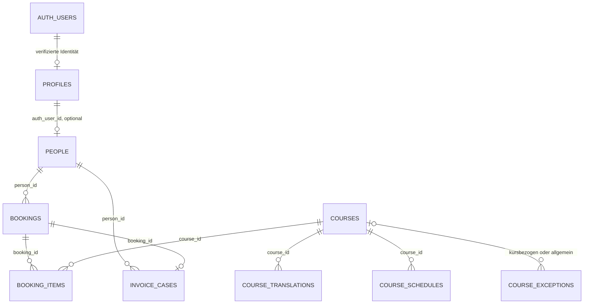
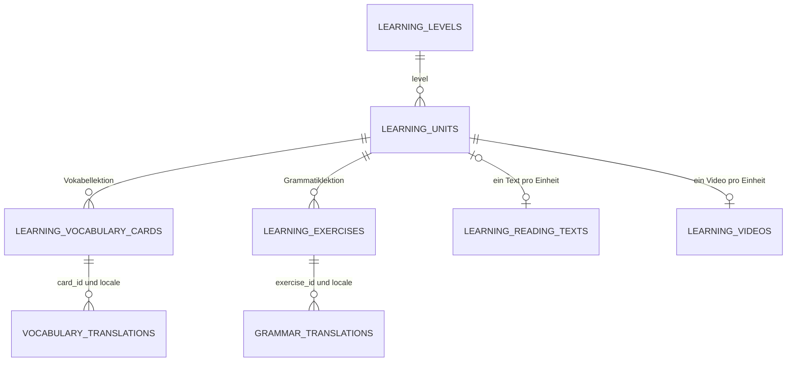
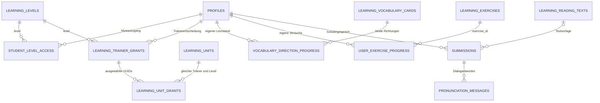

# VPS-Refactor — Sitov Academy, 13. September 2026

## Status und Geltungsbereich

**Die normalisierte Migration wurde auf einer isolierten Wiederherstellung geprüft. Die Live-Bereitstellung läuft noch.** Dieses Dokument beschreibt den freigegebenen Aufbau, die implementierten Datenverträge und vorhandene Prüfnachweise. Es behauptet noch keinen vollständig geprüften Live-Betrieb. Die abschließenden Deployment-Ergebnisse werden nach der Bereitstellung ergänzt.

Der Auftrag ersetzt die bisherige Cloud-Supabase-/Vercel-Architektur durch den eigenen VPS. Cloud-Supabase darf für diesen Umbau weder gelesen noch verändert werden. Frühere Projektdokumente und Migrationen bleiben als Historie erhalten; ihre Cloud-Bindings, Webhooks und Deployment-Anleitungen sind keine Betriebsanweisung für den VPS.

Der Nutzer hat nach vollständiger Sicherung einen frischen Start der Schülerdaten freigegeben. Zwei Staff-Konten bleiben erhalten. Der Unterrichtskatalog und das vorhandene Design werden übernommen. Die einmalige Bereinigung von Schülerkonten und Geschäfts-/Lerndaten ist vom regulären individuellen Lernreset zu unterscheiden.

## Betrieb auf dem VPS

| Bereich | Neuer Betriebsweg |
| --- | --- |
| Host und Einstieg | VPS `217.154.228.254`, HTTPS über `https://217.154.228.254`; DNS unverändert |
| Zertifikat | Kurzlebiges Let's-Encrypt-IP-Zertifikat, ungefähr sieben Tage; `sitov-cert-renew.timer` prüft zweimal täglich, etwa alle zwölf Stunden |
| Proxy | Bestehender Traefik-Proxy mit IP-Router, lokaler Nginx-Verteilung und HTTPS-Weiterleitung |
| Anwendung | `sitov-app.service`, Benutzer `sitov`, Next.js auf `127.0.0.1:3000` |
| Backend | Eigener Supabase-Docker-Stack mit PostgreSQL, Auth, PostgREST und privatem Storage; interne Ports an Loopback gebunden |
| Anwendungsmail | `sitov-mail.service` verarbeitet die Datenbank-Outbox und übergibt an Postfix auf `127.0.0.1:25` |
| Auth-Mail | GoTrue verwendet den lokalen Host-SMTP-Zugang auf Port `2525` aus dem Docker-Netz; kein öffentlicher Relay-Zugang |
| Sprachsynthese | `sitov-tts.service`, lokaler Dienst auf Loopback-Port `9070`; Piper für DE/EN/RU/UK, eSpeak-NG für TR |
| Rate-Limits | Lokale PostgreSQL-Zähler mit Ablaufzeit; kein Upstash-Aufruf |
| Hintergrundaufgaben | Lokaler Mailworker, Zertifikats-Timer und reine SQL-Bereinigung abgelaufener Rate-Limits; alte Cloud-HTTP-Jobs werden entfernt |

Konfiguration und Dienstdateien liegen in [deploy/vps](../deploy/vps). Geheimnisse gehören ausschließlich in geschützte VPS-Konfiguration, beispielsweise `/etc/sitov-academy/app.env`, nicht in diese Dokumentation. Der App- und Mail-Dienst dürfen nur lokale Netzziele erreichen. Die tatsächliche Mailzustellung durch Postfix ist gesondert zu prüfen; eine Outbox-Bestätigung bedeutet zunächst nur dauerhafte Annahme.

Piper-Modellversionen und Prüfsummen sind in [tts-models.json](../deploy/vps/tts-models.json) festgehalten; Lizenzhinweise stehen in [TTS_LICENSES.md](../deploy/vps/TTS_LICENSES.md). Die türkische eSpeak-Stimme kann hörbar von Piper abweichen. Bereits vorhandene tote Referenz-Audio-Links werden entfernt und bei Bedarf lokal neu erzeugt. Persönliche Schüleraufnahmen werden nicht als Sprachsynthese behandelt.

## Erhaltener Katalog

Die Zahlen beziehen sich auf den überprüften Ausgangskatalog und das Migrationsziel, nicht auf neu erzeugte Testdaten.

| Bestand | Anzahl | Bedeutung |
| --- | ---: | --- |
| Vokabelkarten | 512 | Bestehende IDs, deutsche Wörter, Übersetzungen und Beispielsätze erhalten |
| Grammatikübungen | 604 | Bestehende Aufgaben und Lösungs-/Alternativdaten erhalten |
| Aussprachetexte insgesamt | 149 | Einschließlich historischer, nicht aktiver Texte |
| Aktive Aussprachetexte | 60 | Zehn Texte je bestehender Kursstufe |
| Aktive Kurse | 10 | Öffentlicher buchbarer Katalog |
| Archivierte Kurse | 2 | Für Verwaltung und Historie erhalten |
| Lernstufen | 6 | A1.1, A1.2, A2.1, A2.2, B1.1, B1.2 |
| Staff-Konten | 2 | Vom freigegebenen Schüler-Neustart ausgenommen |

Die allgemeine Marketingaussage A1–C2 erweitert nicht automatisch den technischen Trainerkatalog. Historische Texte ohne eindeutige aktive Kursstufe werden erhalten, aber nicht durch eine geratene Zuordnung freigeschaltet.

## Personen, Kurse und Buchungen

- `profiles.id` bleibt die Auth-UUID und das Ziel vorhandener Lern-Fremdschlüssel. Die Tabelle enthält Rolle und Sprachpräferenzen, keine zweite Kopie der persönlichen Kontaktdaten.
- `people` ist die maßgebliche Person mit Name, Kontakt und Anschrift. `auth_user_id` ist optional und eindeutig. Eine Person aus einer öffentlichen Kursanmeldung kann zunächst ohne Lernkonto bestehen. E-Mail-Adressen sind für den Abgleich indexiert, aber nicht künstlich eindeutig; gemeinsam genutzte Adressen werden nicht geraten.
- `profile_details` verbindet Person und Profil als `security_invoker`-Lesesicht. Die Sicht liefert den bestehenden UI-Vertrag, ohne Kontaktdaten doppelt zu speichern.
- `courses.id` ist eine UUID. Der bisherige lesbare Kursbezeichner bleibt als eindeutiger `slug` erhalten. `course_translations`, `course_schedules` und `course_exceptions` ersetzen mehrfach interpretierte Sprach-/Terminfelder. Vergangene Kurse werden archiviert.
- `bookings` bildet den Vorgang mit Person, Zielmonat, Beginn, Art und Status ab. Die bei der Anmeldung angegebenen Kontaktdaten und Zustimmungen sind ein bewusster Vorgangs-Snapshot, keine zweite editierbare Stammdatenquelle. Für reguläre Vorgänge gilt ein Eintrag pro Person und Monat; Probebuchungen haben eine eigene Art.
- `booking_items` ordnet einer Buchung ihre Kurse zu. Titel, Einheit und Preis werden als Snapshot gespeichert, damit spätere Katalogänderungen den damaligen Vorgang nicht verändern. `(booking_id, course_id)` ist eindeutig.
- `invoice_cases` ist die manuelle Arbeitsliste pro Person und Monat mit eindeutigem Buchungsbezug. `outstanding` und `created` dokumentieren die Rechnungserstellung. Annahme, Rechnung, Versand und Zahlung werden nicht gleichgesetzt.
- `teacher_student_notes` bleibt das Staff-Schwarze-Brett am Profil. Eine kanonische Notiz pro Schüler wird mit Marker und partiellem Unique-Index geführt; konkurrierende erste Speicherungen laufen über einen gesperrten RPC.

Eine vorhandene Person und deren Buchungen werden erst nach bestätigter Auth-E-Mail und eindeutigem, noch nicht beanspruchtem Treffer verknüpft. Öffentliche Formulardaten oder frei editierbare Auth-Metadaten verleihen keine Staff-Rolle und keinen Zugriff auf fremde Daten.

## Lernkatalog und Übersetzungen

`learning_units.id` ist die stabile Berechtigungs-ID. Jede Einheit hat genau ein Niveau, einen Trainer, einen lesbaren Namen, Sortierung und Aktivstatus. Vokabeln und Grammatik werden in Lektionen gruppiert; jeder Aussprachetext ist einzeln freigebbar. Historische, nicht publizierte Aussprachetexte dürfen ohne aktuelle Einheit verbleiben.

`vocabulary_translations` speichert Wortübersetzung, Beispielsatz und sprachabhängige Schwierigkeit je Karte und Locale. `grammar_translations` speichert lokalisierte Hinweise und Erklärungen je Aufgabe und Locale. Das versionierte Grammatik-JSON enthält weiterhin die fachliche Aufgabenstruktur, Optionen, richtige Lösung und akzeptierte Alternativen; sprachabhängige Erklärungen werden darin nicht nochmals gespeichert.

Die bisherigen Namen `vocabulary_cards`, `exercises`, `pronunciation_prompts` und `videos` sind RLS-beachtende Lesesichten. Dadurch kann die vorhandene UI mit ihren etablierten DTOs weiterarbeiten. CMS-Schreiben verwendet `save_learning_content` bzw. `delete_learning_content`; eine Änderung an einer Karte benennt nicht versehentlich die gemeinsame Lektion ihrer Geschwister um. Eine Einheit darf niemals Inhalt eines anderen Trainers aufnehmen.

Die Migration prüft vor Commit Gesamtzahlen, erhaltene Inhalts-IDs, deutsche Wörter/Lesetexte, alle Vokabelübersetzungen und Beispielsätze sowie das unveränderte fachliche Grammatik-JSON. Ein Fehler bricht die Transaktion ab.

## Freigaben, Lernstände und Audio-Dialoge

**Freigaben:** `student_level_access` ist die einzige gespeicherte Niveauzuordnung. `learning_trainer_grants` enthält `enabled` und `unit_mode` (`all` oder `selected`). Eine fehlende Trainerentscheidung erbt den bestehenden Niveauzugang. `selected` ohne Zeilen in `learning_unit_grants` bedeutet keine freigegebenen Einheiten. Zusammengesetzte Fremdschlüssel verhindern, dass eine Auswahl Einheiten eines anderen Niveaus oder Trainers enthält. `profiles.allowed_levels` wurde entfernt; `profile_details.allowed_levels` und die Sicht `student_trainer_access` sind daraus abgeleitete Kompatibilitätsdaten.

**Vokabeln:** `vocabulary_direction_progress` speichert genau einen Zustand pro `(user_id, card_id, direction)`. Beide Richtungen werden unabhängig eingestuft, terminiert und bewertet. „Bekannt“ setzt die betroffene Richtung in Phase 6; der Abschluss muss noch nachgewiesen werden. Der interne Wert 7 bezeichnet den erfolgreich abgeschlossenen Sechs-Phasen-Durchlauf. Ein Wort ist erst gelernt, wenn beide Richtungen diesen Zustand erreicht haben. Die alte `user_vocabulary_progress` ist nur eine Lesesicht auf die deutsche Ausgangsrichtung. Antwortbelege und die letzte Karte verhindern doppelte Bewertungen bzw. unmittelbares Wiederholen desselben Wortes.

**Grammatik:** `record_grammar_attempt` bewertet die übermittelte Antwort serverseitig, prüft Nutzer und Einheit und schreibt Versuche/Ergebnis atomar. Studierende dürfen keine beliebigen Punktzahlen direkt in die Tabelle schreiben.

**Aussprache:** `submissions` hält die ursprüngliche Aufnahme, den Text-Snapshot und den Gesprächsstatus. `pronunciation_messages` speichert jede spätere Text-/Sprachnachricht genau einmal. `teacher_feedback` ist ausschließlich eine Sicht auf Lehrerantworten. Snapshots sind gewollt: eine spätere Textkorrektur im CMS darf den bereits eingereichten Lesetext nicht verändern.

**Storage:** Dateien werden unter `storage://pronunciation_audio/<auth-uuid>/<datei-uuid>.<format>` referenziert. Eine signierte Wiedergabe verlangt den aktuellen Zugriff auf das zugehörige Gespräch und seine Einheit; fremde Schüler können weder Nachrichten lesen noch deren Dateien signieren. Staff darf die betreuten Gespräche prüfen. Neue Dateien sind unveränderlich; studentische Uploads müssen im eigenen Verzeichnis liegen. Der alte Bucket `audio_submissions` ist privat und für normale App-Zugriffe gesperrt.

## RLS und privilegierte Funktionen

- Katalogzugriff, Lernstände, direkte RPC-Aufrufe und Audio-Wiedergabe prüfen denselben Berechtigungsumfang. Neue Schüler haben zunächst keine Niveauzuordnung. Die deutsche Schüler-Interfacesprache blockiert die Trainer; Staff kann Inhalte weiterhin in deutscher Verwaltungsoberfläche pflegen.
- Authentifizierte Nutzer dürfen an `profiles` nur Sprachpräferenzen ändern. Rollen und Abrechnungskennungen lassen sich darüber nicht selbst setzen. Die Staff-Rolle wird aus der Datenbank gelesen, nicht aus frei editierbaren Metadaten.
- Kompatibilitätssichten verwenden `security_invoker=true`. Private Hilfsschemata sind nicht als ungeschützte Tabellen-APIs geöffnet. Definer-Funktionen setzen einen leeren `search_path` und prüfen den Actor; öffentliche RPC-Fassaden erhalten gezielte Ausführungsrechte.
- Fortschrittsbewertung, Freigaben und Reset sind getrennte, validierte Schreibpfade. Ein Trainer-Override kann niemals ein gesperrtes Niveau öffnen. Staff-CMS-Rechte sind keine vom Schüler übermittelbare Rolle.
- Fremdschlüssel- und Abfrageindizes decken Person/Monat, Kurspositionen, Einheit/Trainer, Übersetzungsschlüssel und fällige Worker-/Lernzustände ab.

Der Restore-Audit fand fehlende private Storage-SELECT-Policies und alte permissive Aufnahme-/Fortschrittspolicies. `learning.sql` bindet diese Policies deshalb ausdrücklich neu, statt die Sicherheit von zufällig verbliebenen Altdefinitionen abhängig zu machen.

## Lokale Mail-Outbox

`private.mail_outbox` speichert Empfänger, Sprache, Ereignis, Payload und Zustellstatus. Ein eindeutiger Ereignisschlüssel verhindert doppeltes Enqueue. Worker reservieren fällige Einträge mit `FOR UPDATE SKIP LOCKED`, erhalten eine zeitlich begrenzte Lease und quittieren nur mit passendem Lease-Token. Fehlversuche werden mit exponentiell wachsender Wartezeit begrenzt wiederholt; nach spätestens acht Versuchen oder einem dauerhaften Fehler bleibt der Eintrag zur Prüfung auf `failed`.

Geschäftsereignisse und Lehrerfeedback verwenden benannte Vorlagen für DE/EN/RU/UK/TR. Feedback nutzt die gespeicherte Nachrichten-UUID als Deduplizierungsschlüssel. Scheitert die Benachrichtigung nach gespeichertem Chatbeitrag, wird dieser Beitrag nicht als fehlgeschlagen gemeldet und durch erneutes Senden dupliziert. SMTP-Zustellung und fachliches Speichern sind unterschiedliche Zustände.

## Backup, Migration und Restore

Vollständiger Sicherungsort auf dem VPS: `/root/backups/sitov-before-refactor-20260913T130956Z`.

Der Sicherungssatz umfasst Datenbankdump, Rollen, geschützte Konfiguration und Proxy-Konfiguration. Die Wiederherstellung wurde vor der produktiven Änderung in einer isolierten Datenbank getestet. Ein verwaistes Altprofil wurde nur in dieser Restore-Testkopie quarantänisiert; daraus folgt keine allgemeine Löschregel für produktive Profile.

Die versionierten Skripte unter [supabase/vps](../supabase/vps) sind ein einmaliger, bewusst freigegebener Umbau. Sie sind keine beliebig wiederholbaren Startskripte und dürfen nicht gegen die frühere Cloud-Instanz laufen.

1. Anwendungsschreiben stoppen und vollständige Sicherung samt lesbarem Restore prüfen. Bei einem neuen Versuch zuerst den tatsächlichen Datenbankstand bestimmen.
2. Alte externe Jobs/Benachrichtigungstrigger stilllegen. `prepare.sql` führt ausschließlich den freigegebenen Schüler-/Geschäftsdaten-Neustart aus; zwei Staff-Konten und der Katalog bleiben erhalten. Seine Storage-Metadatenbereinigung setzt den separat geprüften leeren Objektbestand voraus und darf nicht auf einen Bucket mit tatsächlichen Dateien übertragen werden.
3. `mail.sql` vor `business.sql` einspielen, anschließend `learning.sql` und `platform.sql`. Die Abhängigkeit ist verbindlich: Geschäfts-RPCs benötigen die Outbox, der Lernumbau die neue Person-/Profilsicht.
4. Typen aus der tatsächlich migrierten, isoliert geprüften Datenbank erzeugen. Inhaltssummen, Freigaben, Policies und Grants prüfen; keine Schemaannahmen ausschließlich aus alten Markdown- oder SQL-Dateien ableiten.
5. Anwendung und lokale Dienste bereitstellen. HTTPS, Auth-Weiterleitungen, Mailannahme/-zustellung, Trainer und private Aufnahme-/Feedback-Wiedergabe gesondert prüfen. Erst danach ist ein Live-Abschlussnachweis zulässig.
6. Bei einem Rollback Anwendungsschreiben stoppen und den zusammengehörigen Sicherungssatz aus Datenbank/Rollen, Konfiguration und passendem Anwendungscode wiederherstellen. Ein Restore ist kein partielles Zurückkopieren einzelner Tabellen in das neue Modell. Daten, die nach der Umschaltung entstanden sind, müssen vor einem Rollback separat gesichert werden.

Beim späteren **individuellen Lernreset** bleibt die Person samt Kurs- und Rechnungsdaten bestehen. Eine owner-geprüfte Reset-Transaktion erstellt zunächst ein beständiges Dateiverzeichnis. Die Anwendung entfernt echte Dateien über die Storage-API; erst nach bestätigter Entfernung werden Richtungsfortschritte, Übungen und Dialoge atomar gelöscht. Aktive Reset-Jobs blockieren neue Lern-/Audio-Schreibvorgänge. Der Vorgang ist nach Fehlern fortsetzbar und erhält Lehrerdateien, die noch in einem anderen Schülergespräch verwendet werden.

## Bisherige Prüfnachweise

| Prüfung | Bisheriger Stand |
| --- | --- |
| Vollständige Sicherung und isolierter Restore | Durchgeführt; produktive Sicherung liegt am oben genannten VPS-Pfad |
| Kombinierte Migration auf Restore-Kopie | Durchgeführt; zusätzliche RLS-/Storage-Auditkorrekturen werden vor Live-Anwendung erneut dort geprüft |
| Inhaltserhalt | SQL-Assertions für Identitäten, Zahlen, Vokabelübersetzungen/Beispielsätze und fachliche Grammatikdaten implementiert |
| Lernbereich, UI und Actions | 30 gezielt ausgewählte Jest-Suites mit 307 bestandenen Tests |
| Normalisierte PostgreSQL-Funktionen und Rechte | Elf isolierte Tests bestanden, einschließlich beider Richtungen, Einzeltexte und vollständigem resumable Reset |
| TypeScript Lernbereich | Keine Fehler im übernommenen Lern-/CMS-/Feedback-Bereich |
| Gesamtbuild und Live-Browserprüfung | Abschließender Deployment-Nachweis noch offen |
| Auth-Mail und echte SMTP-Zustellung | Abschließender Deployment-Nachweis noch offen |
| Live-HTTPS und Zertifikats-Erneuerung | Konfiguration vorhanden; abschließender Betriebsnachweis noch offen |

Die Details zum späteren Live-Abschluss sollen als eigener datierter Abschnitt ergänzt werden. Frühere Testzahlen aus der Cloud-Architektur sind kein Prüfnachweis dieses Deployments.

## Nachtrag: öffentliche Storage-URLs bei interner Serververbindung

`lib/storage-public-url.ts` trennt die interne API-Verbindung von der im Browser verwendeten Datei-Adresse. Aus `http://127.0.0.1:9080/storage/v1/object/...` wird anhand der Konfiguration `https://217.154.228.254/supabase/storage/v1/object/...`. Es erfolgt keine freie URL-Weiterleitung: Origin und Storage-Pfadgrenze müssen exakt zum konfigurierten Backend gehören. Kodierte Dateinamen und sämtliche Signatur-/Query-Bytes bleiben unverändert. Cache-Treffer, neue Referenzaufnahmen und beide serverseitigen Signierstellen verwenden diesen Adapter. 39 gezielte Tests prüfen Mapping, Signaturerhalt und Ablehnung fremder/manipulierter URLs. Die Prüfung der tatsächlichen Wiedergabe nach dem VPS-Build bleibt Teil des Live-Abschlussnachweises.
